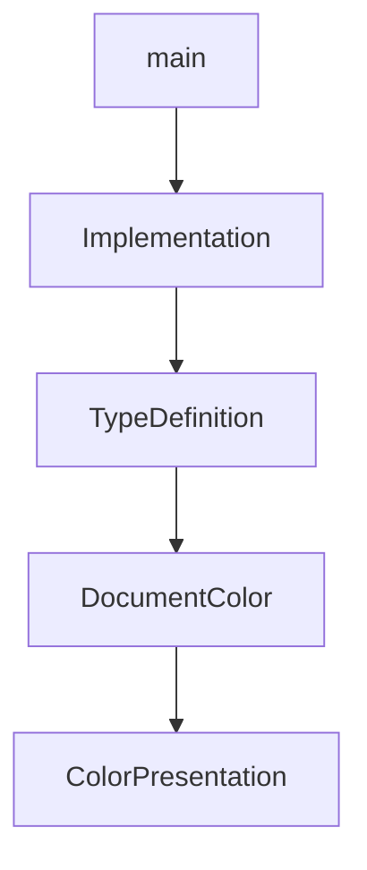

# Chapter 1: Getting Started and Project Status

Welcome to **Chapter 1: Getting Started and Project Status**. In this part of **OpenCode AI Legacy Tutorial: Archived Terminal Agent Workflows and Migration to Crush**, you will build an intuitive mental model first, then move into concrete implementation details and practical production tradeoffs.


This chapter sets expectations for working with an archived repository.

## Learning Goals

- confirm archive/migration status before adoption
- identify valid use cases for legacy operation
- avoid treating archived defaults as production-ready
- define ownership if you must maintain a fork

## Status Note

The repository is archived and points users to Crush for active development. Treat OpenCode AI primarily as a reference or controlled legacy dependency.

## Source References

- [OpenCode AI README](https://github.com/opencode-ai/opencode/blob/main/README.md)
- [Crush Successor Repository](https://github.com/charmbracelet/crush)

## Summary

You now have the right baseline context for responsible legacy usage.

Next: [Chapter 2: Legacy Architecture and Feature Model](02-legacy-architecture-and-feature-model.md)

## Source Code Walkthrough

### `main.go`

The `main` function in [`main.go`](https://github.com/opencode-ai/opencode/blob/HEAD/main.go) handles a key part of this chapter's functionality:

```go
package main

import (
	"github.com/opencode-ai/opencode/cmd"
	"github.com/opencode-ai/opencode/internal/logging"
)

func main() {
	defer logging.RecoverPanic("main", func() {
		logging.ErrorPersist("Application terminated due to unhandled panic")
	})

	cmd.Execute()
}

```

This function is important because it defines how OpenCode AI Legacy Tutorial: Archived Terminal Agent Workflows and Migration to Crush implements the patterns covered in this chapter.

### `internal/lsp/methods.go`

The `Implementation` function in [`internal/lsp/methods.go`](https://github.com/opencode-ai/opencode/blob/HEAD/internal/lsp/methods.go) handles a key part of this chapter's functionality:

```go
)

// Implementation sends a textDocument/implementation request to the LSP server.
// A request to resolve the implementation locations of a symbol at a given text document position. The request's parameter is of type TextDocumentPositionParams the response is of type Definition or a Thenable that resolves to such.
func (c *Client) Implementation(ctx context.Context, params protocol.ImplementationParams) (protocol.Or_Result_textDocument_implementation, error) {
	var result protocol.Or_Result_textDocument_implementation
	err := c.Call(ctx, "textDocument/implementation", params, &result)
	return result, err
}

// TypeDefinition sends a textDocument/typeDefinition request to the LSP server.
// A request to resolve the type definition locations of a symbol at a given text document position. The request's parameter is of type TextDocumentPositionParams the response is of type Definition or a Thenable that resolves to such.
func (c *Client) TypeDefinition(ctx context.Context, params protocol.TypeDefinitionParams) (protocol.Or_Result_textDocument_typeDefinition, error) {
	var result protocol.Or_Result_textDocument_typeDefinition
	err := c.Call(ctx, "textDocument/typeDefinition", params, &result)
	return result, err
}

// DocumentColor sends a textDocument/documentColor request to the LSP server.
// A request to list all color symbols found in a given text document. The request's parameter is of type DocumentColorParams the response is of type ColorInformation ColorInformation[] or a Thenable that resolves to such.
func (c *Client) DocumentColor(ctx context.Context, params protocol.DocumentColorParams) ([]protocol.ColorInformation, error) {
	var result []protocol.ColorInformation
	err := c.Call(ctx, "textDocument/documentColor", params, &result)
	return result, err
}

// ColorPresentation sends a textDocument/colorPresentation request to the LSP server.
// A request to list all presentation for a color. The request's parameter is of type ColorPresentationParams the response is of type ColorInformation ColorInformation[] or a Thenable that resolves to such.
func (c *Client) ColorPresentation(ctx context.Context, params protocol.ColorPresentationParams) ([]protocol.ColorPresentation, error) {
	var result []protocol.ColorPresentation
	err := c.Call(ctx, "textDocument/colorPresentation", params, &result)
	return result, err
```

This function is important because it defines how OpenCode AI Legacy Tutorial: Archived Terminal Agent Workflows and Migration to Crush implements the patterns covered in this chapter.

### `internal/lsp/methods.go`

The `TypeDefinition` function in [`internal/lsp/methods.go`](https://github.com/opencode-ai/opencode/blob/HEAD/internal/lsp/methods.go) handles a key part of this chapter's functionality:

```go
}

// TypeDefinition sends a textDocument/typeDefinition request to the LSP server.
// A request to resolve the type definition locations of a symbol at a given text document position. The request's parameter is of type TextDocumentPositionParams the response is of type Definition or a Thenable that resolves to such.
func (c *Client) TypeDefinition(ctx context.Context, params protocol.TypeDefinitionParams) (protocol.Or_Result_textDocument_typeDefinition, error) {
	var result protocol.Or_Result_textDocument_typeDefinition
	err := c.Call(ctx, "textDocument/typeDefinition", params, &result)
	return result, err
}

// DocumentColor sends a textDocument/documentColor request to the LSP server.
// A request to list all color symbols found in a given text document. The request's parameter is of type DocumentColorParams the response is of type ColorInformation ColorInformation[] or a Thenable that resolves to such.
func (c *Client) DocumentColor(ctx context.Context, params protocol.DocumentColorParams) ([]protocol.ColorInformation, error) {
	var result []protocol.ColorInformation
	err := c.Call(ctx, "textDocument/documentColor", params, &result)
	return result, err
}

// ColorPresentation sends a textDocument/colorPresentation request to the LSP server.
// A request to list all presentation for a color. The request's parameter is of type ColorPresentationParams the response is of type ColorInformation ColorInformation[] or a Thenable that resolves to such.
func (c *Client) ColorPresentation(ctx context.Context, params protocol.ColorPresentationParams) ([]protocol.ColorPresentation, error) {
	var result []protocol.ColorPresentation
	err := c.Call(ctx, "textDocument/colorPresentation", params, &result)
	return result, err
}

// FoldingRange sends a textDocument/foldingRange request to the LSP server.
// A request to provide folding ranges in a document. The request's parameter is of type FoldingRangeParams, the response is of type FoldingRangeList or a Thenable that resolves to such.
func (c *Client) FoldingRange(ctx context.Context, params protocol.FoldingRangeParams) ([]protocol.FoldingRange, error) {
	var result []protocol.FoldingRange
	err := c.Call(ctx, "textDocument/foldingRange", params, &result)
	return result, err
```

This function is important because it defines how OpenCode AI Legacy Tutorial: Archived Terminal Agent Workflows and Migration to Crush implements the patterns covered in this chapter.

### `internal/lsp/methods.go`

The `DocumentColor` function in [`internal/lsp/methods.go`](https://github.com/opencode-ai/opencode/blob/HEAD/internal/lsp/methods.go) handles a key part of this chapter's functionality:

```go
}

// DocumentColor sends a textDocument/documentColor request to the LSP server.
// A request to list all color symbols found in a given text document. The request's parameter is of type DocumentColorParams the response is of type ColorInformation ColorInformation[] or a Thenable that resolves to such.
func (c *Client) DocumentColor(ctx context.Context, params protocol.DocumentColorParams) ([]protocol.ColorInformation, error) {
	var result []protocol.ColorInformation
	err := c.Call(ctx, "textDocument/documentColor", params, &result)
	return result, err
}

// ColorPresentation sends a textDocument/colorPresentation request to the LSP server.
// A request to list all presentation for a color. The request's parameter is of type ColorPresentationParams the response is of type ColorInformation ColorInformation[] or a Thenable that resolves to such.
func (c *Client) ColorPresentation(ctx context.Context, params protocol.ColorPresentationParams) ([]protocol.ColorPresentation, error) {
	var result []protocol.ColorPresentation
	err := c.Call(ctx, "textDocument/colorPresentation", params, &result)
	return result, err
}

// FoldingRange sends a textDocument/foldingRange request to the LSP server.
// A request to provide folding ranges in a document. The request's parameter is of type FoldingRangeParams, the response is of type FoldingRangeList or a Thenable that resolves to such.
func (c *Client) FoldingRange(ctx context.Context, params protocol.FoldingRangeParams) ([]protocol.FoldingRange, error) {
	var result []protocol.FoldingRange
	err := c.Call(ctx, "textDocument/foldingRange", params, &result)
	return result, err
}

// Declaration sends a textDocument/declaration request to the LSP server.
// A request to resolve the type definition locations of a symbol at a given text document position. The request's parameter is of type TextDocumentPositionParams the response is of type Declaration or a typed array of DeclarationLink or a Thenable that resolves to such.
func (c *Client) Declaration(ctx context.Context, params protocol.DeclarationParams) (protocol.Or_Result_textDocument_declaration, error) {
	var result protocol.Or_Result_textDocument_declaration
	err := c.Call(ctx, "textDocument/declaration", params, &result)
	return result, err
```

This function is important because it defines how OpenCode AI Legacy Tutorial: Archived Terminal Agent Workflows and Migration to Crush implements the patterns covered in this chapter.


## How These Components Connect


