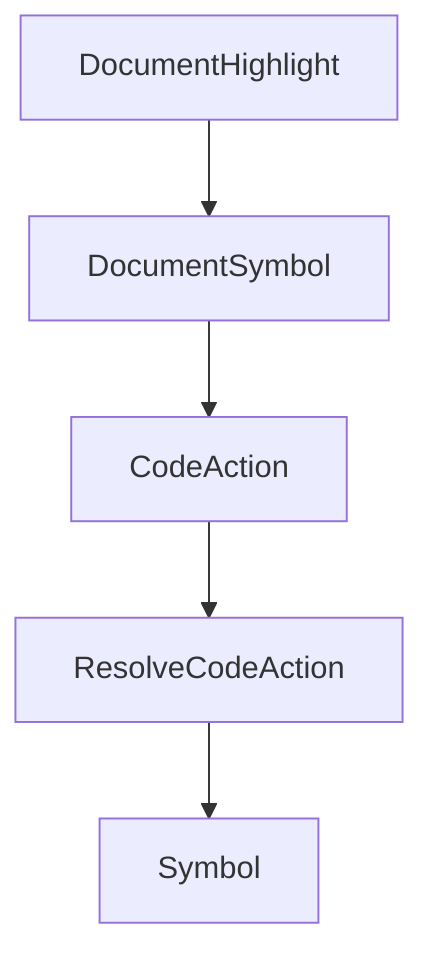

# Chapter 2: Legacy Architecture and Feature Model

Welcome to **Chapter 2: Legacy Architecture and Feature Model**. In this part of **OpenCode AI Legacy Tutorial: Archived Terminal Agent Workflows and Migration to Crush**, you will build an intuitive mental model first, then move into concrete implementation details and practical production tradeoffs.


This chapter reviews the core product model to preserve useful patterns.

## Learning Goals

- understand TUI-first terminal architecture
- map session/tool/model capabilities
- identify still-useful interaction patterns
- distinguish reusable ideas from legacy constraints

## Architecture Highlights

- Bubble Tea-based interactive terminal UX
- multi-provider model support with configurable agents
- local session persistence and context compaction features

## Source References

- [OpenCode AI README](https://github.com/opencode-ai/opencode/blob/main/README.md)
- [OpenCode AI Source Tree](https://github.com/opencode-ai/opencode)

## Summary

You now understand what parts of the legacy architecture remain worth carrying forward.

Next: [Chapter 3: Installation and Configuration Baseline](03-installation-and-configuration-baseline.md)

## Depth Expansion Playbook

## Source Code Walkthrough

### `internal/lsp/methods.go`

The `DocumentHighlight` function in [`internal/lsp/methods.go`](https://github.com/opencode-ai/opencode/blob/HEAD/internal/lsp/methods.go) handles a key part of this chapter's functionality:

```go
}

// DocumentHighlight sends a textDocument/documentHighlight request to the LSP server.
// Request to resolve a DocumentHighlight for a given text document position. The request's parameter is of type TextDocumentPosition the request response is an array of type DocumentHighlight or a Thenable that resolves to such.
func (c *Client) DocumentHighlight(ctx context.Context, params protocol.DocumentHighlightParams) ([]protocol.DocumentHighlight, error) {
	var result []protocol.DocumentHighlight
	err := c.Call(ctx, "textDocument/documentHighlight", params, &result)
	return result, err
}

// DocumentSymbol sends a textDocument/documentSymbol request to the LSP server.
// A request to list all symbols found in a given text document. The request's parameter is of type TextDocumentIdentifier the response is of type SymbolInformation SymbolInformation[] or a Thenable that resolves to such.
func (c *Client) DocumentSymbol(ctx context.Context, params protocol.DocumentSymbolParams) (protocol.Or_Result_textDocument_documentSymbol, error) {
	var result protocol.Or_Result_textDocument_documentSymbol
	err := c.Call(ctx, "textDocument/documentSymbol", params, &result)
	return result, err
}

// CodeAction sends a textDocument/codeAction request to the LSP server.
// A request to provide commands for the given text document and range.
func (c *Client) CodeAction(ctx context.Context, params protocol.CodeActionParams) ([]protocol.Or_Result_textDocument_codeAction_Item0_Elem, error) {
	var result []protocol.Or_Result_textDocument_codeAction_Item0_Elem
	err := c.Call(ctx, "textDocument/codeAction", params, &result)
	return result, err
}

// ResolveCodeAction sends a codeAction/resolve request to the LSP server.
// Request to resolve additional information for a given code action.The request's parameter is of type CodeAction the response is of type CodeAction or a Thenable that resolves to such.
func (c *Client) ResolveCodeAction(ctx context.Context, params protocol.CodeAction) (protocol.CodeAction, error) {
	var result protocol.CodeAction
	err := c.Call(ctx, "codeAction/resolve", params, &result)
	return result, err
```

This function is important because it defines how OpenCode AI Legacy Tutorial: Archived Terminal Agent Workflows and Migration to Crush implements the patterns covered in this chapter.

### `internal/lsp/methods.go`

The `DocumentSymbol` function in [`internal/lsp/methods.go`](https://github.com/opencode-ai/opencode/blob/HEAD/internal/lsp/methods.go) handles a key part of this chapter's functionality:

```go
}

// DocumentSymbol sends a textDocument/documentSymbol request to the LSP server.
// A request to list all symbols found in a given text document. The request's parameter is of type TextDocumentIdentifier the response is of type SymbolInformation SymbolInformation[] or a Thenable that resolves to such.
func (c *Client) DocumentSymbol(ctx context.Context, params protocol.DocumentSymbolParams) (protocol.Or_Result_textDocument_documentSymbol, error) {
	var result protocol.Or_Result_textDocument_documentSymbol
	err := c.Call(ctx, "textDocument/documentSymbol", params, &result)
	return result, err
}

// CodeAction sends a textDocument/codeAction request to the LSP server.
// A request to provide commands for the given text document and range.
func (c *Client) CodeAction(ctx context.Context, params protocol.CodeActionParams) ([]protocol.Or_Result_textDocument_codeAction_Item0_Elem, error) {
	var result []protocol.Or_Result_textDocument_codeAction_Item0_Elem
	err := c.Call(ctx, "textDocument/codeAction", params, &result)
	return result, err
}

// ResolveCodeAction sends a codeAction/resolve request to the LSP server.
// Request to resolve additional information for a given code action.The request's parameter is of type CodeAction the response is of type CodeAction or a Thenable that resolves to such.
func (c *Client) ResolveCodeAction(ctx context.Context, params protocol.CodeAction) (protocol.CodeAction, error) {
	var result protocol.CodeAction
	err := c.Call(ctx, "codeAction/resolve", params, &result)
	return result, err
}

// Symbol sends a workspace/symbol request to the LSP server.
// A request to list project-wide symbols matching the query string given by the WorkspaceSymbolParams. The response is of type SymbolInformation SymbolInformation[] or a Thenable that resolves to such. Since 3.17.0 - support for WorkspaceSymbol in the returned data. Clients need to advertise support for WorkspaceSymbols via the client capability workspace.symbol.resolveSupport.
func (c *Client) Symbol(ctx context.Context, params protocol.WorkspaceSymbolParams) (protocol.Or_Result_workspace_symbol, error) {
	var result protocol.Or_Result_workspace_symbol
	err := c.Call(ctx, "workspace/symbol", params, &result)
	return result, err
```

This function is important because it defines how OpenCode AI Legacy Tutorial: Archived Terminal Agent Workflows and Migration to Crush implements the patterns covered in this chapter.

### `internal/lsp/methods.go`

The `CodeAction` function in [`internal/lsp/methods.go`](https://github.com/opencode-ai/opencode/blob/HEAD/internal/lsp/methods.go) handles a key part of this chapter's functionality:

```go
}

// CodeAction sends a textDocument/codeAction request to the LSP server.
// A request to provide commands for the given text document and range.
func (c *Client) CodeAction(ctx context.Context, params protocol.CodeActionParams) ([]protocol.Or_Result_textDocument_codeAction_Item0_Elem, error) {
	var result []protocol.Or_Result_textDocument_codeAction_Item0_Elem
	err := c.Call(ctx, "textDocument/codeAction", params, &result)
	return result, err
}

// ResolveCodeAction sends a codeAction/resolve request to the LSP server.
// Request to resolve additional information for a given code action.The request's parameter is of type CodeAction the response is of type CodeAction or a Thenable that resolves to such.
func (c *Client) ResolveCodeAction(ctx context.Context, params protocol.CodeAction) (protocol.CodeAction, error) {
	var result protocol.CodeAction
	err := c.Call(ctx, "codeAction/resolve", params, &result)
	return result, err
}

// Symbol sends a workspace/symbol request to the LSP server.
// A request to list project-wide symbols matching the query string given by the WorkspaceSymbolParams. The response is of type SymbolInformation SymbolInformation[] or a Thenable that resolves to such. Since 3.17.0 - support for WorkspaceSymbol in the returned data. Clients need to advertise support for WorkspaceSymbols via the client capability workspace.symbol.resolveSupport.
func (c *Client) Symbol(ctx context.Context, params protocol.WorkspaceSymbolParams) (protocol.Or_Result_workspace_symbol, error) {
	var result protocol.Or_Result_workspace_symbol
	err := c.Call(ctx, "workspace/symbol", params, &result)
	return result, err
}

// ResolveWorkspaceSymbol sends a workspaceSymbol/resolve request to the LSP server.
// A request to resolve the range inside the workspace symbol's location. Since 3.17.0
func (c *Client) ResolveWorkspaceSymbol(ctx context.Context, params protocol.WorkspaceSymbol) (protocol.WorkspaceSymbol, error) {
	var result protocol.WorkspaceSymbol
	err := c.Call(ctx, "workspaceSymbol/resolve", params, &result)
	return result, err
```

This function is important because it defines how OpenCode AI Legacy Tutorial: Archived Terminal Agent Workflows and Migration to Crush implements the patterns covered in this chapter.

### `internal/lsp/methods.go`

The `ResolveCodeAction` function in [`internal/lsp/methods.go`](https://github.com/opencode-ai/opencode/blob/HEAD/internal/lsp/methods.go) handles a key part of this chapter's functionality:

```go
}

// ResolveCodeAction sends a codeAction/resolve request to the LSP server.
// Request to resolve additional information for a given code action.The request's parameter is of type CodeAction the response is of type CodeAction or a Thenable that resolves to such.
func (c *Client) ResolveCodeAction(ctx context.Context, params protocol.CodeAction) (protocol.CodeAction, error) {
	var result protocol.CodeAction
	err := c.Call(ctx, "codeAction/resolve", params, &result)
	return result, err
}

// Symbol sends a workspace/symbol request to the LSP server.
// A request to list project-wide symbols matching the query string given by the WorkspaceSymbolParams. The response is of type SymbolInformation SymbolInformation[] or a Thenable that resolves to such. Since 3.17.0 - support for WorkspaceSymbol in the returned data. Clients need to advertise support for WorkspaceSymbols via the client capability workspace.symbol.resolveSupport.
func (c *Client) Symbol(ctx context.Context, params protocol.WorkspaceSymbolParams) (protocol.Or_Result_workspace_symbol, error) {
	var result protocol.Or_Result_workspace_symbol
	err := c.Call(ctx, "workspace/symbol", params, &result)
	return result, err
}

// ResolveWorkspaceSymbol sends a workspaceSymbol/resolve request to the LSP server.
// A request to resolve the range inside the workspace symbol's location. Since 3.17.0
func (c *Client) ResolveWorkspaceSymbol(ctx context.Context, params protocol.WorkspaceSymbol) (protocol.WorkspaceSymbol, error) {
	var result protocol.WorkspaceSymbol
	err := c.Call(ctx, "workspaceSymbol/resolve", params, &result)
	return result, err
}

// CodeLens sends a textDocument/codeLens request to the LSP server.
// A request to provide code lens for the given text document.
func (c *Client) CodeLens(ctx context.Context, params protocol.CodeLensParams) ([]protocol.CodeLens, error) {
	var result []protocol.CodeLens
	err := c.Call(ctx, "textDocument/codeLens", params, &result)
	return result, err
```

This function is important because it defines how OpenCode AI Legacy Tutorial: Archived Terminal Agent Workflows and Migration to Crush implements the patterns covered in this chapter.


## How These Components Connect


