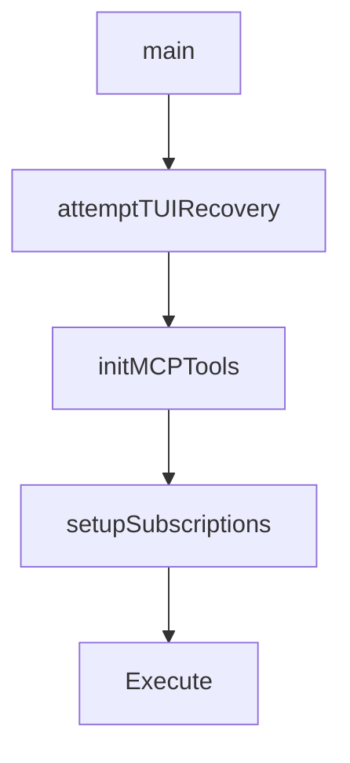

# Chapter 3: Installation and Configuration Baseline

Welcome to **Chapter 3: Installation and Configuration Baseline**. In this part of **OpenCode AI Legacy Tutorial: Archived Terminal Agent Workflows and Migration to Crush**, you will build an intuitive mental model first, then move into concrete implementation details and practical production tradeoffs.


This chapter covers reproducible legacy setup for controlled environments.

## Learning Goals

- install legacy binaries and scripts safely
- configure environment and JSON settings deterministically
- document exact versions for reproducibility
- reduce setup drift across operators

## Setup Guidance

- pin known working release version
- store config templates with environment assumptions
- isolate legacy runtime from modern critical paths

## Source References

- [OpenCode AI Install Script](https://github.com/opencode-ai/opencode/blob/main/install)
- [OpenCode AI Release v0.0.55](https://github.com/opencode-ai/opencode/releases/tag/v0.0.55)
- [OpenCode AI README: Configuration](https://github.com/opencode-ai/opencode/blob/main/README.md)

## Summary

You now have a reproducible setup baseline for legacy OpenCode operation.

Next: [Chapter 4: Model Providers and Runtime Operations](04-model-providers-and-runtime-operations.md)

## Depth Expansion Playbook

## Source Code Walkthrough

### `main.go`

The `main` function in [`main.go`](https://github.com/opencode-ai/opencode/blob/HEAD/main.go) handles a key part of this chapter's functionality:

```go
package main

import (
	"github.com/opencode-ai/opencode/cmd"
	"github.com/opencode-ai/opencode/internal/logging"
)

func main() {
	defer logging.RecoverPanic("main", func() {
		logging.ErrorPersist("Application terminated due to unhandled panic")
	})

	cmd.Execute()
}

```

This function is important because it defines how OpenCode AI Legacy Tutorial: Archived Terminal Agent Workflows and Migration to Crush implements the patterns covered in this chapter.

### `cmd/root.go`

The `attemptTUIRecovery` function in [`cmd/root.go`](https://github.com/opencode-ai/opencode/blob/HEAD/cmd/root.go) handles a key part of this chapter's functionality:

```go
			defer tuiWg.Done()
			defer logging.RecoverPanic("TUI-message-handler", func() {
				attemptTUIRecovery(program)
			})

			for {
				select {
				case <-tuiCtx.Done():
					logging.Info("TUI message handler shutting down")
					return
				case msg, ok := <-ch:
					if !ok {
						logging.Info("TUI message channel closed")
						return
					}
					program.Send(msg)
				}
			}
		}()

		// Cleanup function for when the program exits
		cleanup := func() {
			// Shutdown the app
			app.Shutdown()

			// Cancel subscriptions first
			cancelSubs()

			// Then cancel TUI message handler
			tuiCancel()

			// Wait for TUI message handler to finish
```

This function is important because it defines how OpenCode AI Legacy Tutorial: Archived Terminal Agent Workflows and Migration to Crush implements the patterns covered in this chapter.

### `cmd/root.go`

The `initMCPTools` function in [`cmd/root.go`](https://github.com/opencode-ai/opencode/blob/HEAD/cmd/root.go) handles a key part of this chapter's functionality:

```go

		// Initialize MCP tools early for both modes
		initMCPTools(ctx, app)

		// Non-interactive mode
		if prompt != "" {
			// Run non-interactive flow using the App method
			return app.RunNonInteractive(ctx, prompt, outputFormat, quiet)
		}

		// Interactive mode
		// Set up the TUI
		zone.NewGlobal()
		program := tea.NewProgram(
			tui.New(app),
			tea.WithAltScreen(),
		)

		// Setup the subscriptions, this will send services events to the TUI
		ch, cancelSubs := setupSubscriptions(app, ctx)

		// Create a context for the TUI message handler
		tuiCtx, tuiCancel := context.WithCancel(ctx)
		var tuiWg sync.WaitGroup
		tuiWg.Add(1)

		// Set up message handling for the TUI
		go func() {
			defer tuiWg.Done()
			defer logging.RecoverPanic("TUI-message-handler", func() {
				attemptTUIRecovery(program)
			})
```

This function is important because it defines how OpenCode AI Legacy Tutorial: Archived Terminal Agent Workflows and Migration to Crush implements the patterns covered in this chapter.

### `cmd/root.go`

The `setupSubscriptions` function in [`cmd/root.go`](https://github.com/opencode-ai/opencode/blob/HEAD/cmd/root.go) handles a key part of this chapter's functionality:

```go

		// Setup the subscriptions, this will send services events to the TUI
		ch, cancelSubs := setupSubscriptions(app, ctx)

		// Create a context for the TUI message handler
		tuiCtx, tuiCancel := context.WithCancel(ctx)
		var tuiWg sync.WaitGroup
		tuiWg.Add(1)

		// Set up message handling for the TUI
		go func() {
			defer tuiWg.Done()
			defer logging.RecoverPanic("TUI-message-handler", func() {
				attemptTUIRecovery(program)
			})

			for {
				select {
				case <-tuiCtx.Done():
					logging.Info("TUI message handler shutting down")
					return
				case msg, ok := <-ch:
					if !ok {
						logging.Info("TUI message channel closed")
						return
					}
					program.Send(msg)
				}
			}
		}()

		// Cleanup function for when the program exits
```

This function is important because it defines how OpenCode AI Legacy Tutorial: Archived Terminal Agent Workflows and Migration to Crush implements the patterns covered in this chapter.


## How These Components Connect


