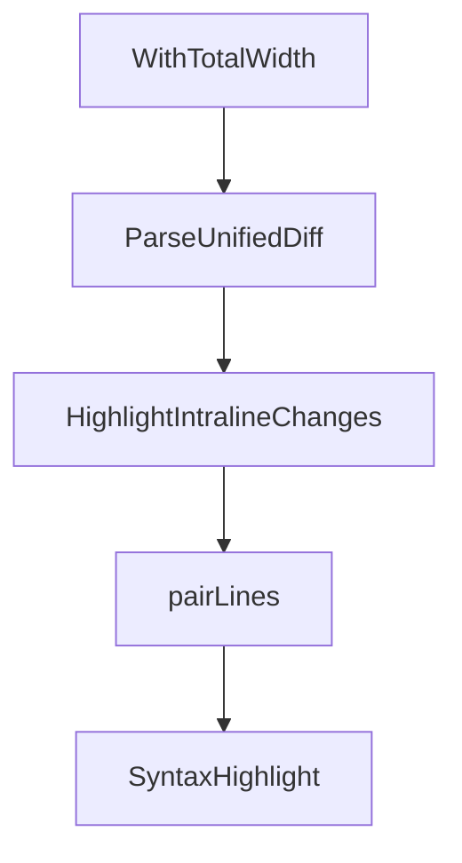

# Chapter 4: Model Providers and Runtime Operations

Welcome to **Chapter 4: Model Providers and Runtime Operations**. In this part of **OpenCode AI Legacy Tutorial: Archived Terminal Agent Workflows and Migration to Crush**, you will build an intuitive mental model first, then move into concrete implementation details and practical production tradeoffs.


This chapter covers model/provider routing and runtime controls in legacy mode.

## Learning Goals

- configure provider credentials and fallback paths
- map model choice to task quality/latency needs
- constrain shell/tool runtime behavior safely
- document environment assumptions for repeatability

## Runtime Considerations

- keep provider keys scoped and rotated
- pin model IDs used in legacy automation
- validate shell config and command safety boundaries

## Source References

- [OpenCode AI README: Environment Variables](https://github.com/opencode-ai/opencode/blob/main/README.md)
- [OpenCode AI README: Supported Models](https://github.com/opencode-ai/opencode/blob/main/README.md)

## Summary

You now have a stable runtime configuration model for legacy operations.

Next: [Chapter 5: Interactive and Non-Interactive Workflows](05-interactive-and-non-interactive-workflows.md)

## Depth Expansion Playbook

## Source Code Walkthrough

### `internal/diff/diff.go`

The `WithTotalWidth` function in [`internal/diff/diff.go`](https://github.com/opencode-ai/opencode/blob/HEAD/internal/diff/diff.go) handles a key part of this chapter's functionality:

```go
}

// WithTotalWidth sets the total width for side-by-side view
func WithTotalWidth(width int) SideBySideOption {
	return func(s *SideBySideConfig) {
		if width > 0 {
			s.TotalWidth = width
		}
	}
}

// -------------------------------------------------------------------------
// Diff Parsing
// -------------------------------------------------------------------------

// ParseUnifiedDiff parses a unified diff format string into structured data
func ParseUnifiedDiff(diff string) (DiffResult, error) {
	var result DiffResult
	var currentHunk *Hunk

	hunkHeaderRe := regexp.MustCompile(`^@@ -(\d+),?(\d*) \+(\d+),?(\d*) @@`)
	lines := strings.Split(diff, "\n")

	var oldLine, newLine int
	inFileHeader := true

	for _, line := range lines {
		// Parse file headers
		if inFileHeader {
			if strings.HasPrefix(line, "--- a/") {
				result.OldFile = strings.TrimPrefix(line, "--- a/")
				continue
```

This function is important because it defines how OpenCode AI Legacy Tutorial: Archived Terminal Agent Workflows and Migration to Crush implements the patterns covered in this chapter.

### `internal/diff/diff.go`

The `ParseUnifiedDiff` function in [`internal/diff/diff.go`](https://github.com/opencode-ai/opencode/blob/HEAD/internal/diff/diff.go) handles a key part of this chapter's functionality:

```go
// -------------------------------------------------------------------------

// ParseUnifiedDiff parses a unified diff format string into structured data
func ParseUnifiedDiff(diff string) (DiffResult, error) {
	var result DiffResult
	var currentHunk *Hunk

	hunkHeaderRe := regexp.MustCompile(`^@@ -(\d+),?(\d*) \+(\d+),?(\d*) @@`)
	lines := strings.Split(diff, "\n")

	var oldLine, newLine int
	inFileHeader := true

	for _, line := range lines {
		// Parse file headers
		if inFileHeader {
			if strings.HasPrefix(line, "--- a/") {
				result.OldFile = strings.TrimPrefix(line, "--- a/")
				continue
			}
			if strings.HasPrefix(line, "+++ b/") {
				result.NewFile = strings.TrimPrefix(line, "+++ b/")
				inFileHeader = false
				continue
			}
		}

		// Parse hunk headers
		if matches := hunkHeaderRe.FindStringSubmatch(line); matches != nil {
			if currentHunk != nil {
				result.Hunks = append(result.Hunks, *currentHunk)
			}
```

This function is important because it defines how OpenCode AI Legacy Tutorial: Archived Terminal Agent Workflows and Migration to Crush implements the patterns covered in this chapter.

### `internal/diff/diff.go`

The `HighlightIntralineChanges` function in [`internal/diff/diff.go`](https://github.com/opencode-ai/opencode/blob/HEAD/internal/diff/diff.go) handles a key part of this chapter's functionality:

```go
}

// HighlightIntralineChanges updates lines in a hunk to show character-level differences
func HighlightIntralineChanges(h *Hunk) {
	var updated []DiffLine
	dmp := diffmatchpatch.New()

	for i := 0; i < len(h.Lines); i++ {
		// Look for removed line followed by added line
		if i+1 < len(h.Lines) &&
			h.Lines[i].Kind == LineRemoved &&
			h.Lines[i+1].Kind == LineAdded {

			oldLine := h.Lines[i]
			newLine := h.Lines[i+1]

			// Find character-level differences
			patches := dmp.DiffMain(oldLine.Content, newLine.Content, false)
			patches = dmp.DiffCleanupSemantic(patches)
			patches = dmp.DiffCleanupMerge(patches)
			patches = dmp.DiffCleanupEfficiency(patches)

			segments := make([]Segment, 0)

			removeStart := 0
			addStart := 0
			for _, patch := range patches {
				switch patch.Type {
				case diffmatchpatch.DiffDelete:
					segments = append(segments, Segment{
						Start: removeStart,
						End:   removeStart + len(patch.Text),
```

This function is important because it defines how OpenCode AI Legacy Tutorial: Archived Terminal Agent Workflows and Migration to Crush implements the patterns covered in this chapter.

### `internal/diff/diff.go`

The `pairLines` function in [`internal/diff/diff.go`](https://github.com/opencode-ai/opencode/blob/HEAD/internal/diff/diff.go) handles a key part of this chapter's functionality:

```go
}

// pairLines converts a flat list of diff lines to pairs for side-by-side display
func pairLines(lines []DiffLine) []linePair {
	var pairs []linePair
	i := 0

	for i < len(lines) {
		switch lines[i].Kind {
		case LineRemoved:
			// Check if the next line is an addition, if so pair them
			if i+1 < len(lines) && lines[i+1].Kind == LineAdded {
				pairs = append(pairs, linePair{left: &lines[i], right: &lines[i+1]})
				i += 2
			} else {
				pairs = append(pairs, linePair{left: &lines[i], right: nil})
				i++
			}
		case LineAdded:
			pairs = append(pairs, linePair{left: nil, right: &lines[i]})
			i++
		case LineContext:
			pairs = append(pairs, linePair{left: &lines[i], right: &lines[i]})
			i++
		}
	}

	return pairs
}

// -------------------------------------------------------------------------
// Syntax Highlighting
```

This function is important because it defines how OpenCode AI Legacy Tutorial: Archived Terminal Agent Workflows and Migration to Crush implements the patterns covered in this chapter.


## How These Components Connect


