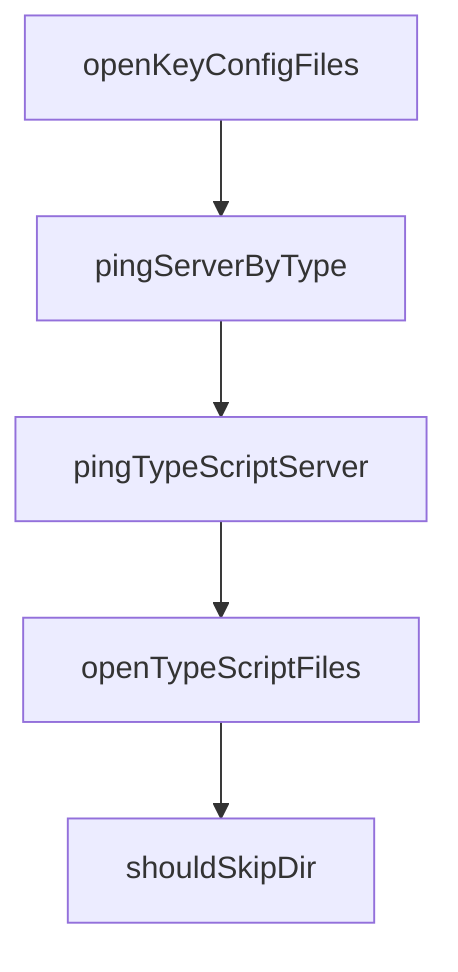

# Chapter 4: Model Providers and Runtime Operations

Welcome to **Chapter 4: Model Providers and Runtime Operations**. In this part of **OpenCode AI Legacy Tutorial: Archived Terminal Agent Workflows and Migration to Crush**, you will build an intuitive mental model first, then move into concrete implementation details and practical production tradeoffs.


This chapter covers model/provider routing and runtime controls in legacy mode.

## Learning Goals

- configure provider credentials and fallback paths
- map model choice to task quality/latency needs
- constrain shell/tool runtime behavior safely
- document environment assumptions for repeatability

## Runtime Considerations

- keep provider keys scoped and rotated
- pin model IDs used in legacy automation
- validate shell config and command safety boundaries

## Source References

- [OpenCode AI README: Environment Variables](https://github.com/opencode-ai/opencode/blob/main/README.md)
- [OpenCode AI README: Supported Models](https://github.com/opencode-ai/opencode/blob/main/README.md)

## Summary

You now have a stable runtime configuration model for legacy operations.

Next: [Chapter 5: Interactive and Non-Interactive Workflows](05-interactive-and-non-interactive-workflows.md)

## Source Code Walkthrough

### `internal/lsp/client.go`

The `openKeyConfigFiles` function in [`internal/lsp/client.go`](https://github.com/opencode-ai/opencode/blob/HEAD/internal/lsp/client.go) handles a key part of this chapter's functionality:

```go
			logging.Debug("TypeScript-like server detected, opening key configuration files")
		}
		c.openKeyConfigFiles(ctx)
	}

	for {
		select {
		case <-ctx.Done():
			c.SetServerState(StateError)
			return fmt.Errorf("timeout waiting for LSP server to be ready")
		case <-ticker.C:
			// Try a ping method appropriate for this server type
			err := c.pingServerByType(ctx, serverType)
			if err == nil {
				// Server responded successfully
				c.SetServerState(StateReady)
				if cnf.DebugLSP {
					logging.Debug("LSP server is ready")
				}
				return nil
			} else {
				logging.Debug("LSP server not ready yet", "error", err, "serverType", serverType)
			}

			if cnf.DebugLSP {
				logging.Debug("LSP server not ready yet", "error", err, "serverType", serverType)
			}
		}
	}
}

// ServerType represents the type of LSP server
```

This function is important because it defines how OpenCode AI Legacy Tutorial: Archived Terminal Agent Workflows and Migration to Crush implements the patterns covered in this chapter.

### `internal/lsp/client.go`

The `pingServerByType` function in [`internal/lsp/client.go`](https://github.com/opencode-ai/opencode/blob/HEAD/internal/lsp/client.go) handles a key part of this chapter's functionality:

```go
		case <-ticker.C:
			// Try a ping method appropriate for this server type
			err := c.pingServerByType(ctx, serverType)
			if err == nil {
				// Server responded successfully
				c.SetServerState(StateReady)
				if cnf.DebugLSP {
					logging.Debug("LSP server is ready")
				}
				return nil
			} else {
				logging.Debug("LSP server not ready yet", "error", err, "serverType", serverType)
			}

			if cnf.DebugLSP {
				logging.Debug("LSP server not ready yet", "error", err, "serverType", serverType)
			}
		}
	}
}

// ServerType represents the type of LSP server
type ServerType int

const (
	ServerTypeUnknown ServerType = iota
	ServerTypeGo
	ServerTypeTypeScript
	ServerTypeRust
	ServerTypePython
	ServerTypeGeneric
)
```

This function is important because it defines how OpenCode AI Legacy Tutorial: Archived Terminal Agent Workflows and Migration to Crush implements the patterns covered in this chapter.

### `internal/lsp/client.go`

The `pingTypeScriptServer` function in [`internal/lsp/client.go`](https://github.com/opencode-ai/opencode/blob/HEAD/internal/lsp/client.go) handles a key part of this chapter's functionality:

```go
	case ServerTypeTypeScript:
		// For TypeScript, try a document symbol request on an open file
		return c.pingTypeScriptServer(ctx)
	case ServerTypeGo:
		// For Go, workspace/symbol works well
		return c.pingWithWorkspaceSymbol(ctx)
	case ServerTypeRust:
		// For Rust, workspace/symbol works well
		return c.pingWithWorkspaceSymbol(ctx)
	default:
		// Default ping method
		return c.pingWithWorkspaceSymbol(ctx)
	}
}

// pingTypeScriptServer tries to ping a TypeScript server with appropriate methods
func (c *Client) pingTypeScriptServer(ctx context.Context) error {
	// First try workspace/symbol which works for many servers
	if err := c.pingWithWorkspaceSymbol(ctx); err == nil {
		return nil
	}

	// If that fails, try to find an open file and request document symbols
	c.openFilesMu.RLock()
	defer c.openFilesMu.RUnlock()

	// If we have any open files, try to get document symbols for one
	for uri := range c.openFiles {
		filePath := strings.TrimPrefix(uri, "file://")
		if strings.HasSuffix(filePath, ".ts") || strings.HasSuffix(filePath, ".js") ||
			strings.HasSuffix(filePath, ".tsx") || strings.HasSuffix(filePath, ".jsx") {
			var symbols []protocol.DocumentSymbol
```

This function is important because it defines how OpenCode AI Legacy Tutorial: Archived Terminal Agent Workflows and Migration to Crush implements the patterns covered in this chapter.

### `internal/lsp/client.go`

The `openTypeScriptFiles` function in [`internal/lsp/client.go`](https://github.com/opencode-ai/opencode/blob/HEAD/internal/lsp/client.go) handles a key part of this chapter's functionality:

```go

		// Also find and open a few TypeScript files to help the server initialize
		c.openTypeScriptFiles(ctx, workDir)
	case ServerTypeGo:
		filesToOpen = []string{
			filepath.Join(workDir, "go.mod"),
			filepath.Join(workDir, "go.sum"),
		}
	case ServerTypeRust:
		filesToOpen = []string{
			filepath.Join(workDir, "Cargo.toml"),
			filepath.Join(workDir, "Cargo.lock"),
		}
	}

	// Try to open each file, ignoring errors if they don't exist
	for _, file := range filesToOpen {
		if _, err := os.Stat(file); err == nil {
			// File exists, try to open it
			if err := c.OpenFile(ctx, file); err != nil {
				logging.Debug("Failed to open key config file", "file", file, "error", err)
			} else {
				logging.Debug("Opened key config file for initialization", "file", file)
			}
		}
	}
}

// pingServerByType sends a ping request appropriate for the server type
func (c *Client) pingServerByType(ctx context.Context, serverType ServerType) error {
	switch serverType {
	case ServerTypeTypeScript:
```

This function is important because it defines how OpenCode AI Legacy Tutorial: Archived Terminal Agent Workflows and Migration to Crush implements the patterns covered in this chapter.


## How These Components Connect


