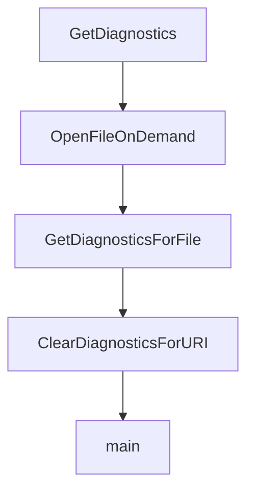

# Chapter 5: Interactive and Non-Interactive Workflows

Welcome to **Chapter 5: Interactive and Non-Interactive Workflows**. In this part of **OpenCode AI Legacy Tutorial: Archived Terminal Agent Workflows and Migration to Crush**, you will build an intuitive mental model first, then move into concrete implementation details and practical production tradeoffs.


This chapter maps operator workflows for both TUI and scripted usage.

## Learning Goals

- run interactive sessions for exploratory tasks
- run prompt-mode automation for scripted tasks
- choose output formats for downstream tooling
- avoid unstable assumptions in unattended runs

## Workflow Patterns

- interactive TUI for high-context iterative sessions
- non-interactive prompt mode for CI/scripting glue
- JSON output mode for structured integrations

## Source References

- [OpenCode AI README: Usage](https://github.com/opencode-ai/opencode/blob/main/README.md)
- [OpenCode AI README: Non-Interactive Prompt Mode](https://github.com/opencode-ai/opencode/blob/main/README.md)

## Summary

You now can operate legacy OpenCode in both manual and scripted workflows.

Next: [Chapter 6: Session, Tooling, and Integration Practices](06-session-tooling-and-integration-practices.md)

## Depth Expansion Playbook

## Source Code Walkthrough

### `internal/lsp/client.go`

The `GetDiagnostics` function in [`internal/lsp/client.go`](https://github.com/opencode-ai/opencode/blob/HEAD/internal/lsp/client.go) handles a key part of this chapter's functionality:

```go
}

// GetDiagnostics returns all diagnostics for all files
func (c *Client) GetDiagnostics() map[protocol.DocumentUri][]protocol.Diagnostic {
	return c.diagnostics
}

// OpenFileOnDemand opens a file only if it's not already open
// This is used for lazy-loading files when they're actually needed
func (c *Client) OpenFileOnDemand(ctx context.Context, filepath string) error {
	// Check if the file is already open
	if c.IsFileOpen(filepath) {
		return nil
	}

	// Open the file
	return c.OpenFile(ctx, filepath)
}

// GetDiagnosticsForFile ensures a file is open and returns its diagnostics
// This is useful for on-demand diagnostics when using lazy loading
func (c *Client) GetDiagnosticsForFile(ctx context.Context, filepath string) ([]protocol.Diagnostic, error) {
	uri := fmt.Sprintf("file://%s", filepath)
	documentUri := protocol.DocumentUri(uri)

	// Make sure the file is open
	if !c.IsFileOpen(filepath) {
		if err := c.OpenFile(ctx, filepath); err != nil {
			return nil, fmt.Errorf("failed to open file for diagnostics: %w", err)
		}

		// Give the LSP server a moment to process the file
```

This function is important because it defines how OpenCode AI Legacy Tutorial: Archived Terminal Agent Workflows and Migration to Crush implements the patterns covered in this chapter.

### `internal/lsp/client.go`

The `OpenFileOnDemand` function in [`internal/lsp/client.go`](https://github.com/opencode-ai/opencode/blob/HEAD/internal/lsp/client.go) handles a key part of this chapter's functionality:

```go
}

// OpenFileOnDemand opens a file only if it's not already open
// This is used for lazy-loading files when they're actually needed
func (c *Client) OpenFileOnDemand(ctx context.Context, filepath string) error {
	// Check if the file is already open
	if c.IsFileOpen(filepath) {
		return nil
	}

	// Open the file
	return c.OpenFile(ctx, filepath)
}

// GetDiagnosticsForFile ensures a file is open and returns its diagnostics
// This is useful for on-demand diagnostics when using lazy loading
func (c *Client) GetDiagnosticsForFile(ctx context.Context, filepath string) ([]protocol.Diagnostic, error) {
	uri := fmt.Sprintf("file://%s", filepath)
	documentUri := protocol.DocumentUri(uri)

	// Make sure the file is open
	if !c.IsFileOpen(filepath) {
		if err := c.OpenFile(ctx, filepath); err != nil {
			return nil, fmt.Errorf("failed to open file for diagnostics: %w", err)
		}

		// Give the LSP server a moment to process the file
		time.Sleep(100 * time.Millisecond)
	}

	// Get diagnostics
	c.diagnosticsMu.RLock()
```

This function is important because it defines how OpenCode AI Legacy Tutorial: Archived Terminal Agent Workflows and Migration to Crush implements the patterns covered in this chapter.

### `internal/lsp/client.go`

The `GetDiagnosticsForFile` function in [`internal/lsp/client.go`](https://github.com/opencode-ai/opencode/blob/HEAD/internal/lsp/client.go) handles a key part of this chapter's functionality:

```go
}

// GetDiagnosticsForFile ensures a file is open and returns its diagnostics
// This is useful for on-demand diagnostics when using lazy loading
func (c *Client) GetDiagnosticsForFile(ctx context.Context, filepath string) ([]protocol.Diagnostic, error) {
	uri := fmt.Sprintf("file://%s", filepath)
	documentUri := protocol.DocumentUri(uri)

	// Make sure the file is open
	if !c.IsFileOpen(filepath) {
		if err := c.OpenFile(ctx, filepath); err != nil {
			return nil, fmt.Errorf("failed to open file for diagnostics: %w", err)
		}

		// Give the LSP server a moment to process the file
		time.Sleep(100 * time.Millisecond)
	}

	// Get diagnostics
	c.diagnosticsMu.RLock()
	diagnostics := c.diagnostics[documentUri]
	c.diagnosticsMu.RUnlock()

	return diagnostics, nil
}

// ClearDiagnosticsForURI removes diagnostics for a specific URI from the cache
func (c *Client) ClearDiagnosticsForURI(uri protocol.DocumentUri) {
	c.diagnosticsMu.Lock()
	defer c.diagnosticsMu.Unlock()
	delete(c.diagnostics, uri)
}
```

This function is important because it defines how OpenCode AI Legacy Tutorial: Archived Terminal Agent Workflows and Migration to Crush implements the patterns covered in this chapter.

### `internal/lsp/client.go`

The `ClearDiagnosticsForURI` function in [`internal/lsp/client.go`](https://github.com/opencode-ai/opencode/blob/HEAD/internal/lsp/client.go) handles a key part of this chapter's functionality:

```go
}

// ClearDiagnosticsForURI removes diagnostics for a specific URI from the cache
func (c *Client) ClearDiagnosticsForURI(uri protocol.DocumentUri) {
	c.diagnosticsMu.Lock()
	defer c.diagnosticsMu.Unlock()
	delete(c.diagnostics, uri)
}

```

This function is important because it defines how OpenCode AI Legacy Tutorial: Archived Terminal Agent Workflows and Migration to Crush implements the patterns covered in this chapter.


## How These Components Connect


