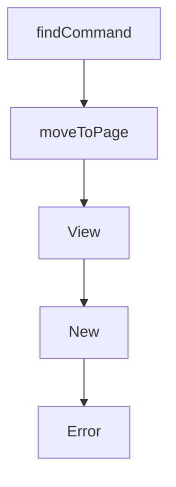

# Chapter 5: Interactive and Non-Interactive Workflows

Welcome to **Chapter 5: Interactive and Non-Interactive Workflows**. In this part of **OpenCode AI Legacy Tutorial: Archived Terminal Agent Workflows and Migration to Crush**, you will build an intuitive mental model first, then move into concrete implementation details and practical production tradeoffs.


This chapter maps operator workflows for both TUI and scripted usage.

## Learning Goals

- run interactive sessions for exploratory tasks
- run prompt-mode automation for scripted tasks
- choose output formats for downstream tooling
- avoid unstable assumptions in unattended runs

## Workflow Patterns

- interactive TUI for high-context iterative sessions
- non-interactive prompt mode for CI/scripting glue
- JSON output mode for structured integrations

## Source References

- [OpenCode AI README: Usage](https://github.com/opencode-ai/opencode/blob/main/README.md)
- [OpenCode AI README: Non-Interactive Prompt Mode](https://github.com/opencode-ai/opencode/blob/main/README.md)

## Summary

You now can operate legacy OpenCode in both manual and scripted workflows.

Next: [Chapter 6: Session, Tooling, and Integration Practices](06-session-tooling-and-integration-practices.md)

## Source Code Walkthrough

### `internal/tui/tui.go`

The `findCommand` function in [`internal/tui/tui.go`](https://github.com/opencode-ai/opencode/blob/HEAD/internal/tui/tui.go) handles a key part of this chapter's functionality:

```go
}

func (a *appModel) findCommand(id string) (dialog.Command, bool) {
	for _, cmd := range a.commands {
		if cmd.ID == id {
			return cmd, true
		}
	}
	return dialog.Command{}, false
}

func (a *appModel) moveToPage(pageID page.PageID) tea.Cmd {
	if a.app.CoderAgent.IsBusy() {
		// For now we don't move to any page if the agent is busy
		return util.ReportWarn("Agent is busy, please wait...")
	}

	var cmds []tea.Cmd
	if _, ok := a.loadedPages[pageID]; !ok {
		cmd := a.pages[pageID].Init()
		cmds = append(cmds, cmd)
		a.loadedPages[pageID] = true
	}
	a.previousPage = a.currentPage
	a.currentPage = pageID
	if sizable, ok := a.pages[a.currentPage].(layout.Sizeable); ok {
		cmd := sizable.SetSize(a.width, a.height)
		cmds = append(cmds, cmd)
	}

	return tea.Batch(cmds...)
}
```

This function is important because it defines how OpenCode AI Legacy Tutorial: Archived Terminal Agent Workflows and Migration to Crush implements the patterns covered in this chapter.

### `internal/tui/tui.go`

The `moveToPage` function in [`internal/tui/tui.go`](https://github.com/opencode-ai/opencode/blob/HEAD/internal/tui/tui.go) handles a key part of this chapter's functionality:

```go

	case page.PageChangeMsg:
		return a, a.moveToPage(msg.ID)

	case dialog.CloseQuitMsg:
		a.showQuit = false
		return a, nil

	case dialog.CloseSessionDialogMsg:
		a.showSessionDialog = false
		return a, nil

	case dialog.CloseCommandDialogMsg:
		a.showCommandDialog = false
		return a, nil

	case startCompactSessionMsg:
		// Start compacting the current session
		a.isCompacting = true
		a.compactingMessage = "Starting summarization..."

		if a.selectedSession.ID == "" {
			a.isCompacting = false
			return a, util.ReportWarn("No active session to summarize")
		}

		// Start the summarization process
		return a, func() tea.Msg {
			ctx := context.Background()
			a.app.CoderAgent.Summarize(ctx, a.selectedSession.ID)
			return nil
		}
```

This function is important because it defines how OpenCode AI Legacy Tutorial: Archived Terminal Agent Workflows and Migration to Crush implements the patterns covered in this chapter.

### `internal/tui/tui.go`

The `View` function in [`internal/tui/tui.go`](https://github.com/opencode-ai/opencode/blob/HEAD/internal/tui/tui.go) handles a key part of this chapter's functionality:

```go
}

func (a appModel) View() string {
	components := []string{
		a.pages[a.currentPage].View(),
	}

	components = append(components, a.status.View())

	appView := lipgloss.JoinVertical(lipgloss.Top, components...)

	if a.showPermissions {
		overlay := a.permissions.View()
		row := lipgloss.Height(appView) / 2
		row -= lipgloss.Height(overlay) / 2
		col := lipgloss.Width(appView) / 2
		col -= lipgloss.Width(overlay) / 2
		appView = layout.PlaceOverlay(
			col,
			row,
			overlay,
			appView,
			true,
		)
	}

	if a.showFilepicker {
		overlay := a.filepicker.View()
		row := lipgloss.Height(appView) / 2
		row -= lipgloss.Height(overlay) / 2
		col := lipgloss.Width(appView) / 2
		col -= lipgloss.Width(overlay) / 2
```

This function is important because it defines how OpenCode AI Legacy Tutorial: Archived Terminal Agent Workflows and Migration to Crush implements the patterns covered in this chapter.

### `internal/tui/tui.go`

The `New` function in [`internal/tui/tui.go`](https://github.com/opencode-ai/opencode/blob/HEAD/internal/tui/tui.go) handles a key part of this chapter's functionality:

```go

var keys = keyMap{
	Logs: key.NewBinding(
		key.WithKeys("ctrl+l"),
		key.WithHelp("ctrl+l", "logs"),
	),

	Quit: key.NewBinding(
		key.WithKeys("ctrl+c"),
		key.WithHelp("ctrl+c", "quit"),
	),
	Help: key.NewBinding(
		key.WithKeys("ctrl+_", "ctrl+h"),
		key.WithHelp("ctrl+?", "toggle help"),
	),

	SwitchSession: key.NewBinding(
		key.WithKeys("ctrl+s"),
		key.WithHelp("ctrl+s", "switch session"),
	),

	Commands: key.NewBinding(
		key.WithKeys("ctrl+k"),
		key.WithHelp("ctrl+k", "commands"),
	),
	Filepicker: key.NewBinding(
		key.WithKeys("ctrl+f"),
		key.WithHelp("ctrl+f", "select files to upload"),
	),
	Models: key.NewBinding(
		key.WithKeys("ctrl+o"),
		key.WithHelp("ctrl+o", "model selection"),
```

This function is important because it defines how OpenCode AI Legacy Tutorial: Archived Terminal Agent Workflows and Migration to Crush implements the patterns covered in this chapter.


## How These Components Connect


