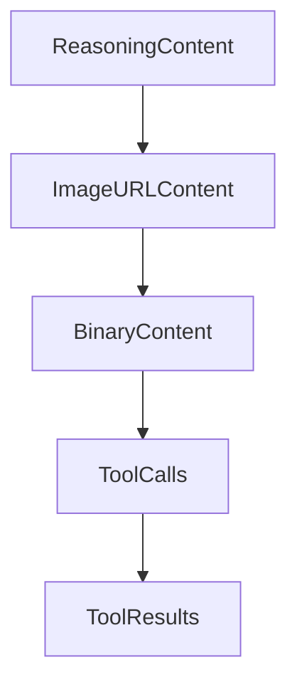

# Chapter 6: Session, Tooling, and Integration Practices

Welcome to **Chapter 6: Session, Tooling, and Integration Practices**. In this part of **OpenCode AI Legacy Tutorial: Archived Terminal Agent Workflows and Migration to Crush**, you will build an intuitive mental model first, then move into concrete implementation details and practical production tradeoffs.


This chapter explains session continuity and integration hygiene in legacy systems.

## Learning Goals

- manage session persistence and compaction behavior
- configure MCP and LSP integrations conservatively
- avoid tool sprawl in archived environments
- maintain clear audit trails for legacy runs

## Integration Guidance

- keep MCP server list minimal and trusted
- document LSP dependencies explicitly
- monitor compaction effects on long-running sessions

## Source References

- [OpenCode AI README: Auto Compact](https://github.com/opencode-ai/opencode/blob/main/README.md)
- [OpenCode AI README: MCP/LSP Config Sections](https://github.com/opencode-ai/opencode/blob/main/README.md)

## Summary

You now have stable session and integration practices for controlled legacy operation.

Next: [Chapter 7: Migration to Crush and Modern Alternatives](07-migration-to-crush-and-modern-alternatives.md)

## Source Code Walkthrough

### `internal/message/content.go`

The `ReasoningContent` function in [`internal/message/content.go`](https://github.com/opencode-ai/opencode/blob/HEAD/internal/message/content.go) handles a key part of this chapter's functionality:

```go
}

type ReasoningContent struct {
	Thinking string `json:"thinking"`
}

func (tc ReasoningContent) String() string {
	return tc.Thinking
}
func (ReasoningContent) isPart() {}

type TextContent struct {
	Text string `json:"text"`
}

func (tc TextContent) String() string {
	return tc.Text
}

func (TextContent) isPart() {}

type ImageURLContent struct {
	URL    string `json:"url"`
	Detail string `json:"detail,omitempty"`
}

func (iuc ImageURLContent) String() string {
	return iuc.URL
}

func (ImageURLContent) isPart() {}

```

This function is important because it defines how OpenCode AI Legacy Tutorial: Archived Terminal Agent Workflows and Migration to Crush implements the patterns covered in this chapter.

### `internal/message/content.go`

The `ImageURLContent` function in [`internal/message/content.go`](https://github.com/opencode-ai/opencode/blob/HEAD/internal/message/content.go) handles a key part of this chapter's functionality:

```go
func (TextContent) isPart() {}

type ImageURLContent struct {
	URL    string `json:"url"`
	Detail string `json:"detail,omitempty"`
}

func (iuc ImageURLContent) String() string {
	return iuc.URL
}

func (ImageURLContent) isPart() {}

type BinaryContent struct {
	Path     string
	MIMEType string
	Data     []byte
}

func (bc BinaryContent) String(provider models.ModelProvider) string {
	base64Encoded := base64.StdEncoding.EncodeToString(bc.Data)
	if provider == models.ProviderOpenAI {
		return "data:" + bc.MIMEType + ";base64," + base64Encoded
	}
	return base64Encoded
}

func (BinaryContent) isPart() {}

type ToolCall struct {
	ID       string `json:"id"`
	Name     string `json:"name"`
```

This function is important because it defines how OpenCode AI Legacy Tutorial: Archived Terminal Agent Workflows and Migration to Crush implements the patterns covered in this chapter.

### `internal/message/content.go`

The `BinaryContent` function in [`internal/message/content.go`](https://github.com/opencode-ai/opencode/blob/HEAD/internal/message/content.go) handles a key part of this chapter's functionality:

```go
func (ImageURLContent) isPart() {}

type BinaryContent struct {
	Path     string
	MIMEType string
	Data     []byte
}

func (bc BinaryContent) String(provider models.ModelProvider) string {
	base64Encoded := base64.StdEncoding.EncodeToString(bc.Data)
	if provider == models.ProviderOpenAI {
		return "data:" + bc.MIMEType + ";base64," + base64Encoded
	}
	return base64Encoded
}

func (BinaryContent) isPart() {}

type ToolCall struct {
	ID       string `json:"id"`
	Name     string `json:"name"`
	Input    string `json:"input"`
	Type     string `json:"type"`
	Finished bool   `json:"finished"`
}

func (ToolCall) isPart() {}

type ToolResult struct {
	ToolCallID string `json:"tool_call_id"`
	Name       string `json:"name"`
	Content    string `json:"content"`
```

This function is important because it defines how OpenCode AI Legacy Tutorial: Archived Terminal Agent Workflows and Migration to Crush implements the patterns covered in this chapter.

### `internal/message/content.go`

The `ToolCalls` function in [`internal/message/content.go`](https://github.com/opencode-ai/opencode/blob/HEAD/internal/message/content.go) handles a key part of this chapter's functionality:

```go
}

func (m *Message) ToolCalls() []ToolCall {
	toolCalls := make([]ToolCall, 0)
	for _, part := range m.Parts {
		if c, ok := part.(ToolCall); ok {
			toolCalls = append(toolCalls, c)
		}
	}
	return toolCalls
}

func (m *Message) ToolResults() []ToolResult {
	toolResults := make([]ToolResult, 0)
	for _, part := range m.Parts {
		if c, ok := part.(ToolResult); ok {
			toolResults = append(toolResults, c)
		}
	}
	return toolResults
}

func (m *Message) IsFinished() bool {
	for _, part := range m.Parts {
		if _, ok := part.(Finish); ok {
			return true
		}
	}
	return false
}

func (m *Message) FinishPart() *Finish {
```

This function is important because it defines how OpenCode AI Legacy Tutorial: Archived Terminal Agent Workflows and Migration to Crush implements the patterns covered in this chapter.


## How These Components Connect


