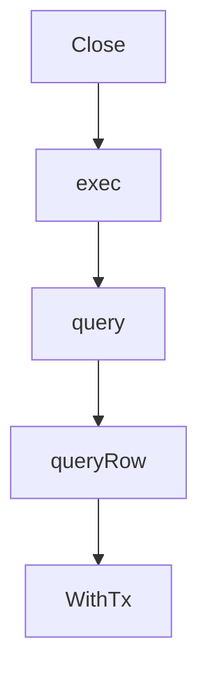

# Chapter 6: Session, Tooling, and Integration Practices

Welcome to **Chapter 6: Session, Tooling, and Integration Practices**. In this part of **OpenCode AI Legacy Tutorial: Archived Terminal Agent Workflows and Migration to Crush**, you will build an intuitive mental model first, then move into concrete implementation details and practical production tradeoffs.


This chapter explains session continuity and integration hygiene in legacy systems.

## Learning Goals

- manage session persistence and compaction behavior
- configure MCP and LSP integrations conservatively
- avoid tool sprawl in archived environments
- maintain clear audit trails for legacy runs

## Integration Guidance

- keep MCP server list minimal and trusted
- document LSP dependencies explicitly
- monitor compaction effects on long-running sessions

## Source References

- [OpenCode AI README: Auto Compact](https://github.com/opencode-ai/opencode/blob/main/README.md)
- [OpenCode AI README: MCP/LSP Config Sections](https://github.com/opencode-ai/opencode/blob/main/README.md)

## Summary

You now have stable session and integration practices for controlled legacy operation.

Next: [Chapter 7: Migration to Crush and Modern Alternatives](07-migration-to-crush-and-modern-alternatives.md)

## Depth Expansion Playbook

## Source Code Walkthrough

### `internal/db/db.go`

The `Close` function in [`internal/db/db.go`](https://github.com/opencode-ai/opencode/blob/HEAD/internal/db/db.go) handles a key part of this chapter's functionality:

```go
}

func (q *Queries) Close() error {
	var err error
	if q.createFileStmt != nil {
		if cerr := q.createFileStmt.Close(); cerr != nil {
			err = fmt.Errorf("error closing createFileStmt: %w", cerr)
		}
	}
	if q.createMessageStmt != nil {
		if cerr := q.createMessageStmt.Close(); cerr != nil {
			err = fmt.Errorf("error closing createMessageStmt: %w", cerr)
		}
	}
	if q.createSessionStmt != nil {
		if cerr := q.createSessionStmt.Close(); cerr != nil {
			err = fmt.Errorf("error closing createSessionStmt: %w", cerr)
		}
	}
	if q.deleteFileStmt != nil {
		if cerr := q.deleteFileStmt.Close(); cerr != nil {
			err = fmt.Errorf("error closing deleteFileStmt: %w", cerr)
		}
	}
	if q.deleteMessageStmt != nil {
		if cerr := q.deleteMessageStmt.Close(); cerr != nil {
			err = fmt.Errorf("error closing deleteMessageStmt: %w", cerr)
		}
	}
	if q.deleteSessionStmt != nil {
		if cerr := q.deleteSessionStmt.Close(); cerr != nil {
			err = fmt.Errorf("error closing deleteSessionStmt: %w", cerr)
```

This function is important because it defines how OpenCode AI Legacy Tutorial: Archived Terminal Agent Workflows and Migration to Crush implements the patterns covered in this chapter.

### `internal/db/db.go`

The `exec` function in [`internal/db/db.go`](https://github.com/opencode-ai/opencode/blob/HEAD/internal/db/db.go) handles a key part of this chapter's functionality:

```go
}

func (q *Queries) exec(ctx context.Context, stmt *sql.Stmt, query string, args ...interface{}) (sql.Result, error) {
	switch {
	case stmt != nil && q.tx != nil:
		return q.tx.StmtContext(ctx, stmt).ExecContext(ctx, args...)
	case stmt != nil:
		return stmt.ExecContext(ctx, args...)
	default:
		return q.db.ExecContext(ctx, query, args...)
	}
}

func (q *Queries) query(ctx context.Context, stmt *sql.Stmt, query string, args ...interface{}) (*sql.Rows, error) {
	switch {
	case stmt != nil && q.tx != nil:
		return q.tx.StmtContext(ctx, stmt).QueryContext(ctx, args...)
	case stmt != nil:
		return stmt.QueryContext(ctx, args...)
	default:
		return q.db.QueryContext(ctx, query, args...)
	}
}

func (q *Queries) queryRow(ctx context.Context, stmt *sql.Stmt, query string, args ...interface{}) *sql.Row {
	switch {
	case stmt != nil && q.tx != nil:
		return q.tx.StmtContext(ctx, stmt).QueryRowContext(ctx, args...)
	case stmt != nil:
		return stmt.QueryRowContext(ctx, args...)
	default:
		return q.db.QueryRowContext(ctx, query, args...)
```

This function is important because it defines how OpenCode AI Legacy Tutorial: Archived Terminal Agent Workflows and Migration to Crush implements the patterns covered in this chapter.

### `internal/db/db.go`

The `query` function in [`internal/db/db.go`](https://github.com/opencode-ai/opencode/blob/HEAD/internal/db/db.go) handles a key part of this chapter's functionality:

```go
	var err error
	if q.createFileStmt, err = db.PrepareContext(ctx, createFile); err != nil {
		return nil, fmt.Errorf("error preparing query CreateFile: %w", err)
	}
	if q.createMessageStmt, err = db.PrepareContext(ctx, createMessage); err != nil {
		return nil, fmt.Errorf("error preparing query CreateMessage: %w", err)
	}
	if q.createSessionStmt, err = db.PrepareContext(ctx, createSession); err != nil {
		return nil, fmt.Errorf("error preparing query CreateSession: %w", err)
	}
	if q.deleteFileStmt, err = db.PrepareContext(ctx, deleteFile); err != nil {
		return nil, fmt.Errorf("error preparing query DeleteFile: %w", err)
	}
	if q.deleteMessageStmt, err = db.PrepareContext(ctx, deleteMessage); err != nil {
		return nil, fmt.Errorf("error preparing query DeleteMessage: %w", err)
	}
	if q.deleteSessionStmt, err = db.PrepareContext(ctx, deleteSession); err != nil {
		return nil, fmt.Errorf("error preparing query DeleteSession: %w", err)
	}
	if q.deleteSessionFilesStmt, err = db.PrepareContext(ctx, deleteSessionFiles); err != nil {
		return nil, fmt.Errorf("error preparing query DeleteSessionFiles: %w", err)
	}
	if q.deleteSessionMessagesStmt, err = db.PrepareContext(ctx, deleteSessionMessages); err != nil {
		return nil, fmt.Errorf("error preparing query DeleteSessionMessages: %w", err)
	}
	if q.getFileStmt, err = db.PrepareContext(ctx, getFile); err != nil {
		return nil, fmt.Errorf("error preparing query GetFile: %w", err)
	}
	if q.getFileByPathAndSessionStmt, err = db.PrepareContext(ctx, getFileByPathAndSession); err != nil {
		return nil, fmt.Errorf("error preparing query GetFileByPathAndSession: %w", err)
	}
	if q.getMessageStmt, err = db.PrepareContext(ctx, getMessage); err != nil {
```

This function is important because it defines how OpenCode AI Legacy Tutorial: Archived Terminal Agent Workflows and Migration to Crush implements the patterns covered in this chapter.

### `internal/db/db.go`

The `queryRow` function in [`internal/db/db.go`](https://github.com/opencode-ai/opencode/blob/HEAD/internal/db/db.go) handles a key part of this chapter's functionality:

```go
}

func (q *Queries) queryRow(ctx context.Context, stmt *sql.Stmt, query string, args ...interface{}) *sql.Row {
	switch {
	case stmt != nil && q.tx != nil:
		return q.tx.StmtContext(ctx, stmt).QueryRowContext(ctx, args...)
	case stmt != nil:
		return stmt.QueryRowContext(ctx, args...)
	default:
		return q.db.QueryRowContext(ctx, query, args...)
	}
}

type Queries struct {
	db                          DBTX
	tx                          *sql.Tx
	createFileStmt              *sql.Stmt
	createMessageStmt           *sql.Stmt
	createSessionStmt           *sql.Stmt
	deleteFileStmt              *sql.Stmt
	deleteMessageStmt           *sql.Stmt
	deleteSessionStmt           *sql.Stmt
	deleteSessionFilesStmt      *sql.Stmt
	deleteSessionMessagesStmt   *sql.Stmt
	getFileStmt                 *sql.Stmt
	getFileByPathAndSessionStmt *sql.Stmt
	getMessageStmt              *sql.Stmt
	getSessionByIDStmt          *sql.Stmt
	listFilesByPathStmt         *sql.Stmt
	listFilesBySessionStmt      *sql.Stmt
	listLatestSessionFilesStmt  *sql.Stmt
	listMessagesBySessionStmt   *sql.Stmt
```

This function is important because it defines how OpenCode AI Legacy Tutorial: Archived Terminal Agent Workflows and Migration to Crush implements the patterns covered in this chapter.


## How These Components Connect


