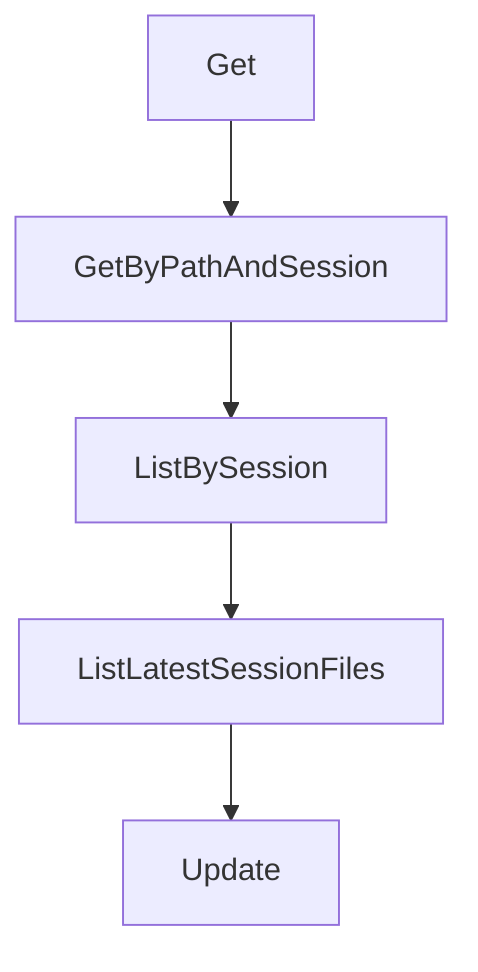

# Chapter 7: Migration to Crush and Modern Alternatives

Welcome to **Chapter 7: Migration to Crush and Modern Alternatives**. In this part of **OpenCode AI Legacy Tutorial: Archived Terminal Agent Workflows and Migration to Crush**, you will build an intuitive mental model first, then move into concrete implementation details and practical production tradeoffs.


This chapter provides a migration framework from archived OpenCode AI to maintained tools.

## Learning Goals

- map feature parity and gaps between legacy and successor
- define migration phases and rollback plans
- preserve critical workflows during transition
- reduce risk from long-lived legacy dependencies

## Migration Template

1. inventory current legacy workflows and dependencies
2. pilot equivalent flows in Crush
3. run dual-track validation with acceptance criteria
4. cut over incrementally and freeze legacy surface

## Source References

- [OpenCode AI Archive Notice](https://github.com/opencode-ai/opencode/blob/main/README.md)
- [Crush Repository](https://github.com/charmbracelet/crush)
- [Crush Tutorial in This Repo](../crush-tutorial/)

## Summary

You now have a practical migration path away from archived OpenCode AI infrastructure.

Next: [Chapter 8: Legacy Governance and Controlled Sunset](08-legacy-governance-and-controlled-sunset.md)

## Source Code Walkthrough

### `internal/history/file.go`

The `Get` function in [`internal/history/file.go`](https://github.com/opencode-ai/opencode/blob/HEAD/internal/history/file.go) handles a key part of this chapter's functionality:

```go
	Create(ctx context.Context, sessionID, path, content string) (File, error)
	CreateVersion(ctx context.Context, sessionID, path, content string) (File, error)
	Get(ctx context.Context, id string) (File, error)
	GetByPathAndSession(ctx context.Context, path, sessionID string) (File, error)
	ListBySession(ctx context.Context, sessionID string) ([]File, error)
	ListLatestSessionFiles(ctx context.Context, sessionID string) ([]File, error)
	Update(ctx context.Context, file File) (File, error)
	Delete(ctx context.Context, id string) error
	DeleteSessionFiles(ctx context.Context, sessionID string) error
}

type service struct {
	*pubsub.Broker[File]
	db *sql.DB
	q  *db.Queries
}

func NewService(q *db.Queries, db *sql.DB) Service {
	return &service{
		Broker: pubsub.NewBroker[File](),
		q:      q,
		db:     db,
	}
}

func (s *service) Create(ctx context.Context, sessionID, path, content string) (File, error) {
	return s.createWithVersion(ctx, sessionID, path, content, InitialVersion)
}

func (s *service) CreateVersion(ctx context.Context, sessionID, path, content string) (File, error) {
	// Get the latest version for this path
	files, err := s.q.ListFilesByPath(ctx, path)
```

This function is important because it defines how OpenCode AI Legacy Tutorial: Archived Terminal Agent Workflows and Migration to Crush implements the patterns covered in this chapter.

### `internal/history/file.go`

The `GetByPathAndSession` function in [`internal/history/file.go`](https://github.com/opencode-ai/opencode/blob/HEAD/internal/history/file.go) handles a key part of this chapter's functionality:

```go
	CreateVersion(ctx context.Context, sessionID, path, content string) (File, error)
	Get(ctx context.Context, id string) (File, error)
	GetByPathAndSession(ctx context.Context, path, sessionID string) (File, error)
	ListBySession(ctx context.Context, sessionID string) ([]File, error)
	ListLatestSessionFiles(ctx context.Context, sessionID string) ([]File, error)
	Update(ctx context.Context, file File) (File, error)
	Delete(ctx context.Context, id string) error
	DeleteSessionFiles(ctx context.Context, sessionID string) error
}

type service struct {
	*pubsub.Broker[File]
	db *sql.DB
	q  *db.Queries
}

func NewService(q *db.Queries, db *sql.DB) Service {
	return &service{
		Broker: pubsub.NewBroker[File](),
		q:      q,
		db:     db,
	}
}

func (s *service) Create(ctx context.Context, sessionID, path, content string) (File, error) {
	return s.createWithVersion(ctx, sessionID, path, content, InitialVersion)
}

func (s *service) CreateVersion(ctx context.Context, sessionID, path, content string) (File, error) {
	// Get the latest version for this path
	files, err := s.q.ListFilesByPath(ctx, path)
	if err != nil {
```

This function is important because it defines how OpenCode AI Legacy Tutorial: Archived Terminal Agent Workflows and Migration to Crush implements the patterns covered in this chapter.

### `internal/history/file.go`

The `ListBySession` function in [`internal/history/file.go`](https://github.com/opencode-ai/opencode/blob/HEAD/internal/history/file.go) handles a key part of this chapter's functionality:

```go
	Get(ctx context.Context, id string) (File, error)
	GetByPathAndSession(ctx context.Context, path, sessionID string) (File, error)
	ListBySession(ctx context.Context, sessionID string) ([]File, error)
	ListLatestSessionFiles(ctx context.Context, sessionID string) ([]File, error)
	Update(ctx context.Context, file File) (File, error)
	Delete(ctx context.Context, id string) error
	DeleteSessionFiles(ctx context.Context, sessionID string) error
}

type service struct {
	*pubsub.Broker[File]
	db *sql.DB
	q  *db.Queries
}

func NewService(q *db.Queries, db *sql.DB) Service {
	return &service{
		Broker: pubsub.NewBroker[File](),
		q:      q,
		db:     db,
	}
}

func (s *service) Create(ctx context.Context, sessionID, path, content string) (File, error) {
	return s.createWithVersion(ctx, sessionID, path, content, InitialVersion)
}

func (s *service) CreateVersion(ctx context.Context, sessionID, path, content string) (File, error) {
	// Get the latest version for this path
	files, err := s.q.ListFilesByPath(ctx, path)
	if err != nil {
		return File{}, err
```

This function is important because it defines how OpenCode AI Legacy Tutorial: Archived Terminal Agent Workflows and Migration to Crush implements the patterns covered in this chapter.

### `internal/history/file.go`

The `ListLatestSessionFiles` function in [`internal/history/file.go`](https://github.com/opencode-ai/opencode/blob/HEAD/internal/history/file.go) handles a key part of this chapter's functionality:

```go
	GetByPathAndSession(ctx context.Context, path, sessionID string) (File, error)
	ListBySession(ctx context.Context, sessionID string) ([]File, error)
	ListLatestSessionFiles(ctx context.Context, sessionID string) ([]File, error)
	Update(ctx context.Context, file File) (File, error)
	Delete(ctx context.Context, id string) error
	DeleteSessionFiles(ctx context.Context, sessionID string) error
}

type service struct {
	*pubsub.Broker[File]
	db *sql.DB
	q  *db.Queries
}

func NewService(q *db.Queries, db *sql.DB) Service {
	return &service{
		Broker: pubsub.NewBroker[File](),
		q:      q,
		db:     db,
	}
}

func (s *service) Create(ctx context.Context, sessionID, path, content string) (File, error) {
	return s.createWithVersion(ctx, sessionID, path, content, InitialVersion)
}

func (s *service) CreateVersion(ctx context.Context, sessionID, path, content string) (File, error) {
	// Get the latest version for this path
	files, err := s.q.ListFilesByPath(ctx, path)
	if err != nil {
		return File{}, err
	}
```

This function is important because it defines how OpenCode AI Legacy Tutorial: Archived Terminal Agent Workflows and Migration to Crush implements the patterns covered in this chapter.


## How These Components Connect


