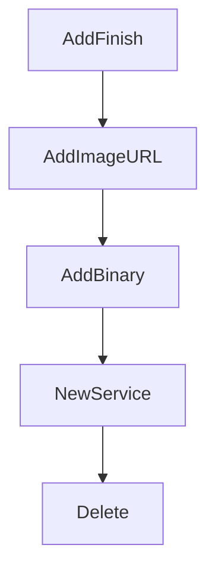

# Chapter 7: Migration to Crush and Modern Alternatives

Welcome to **Chapter 7: Migration to Crush and Modern Alternatives**. In this part of **OpenCode AI Legacy Tutorial: Archived Terminal Agent Workflows and Migration to Crush**, you will build an intuitive mental model first, then move into concrete implementation details and practical production tradeoffs.


This chapter provides a migration framework from archived OpenCode AI to maintained tools.

## Learning Goals

- map feature parity and gaps between legacy and successor
- define migration phases and rollback plans
- preserve critical workflows during transition
- reduce risk from long-lived legacy dependencies

## Migration Template

1. inventory current legacy workflows and dependencies
2. pilot equivalent flows in Crush
3. run dual-track validation with acceptance criteria
4. cut over incrementally and freeze legacy surface

## Source References

- [OpenCode AI Archive Notice](https://github.com/opencode-ai/opencode/blob/main/README.md)
- [Crush Repository](https://github.com/charmbracelet/crush)
- [Crush Tutorial in This Repo](../crush-tutorial/)

## Summary

You now have a practical migration path away from archived OpenCode AI infrastructure.

Next: [Chapter 8: Legacy Governance and Controlled Sunset](08-legacy-governance-and-controlled-sunset.md)

## Depth Expansion Playbook

## Source Code Walkthrough

### `internal/message/content.go`

The `AddFinish` function in [`internal/message/content.go`](https://github.com/opencode-ai/opencode/blob/HEAD/internal/message/content.go) handles a key part of this chapter's functionality:

```go
}

func (m *Message) AddFinish(reason FinishReason) {
	// remove any existing finish part
	for i, part := range m.Parts {
		if _, ok := part.(Finish); ok {
			m.Parts = slices.Delete(m.Parts, i, i+1)
			break
		}
	}
	m.Parts = append(m.Parts, Finish{Reason: reason, Time: time.Now().Unix()})
}

func (m *Message) AddImageURL(url, detail string) {
	m.Parts = append(m.Parts, ImageURLContent{URL: url, Detail: detail})
}

func (m *Message) AddBinary(mimeType string, data []byte) {
	m.Parts = append(m.Parts, BinaryContent{MIMEType: mimeType, Data: data})
}

```

This function is important because it defines how OpenCode AI Legacy Tutorial: Archived Terminal Agent Workflows and Migration to Crush implements the patterns covered in this chapter.

### `internal/message/content.go`

The `AddImageURL` function in [`internal/message/content.go`](https://github.com/opencode-ai/opencode/blob/HEAD/internal/message/content.go) handles a key part of this chapter's functionality:

```go
}

func (m *Message) AddImageURL(url, detail string) {
	m.Parts = append(m.Parts, ImageURLContent{URL: url, Detail: detail})
}

func (m *Message) AddBinary(mimeType string, data []byte) {
	m.Parts = append(m.Parts, BinaryContent{MIMEType: mimeType, Data: data})
}

```

This function is important because it defines how OpenCode AI Legacy Tutorial: Archived Terminal Agent Workflows and Migration to Crush implements the patterns covered in this chapter.

### `internal/message/content.go`

The `AddBinary` function in [`internal/message/content.go`](https://github.com/opencode-ai/opencode/blob/HEAD/internal/message/content.go) handles a key part of this chapter's functionality:

```go
}

func (m *Message) AddBinary(mimeType string, data []byte) {
	m.Parts = append(m.Parts, BinaryContent{MIMEType: mimeType, Data: data})
}

```

This function is important because it defines how OpenCode AI Legacy Tutorial: Archived Terminal Agent Workflows and Migration to Crush implements the patterns covered in this chapter.

### `internal/message/message.go`

The `NewService` function in [`internal/message/message.go`](https://github.com/opencode-ai/opencode/blob/HEAD/internal/message/message.go) handles a key part of this chapter's functionality:

```go
}

func NewService(q db.Querier) Service {
	return &service{
		Broker: pubsub.NewBroker[Message](),
		q:      q,
	}
}

func (s *service) Delete(ctx context.Context, id string) error {
	message, err := s.Get(ctx, id)
	if err != nil {
		return err
	}
	err = s.q.DeleteMessage(ctx, message.ID)
	if err != nil {
		return err
	}
	s.Publish(pubsub.DeletedEvent, message)
	return nil
}

func (s *service) Create(ctx context.Context, sessionID string, params CreateMessageParams) (Message, error) {
	if params.Role != Assistant {
		params.Parts = append(params.Parts, Finish{
			Reason: "stop",
		})
	}
	partsJSON, err := marshallParts(params.Parts)
	if err != nil {
		return Message{}, err
	}
```

This function is important because it defines how OpenCode AI Legacy Tutorial: Archived Terminal Agent Workflows and Migration to Crush implements the patterns covered in this chapter.


## How These Components Connect


