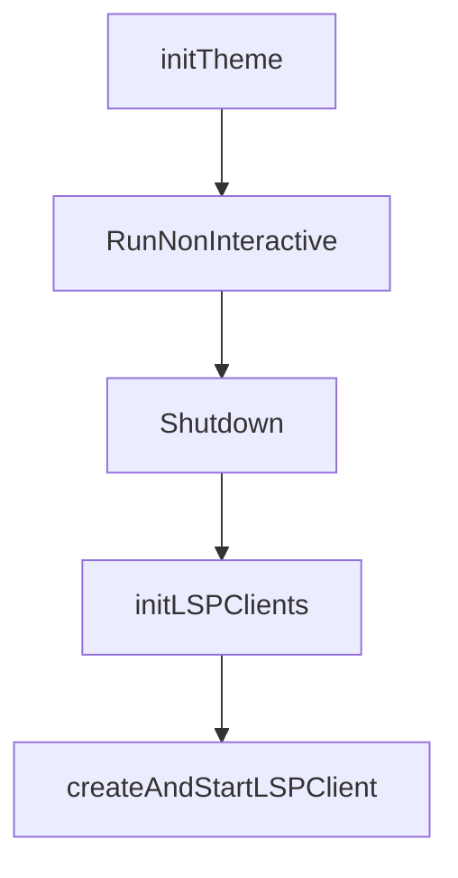

# Chapter 8: Legacy Governance and Controlled Sunset

Welcome to **Chapter 8: Legacy Governance and Controlled Sunset**. In this part of **OpenCode AI Legacy Tutorial: Archived Terminal Agent Workflows and Migration to Crush**, you will build an intuitive mental model first, then move into concrete implementation details and practical production tradeoffs.


This chapter covers governance patterns for responsibly retiring legacy agent stacks.

## Learning Goals

- enforce ownership and review gates for legacy usage
- define sunset milestones and deadlines
- monitor residual risk until full decommission
- preserve historical context for auditability

## Sunset Checklist

- freeze feature work on legacy stack
- allow only security/critical fixes
- migrate all automated pipelines first
- decommission runtime keys and infra after cutover

## Source References

- [OpenCode AI Repository](https://github.com/opencode-ai/opencode)
- [OpenCode AI Releases](https://github.com/opencode-ai/opencode/releases)
- [Crush Successor Repository](https://github.com/charmbracelet/crush)

## Summary

You now have a full legacy-to-sunset runbook for archived terminal coding-agent infrastructure.

Next tutorial: [AGENTS.md Tutorial](../agents-md-tutorial/)

## Depth Expansion Playbook

## Source Code Walkthrough

### `internal/app/app.go`

The `initTheme` function in [`internal/app/app.go`](https://github.com/opencode-ai/opencode/blob/HEAD/internal/app/app.go) handles a key part of this chapter's functionality:

```go

	// Initialize theme based on configuration
	app.initTheme()

	// Initialize LSP clients in the background
	go app.initLSPClients(ctx)

	var err error
	app.CoderAgent, err = agent.NewAgent(
		config.AgentCoder,
		app.Sessions,
		app.Messages,
		agent.CoderAgentTools(
			app.Permissions,
			app.Sessions,
			app.Messages,
			app.History,
			app.LSPClients,
		),
	)
	if err != nil {
		logging.Error("Failed to create coder agent", err)
		return nil, err
	}

	return app, nil
}

// initTheme sets the application theme based on the configuration
func (app *App) initTheme() {
	cfg := config.Get()
	if cfg == nil || cfg.TUI.Theme == "" {
```

This function is important because it defines how OpenCode AI Legacy Tutorial: Archived Terminal Agent Workflows and Migration to Crush implements the patterns covered in this chapter.

### `internal/app/app.go`

The `RunNonInteractive` function in [`internal/app/app.go`](https://github.com/opencode-ai/opencode/blob/HEAD/internal/app/app.go) handles a key part of this chapter's functionality:

```go
}

// RunNonInteractive handles the execution flow when a prompt is provided via CLI flag.
func (a *App) RunNonInteractive(ctx context.Context, prompt string, outputFormat string, quiet bool) error {
	logging.Info("Running in non-interactive mode")

	// Start spinner if not in quiet mode
	var spinner *format.Spinner
	if !quiet {
		spinner = format.NewSpinner("Thinking...")
		spinner.Start()
		defer spinner.Stop()
	}

	const maxPromptLengthForTitle = 100
	titlePrefix := "Non-interactive: "
	var titleSuffix string

	if len(prompt) > maxPromptLengthForTitle {
		titleSuffix = prompt[:maxPromptLengthForTitle] + "..."
	} else {
		titleSuffix = prompt
	}
	title := titlePrefix + titleSuffix

	sess, err := a.Sessions.Create(ctx, title)
	if err != nil {
		return fmt.Errorf("failed to create session for non-interactive mode: %w", err)
	}
	logging.Info("Created session for non-interactive run", "session_id", sess.ID)

	// Automatically approve all permission requests for this non-interactive session
```

This function is important because it defines how OpenCode AI Legacy Tutorial: Archived Terminal Agent Workflows and Migration to Crush implements the patterns covered in this chapter.

### `internal/app/app.go`

The `Shutdown` function in [`internal/app/app.go`](https://github.com/opencode-ai/opencode/blob/HEAD/internal/app/app.go) handles a key part of this chapter's functionality:

```go
}

// Shutdown performs a clean shutdown of the application
func (app *App) Shutdown() {
	// Cancel all watcher goroutines
	app.cancelFuncsMutex.Lock()
	for _, cancel := range app.watcherCancelFuncs {
		cancel()
	}
	app.cancelFuncsMutex.Unlock()
	app.watcherWG.Wait()

	// Perform additional cleanup for LSP clients
	app.clientsMutex.RLock()
	clients := make(map[string]*lsp.Client, len(app.LSPClients))
	maps.Copy(clients, app.LSPClients)
	app.clientsMutex.RUnlock()

	for name, client := range clients {
		shutdownCtx, cancel := context.WithTimeout(context.Background(), 5*time.Second)
		if err := client.Shutdown(shutdownCtx); err != nil {
			logging.Error("Failed to shutdown LSP client", "name", name, "error", err)
		}
		cancel()
	}
}

```

This function is important because it defines how OpenCode AI Legacy Tutorial: Archived Terminal Agent Workflows and Migration to Crush implements the patterns covered in this chapter.

### `internal/app/lsp.go`

The `initLSPClients` function in [`internal/app/lsp.go`](https://github.com/opencode-ai/opencode/blob/HEAD/internal/app/lsp.go) handles a key part of this chapter's functionality:

```go
)

func (app *App) initLSPClients(ctx context.Context) {
	cfg := config.Get()

	// Initialize LSP clients
	for name, clientConfig := range cfg.LSP {
		// Start each client initialization in its own goroutine
		go app.createAndStartLSPClient(ctx, name, clientConfig.Command, clientConfig.Args...)
	}
	logging.Info("LSP clients initialization started in background")
}

// createAndStartLSPClient creates a new LSP client, initializes it, and starts its workspace watcher
func (app *App) createAndStartLSPClient(ctx context.Context, name string, command string, args ...string) {
	// Create a specific context for initialization with a timeout
	logging.Info("Creating LSP client", "name", name, "command", command, "args", args)
	
	// Create the LSP client
	lspClient, err := lsp.NewClient(ctx, command, args...)
	if err != nil {
		logging.Error("Failed to create LSP client for", name, err)
		return
	}

	// Create a longer timeout for initialization (some servers take time to start)
	initCtx, cancel := context.WithTimeout(ctx, 30*time.Second)
	defer cancel()
	
	// Initialize with the initialization context
	_, err = lspClient.InitializeLSPClient(initCtx, config.WorkingDirectory())
	if err != nil {
```

This function is important because it defines how OpenCode AI Legacy Tutorial: Archived Terminal Agent Workflows and Migration to Crush implements the patterns covered in this chapter.


## How These Components Connect


