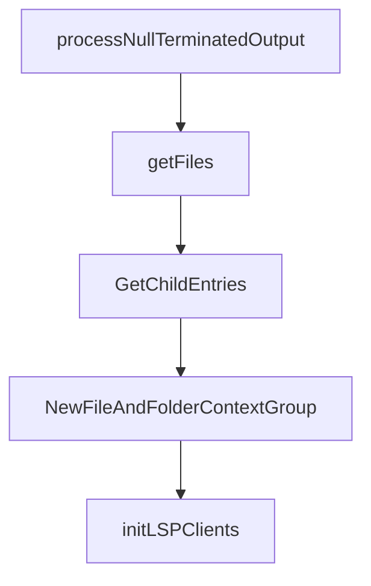

# Chapter 8: Legacy Governance and Controlled Sunset

Welcome to **Chapter 8: Legacy Governance and Controlled Sunset**. In this part of **OpenCode AI Legacy Tutorial: Archived Terminal Agent Workflows and Migration to Crush**, you will build an intuitive mental model first, then move into concrete implementation details and practical production tradeoffs.


This chapter covers governance patterns for responsibly retiring legacy agent stacks.

## Learning Goals

- enforce ownership and review gates for legacy usage
- define sunset milestones and deadlines
- monitor residual risk until full decommission
- preserve historical context for auditability

## Sunset Checklist

- freeze feature work on legacy stack
- allow only security/critical fixes
- migrate all automated pipelines first
- decommission runtime keys and infra after cutover

## Source References

- [OpenCode AI Repository](https://github.com/opencode-ai/opencode)
- [OpenCode AI Releases](https://github.com/opencode-ai/opencode/releases)
- [Crush Successor Repository](https://github.com/charmbracelet/crush)

## Summary

You now have a full legacy-to-sunset runbook for archived terminal coding-agent infrastructure.

Next tutorial: [AGENTS.md Tutorial](../agents-md-tutorial/)

## Source Code Walkthrough

### `internal/completions/files-folders.go`

The `processNullTerminatedOutput` function in [`internal/completions/files-folders.go`](https://github.com/opencode-ai/opencode/blob/HEAD/internal/completions/files-folders.go) handles a key part of this chapter's functionality:

```go
}

func processNullTerminatedOutput(outputBytes []byte) []string {
	if len(outputBytes) > 0 && outputBytes[len(outputBytes)-1] == 0 {
		outputBytes = outputBytes[:len(outputBytes)-1]
	}

	if len(outputBytes) == 0 {
		return []string{}
	}

	split := bytes.Split(outputBytes, []byte{0})
	matches := make([]string, 0, len(split))

	for _, p := range split {
		if len(p) == 0 {
			continue
		}

		path := string(p)
		path = filepath.Join(".", path)

		if !fileutil.SkipHidden(path) {
			matches = append(matches, path)
		}
	}

	return matches
}

func (cg *filesAndFoldersContextGroup) getFiles(query string) ([]string, error) {
	cmdRg := fileutil.GetRgCmd("") // No glob pattern for this use case
```

This function is important because it defines how OpenCode AI Legacy Tutorial: Archived Terminal Agent Workflows and Migration to Crush implements the patterns covered in this chapter.

### `internal/completions/files-folders.go`

The `getFiles` function in [`internal/completions/files-folders.go`](https://github.com/opencode-ai/opencode/blob/HEAD/internal/completions/files-folders.go) handles a key part of this chapter's functionality:

```go
}

func (cg *filesAndFoldersContextGroup) getFiles(query string) ([]string, error) {
	cmdRg := fileutil.GetRgCmd("") // No glob pattern for this use case
	cmdFzf := fileutil.GetFzfCmd(query)

	var matches []string
	// Case 1: Both rg and fzf available
	if cmdRg != nil && cmdFzf != nil {
		rgPipe, err := cmdRg.StdoutPipe()
		if err != nil {
			return nil, fmt.Errorf("failed to get rg stdout pipe: %w", err)
		}
		defer rgPipe.Close()

		cmdFzf.Stdin = rgPipe
		var fzfOut bytes.Buffer
		var fzfErr bytes.Buffer
		cmdFzf.Stdout = &fzfOut
		cmdFzf.Stderr = &fzfErr

		if err := cmdFzf.Start(); err != nil {
			return nil, fmt.Errorf("failed to start fzf: %w", err)
		}

		errRg := cmdRg.Run()
		errFzf := cmdFzf.Wait()

		if errRg != nil {
			logging.Warn(fmt.Sprintf("rg command failed during pipe: %v", errRg))
		}

```

This function is important because it defines how OpenCode AI Legacy Tutorial: Archived Terminal Agent Workflows and Migration to Crush implements the patterns covered in this chapter.

### `internal/completions/files-folders.go`

The `GetChildEntries` function in [`internal/completions/files-folders.go`](https://github.com/opencode-ai/opencode/blob/HEAD/internal/completions/files-folders.go) handles a key part of this chapter's functionality:

```go
}

func (cg *filesAndFoldersContextGroup) GetChildEntries(query string) ([]dialog.CompletionItemI, error) {
	matches, err := cg.getFiles(query)
	if err != nil {
		return nil, err
	}

	items := make([]dialog.CompletionItemI, 0, len(matches))
	for _, file := range matches {
		item := dialog.NewCompletionItem(dialog.CompletionItem{
			Title: file,
			Value: file,
		})
		items = append(items, item)
	}

	return items, nil
}

func NewFileAndFolderContextGroup() dialog.CompletionProvider {
	return &filesAndFoldersContextGroup{
		prefix: "file",
	}
}

```

This function is important because it defines how OpenCode AI Legacy Tutorial: Archived Terminal Agent Workflows and Migration to Crush implements the patterns covered in this chapter.

### `internal/completions/files-folders.go`

The `NewFileAndFolderContextGroup` function in [`internal/completions/files-folders.go`](https://github.com/opencode-ai/opencode/blob/HEAD/internal/completions/files-folders.go) handles a key part of this chapter's functionality:

```go
}

func NewFileAndFolderContextGroup() dialog.CompletionProvider {
	return &filesAndFoldersContextGroup{
		prefix: "file",
	}
}

```

This function is important because it defines how OpenCode AI Legacy Tutorial: Archived Terminal Agent Workflows and Migration to Crush implements the patterns covered in this chapter.


## How These Components Connect


