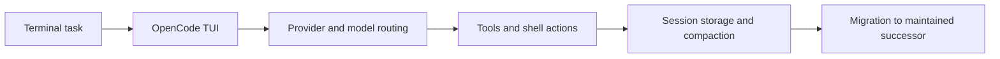

# OpenCode AI Legacy Tutorial: Archived Terminal Agent Workflows and Migration to Crush

> Learn from `opencode-ai/opencode` architecture and workflows, and migrate safely to actively maintained successors.

## Why This Track Matters

This repository is archived, but still useful as a reference for terminal-agent UX patterns, multi-provider model routing, and migration planning to maintained tools.

This track focuses on:

- understanding archived OpenCode behavior and capabilities
- operating legacy workflows safely when needed
- planning migration to Crush and related maintained stacks
- preserving useful patterns without carrying unbounded legacy risk

## Current Snapshot (Verified February 12, 2026)

- repository: [`opencode-ai/opencode`](https://github.com/opencode-ai/opencode)
- stars: about **10.9k**
- latest release: [`v0.0.55`](https://github.com/opencode-ai/opencode/releases/tag/v0.0.55)
- recent activity: updates on **September 18, 2025**
- maintenance status: repository archived and moved to [`charmbracelet/crush`](https://github.com/charmbracelet/crush)
- project positioning: legacy terminal coding agent reference implementation

## Mental Model

## Chapter Guide

| Chapter | Key Question | Outcome |
|:--------|:-------------|:--------|
| [01 - Getting Started and Project Status](01-getting-started-and-project-status.md) | How should I approach an archived coding-agent project? | Safe baseline |
| [02 - Legacy Architecture and Feature Model](02-legacy-architecture-and-feature-model.md) | What did OpenCode optimize for in terminal workflows? | Architecture understanding |
| [03 - Installation and Configuration Baseline](03-installation-and-configuration-baseline.md) | How do I reproduce legacy setups reliably? | Reproducible setup |
| [04 - Model Providers and Runtime Operations](04-model-providers-and-runtime-operations.md) | How do provider and environment settings affect behavior? | Better runtime control |
| [05 - Interactive and Non-Interactive Workflows](05-interactive-and-non-interactive-workflows.md) | How do I automate tasks in legacy mode? | Workflow clarity |
| [06 - Session, Tooling, and Integration Practices](06-session-tooling-and-integration-practices.md) | How do I manage sessions/tools/MCP configs safely? | Operational stability |
| [07 - Migration to Crush and Modern Alternatives](07-migration-to-crush-and-modern-alternatives.md) | How do I move off archived infrastructure? | Migration plan |
| [08 - Legacy Governance and Controlled Sunset](08-legacy-governance-and-controlled-sunset.md) | How do teams retire legacy usage responsibly? | Sunset runbook |

## What You Will Learn

- how to evaluate and use archived coding-agent tooling safely
- how to reproduce and document legacy OpenCode behavior
- how to plan and execute migration to maintained successors
- how to manage governance and risk during legacy sunset periods

## Source References

- [OpenCode AI Repository](https://github.com/opencode-ai/opencode)
- [OpenCode AI README](https://github.com/opencode-ai/opencode/blob/main/README.md)
- [OpenCode AI Release v0.0.55](https://github.com/opencode-ai/opencode/releases/tag/v0.0.55)
- [Crush Repository](https://github.com/charmbracelet/crush)

## Related Tutorials

- [OpenCode Tutorial](../opencode-tutorial/)
- [Crush Tutorial](../crush-tutorial/)
- [Codex CLI Tutorial](../codex-cli-tutorial/)
- [Goose Tutorial](../goose-tutorial/)

---

Start with [Chapter 1: Getting Started and Project Status](01-getting-started-and-project-status.md).
