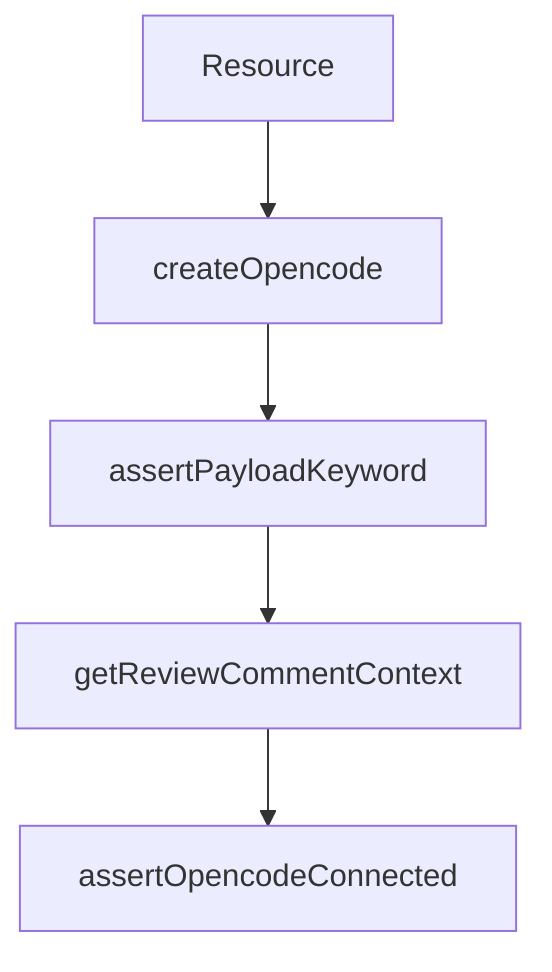

# Chapter 1: Getting Started

Welcome to **Chapter 1: Getting Started**. In this part of **OpenCode Tutorial: Open-Source Terminal Coding Agent at Scale**, you will build an intuitive mental model first, then move into concrete implementation details and practical production tradeoffs.


This chapter gets OpenCode running and establishes a clean baseline for deeper customization.

## Learning Goals

- install OpenCode using your preferred package path
- validate local model/provider connectivity
- run first tasks in terminal agent mode
- understand the difference between `build` and `plan` modes

## Installation Paths

| Path | Command | Best For |
|:-----|:--------|:---------|
| install script | `curl -fsSL https://opencode.ai/install | bash` | fastest bootstrap |
| npm | `npm i -g opencode-ai@latest` | Node-centric environments |
| Homebrew | `brew install anomalyco/tap/opencode` | macOS/Linux package-managed setup |

## First Run Checklist

1. launch `opencode`
2. confirm provider credentials are available
3. run a simple repo analysis task
4. switch between `build` and `plan` modes
5. verify output and suggested edits are coherent

## Early Failure Triage

| Symptom | Likely Cause | First Fix |
|:--------|:-------------|:----------|
| no model responses | missing provider credentials | configure provider key and retry |
| unsafe command concerns | wrong agent mode for task | use `plan` mode for analysis-first sessions |
| poor repo understanding | insufficient context scope | add clearer task framing and target files |

## Source References

- [OpenCode README](https://github.com/anomalyco/opencode/blob/dev/README.md)
- [OpenCode Install Docs](https://opencode.ai/docs)

## Summary

You now have OpenCode installed and validated for day-to-day terminal workflows.

Next: [Chapter 2: Architecture and Agent Loop](02-architecture-agent-loop.md)

## Depth Expansion Playbook

## Source Code Walkthrough

### `sst-env.d.ts`

The `Resource` interface in [`sst-env.d.ts`](https://github.com/anomalyco/opencode/blob/HEAD/sst-env.d.ts) handles a key part of this chapter's functionality:

```ts

declare module "sst" {
  export interface Resource {
    "ADMIN_SECRET": {
      "type": "sst.sst.Secret"
      "value": string
    }
    "AUTH_API_URL": {
      "type": "sst.sst.Linkable"
      "value": string
    }
    "AWS_SES_ACCESS_KEY_ID": {
      "type": "sst.sst.Secret"
      "value": string
    }
    "AWS_SES_SECRET_ACCESS_KEY": {
      "type": "sst.sst.Secret"
      "value": string
    }
    "Api": {
      "type": "sst.cloudflare.Worker"
      "url": string
    }
    "AuthApi": {
      "type": "sst.cloudflare.Worker"
      "url": string
    }
    "AuthStorage": {
      "namespaceId": string
      "type": "sst.cloudflare.Kv"
    }
    "Bucket": {
```

This interface is important because it defines how OpenCode Tutorial: Open-Source Terminal Coding Agent at Scale implements the patterns covered in this chapter.

### `github/index.ts`

The `createOpencode` function in [`github/index.ts`](https://github.com/anomalyco/opencode/blob/HEAD/github/index.ts) handles a key part of this chapter's functionality:

```ts
import type { Context as GitHubContext } from "@actions/github/lib/context"
import type { IssueCommentEvent, PullRequestReviewCommentEvent } from "@octokit/webhooks-types"
import { createOpencodeClient } from "@opencode-ai/sdk"
import { spawn } from "node:child_process"
import { setTimeout as sleep } from "node:timers/promises"

type GitHubAuthor = {
  login: string
  name?: string
}

type GitHubComment = {
  id: string
  databaseId: string
  body: string
  author: GitHubAuthor
  createdAt: string
}

type GitHubReviewComment = GitHubComment & {
  path: string
  line: number | null
}

type GitHubCommit = {
  oid: string
  message: string
  author: {
    name: string
    email: string
  }
}
```

This function is important because it defines how OpenCode Tutorial: Open-Source Terminal Coding Agent at Scale implements the patterns covered in this chapter.

### `github/index.ts`

The `assertPayloadKeyword` function in [`github/index.ts`](https://github.com/anomalyco/opencode/blob/HEAD/github/index.ts) handles a key part of this chapter's functionality:

```ts
try {
  assertContextEvent("issue_comment", "pull_request_review_comment")
  assertPayloadKeyword()
  await assertOpencodeConnected()

  accessToken = await getAccessToken()
  octoRest = new Octokit({ auth: accessToken })
  octoGraph = graphql.defaults({
    headers: { authorization: `token ${accessToken}` },
  })

  const { userPrompt, promptFiles } = await getUserPrompt()
  await configureGit(accessToken)
  await assertPermissions()

  const comment = await createComment()
  commentId = comment.data.id

  // Setup opencode session
  const repoData = await fetchRepo()
  session = await client.session.create<true>().then((r) => r.data)
  await subscribeSessionEvents()
  shareId = await (async () => {
    if (useEnvShare() === false) return
    if (!useEnvShare() && repoData.data.private) return
    await client.session.share<true>({ path: session })
    return session.id.slice(-8)
  })()
  console.log("opencode session", session.id)
  if (shareId) {
    console.log("Share link:", `${useShareUrl()}/s/${shareId}`)
  }
```

This function is important because it defines how OpenCode Tutorial: Open-Source Terminal Coding Agent at Scale implements the patterns covered in this chapter.

### `github/index.ts`

The `getReviewCommentContext` function in [`github/index.ts`](https://github.com/anomalyco/opencode/blob/HEAD/github/index.ts) handles a key part of this chapter's functionality:

```ts
}

function getReviewCommentContext() {
  const context = useContext()
  if (context.eventName !== "pull_request_review_comment") {
    return null
  }

  const payload = context.payload as PullRequestReviewCommentEvent
  return {
    file: payload.comment.path,
    diffHunk: payload.comment.diff_hunk,
    line: payload.comment.line,
    originalLine: payload.comment.original_line,
    position: payload.comment.position,
    commitId: payload.comment.commit_id,
    originalCommitId: payload.comment.original_commit_id,
  }
}

async function assertOpencodeConnected() {
  let retry = 0
  let connected = false
  do {
    try {
      await client.app.log<true>({
        body: {
          service: "github-workflow",
          level: "info",
          message: "Prepare to react to GitHub Workflow event",
        },
      })
```

This function is important because it defines how OpenCode Tutorial: Open-Source Terminal Coding Agent at Scale implements the patterns covered in this chapter.


## How These Components Connect


