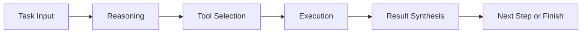
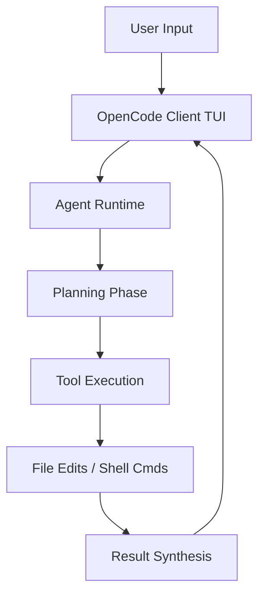

# Chapter 2: Architecture and Agent Loop

Welcome to **Chapter 2: Architecture and Agent Loop**. In this part of **OpenCode Tutorial: Open-Source Terminal Coding Agent at Scale**, you will build an intuitive mental model first, then move into concrete implementation details and practical production tradeoffs.

OpenCode is built around an interactive coding-agent loop optimized for terminal-native development.

## Core Loop

## Key Components

| Component | Role |
|:----------|:-----|
| client UI | terminal interaction and control |
| agent runtime | planning + execution orchestration |
| tool system | file, shell, and search operations |
| provider layer | model routing and inference integration |

## Why This Matters

Understanding this loop helps you tune OpenCode behavior without relying on trial and error.

## Source References

- [OpenCode Repository](https://github.com/anomalyco/opencode)
- [OpenCode Docs](https://opencode.ai/docs)

## Summary

You now have the architecture mental model required for safe customization.

Next: [Chapter 3: Model and Provider Routing](03-model-and-provider-routing.md)

## How These Components Connect

