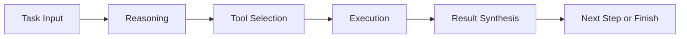
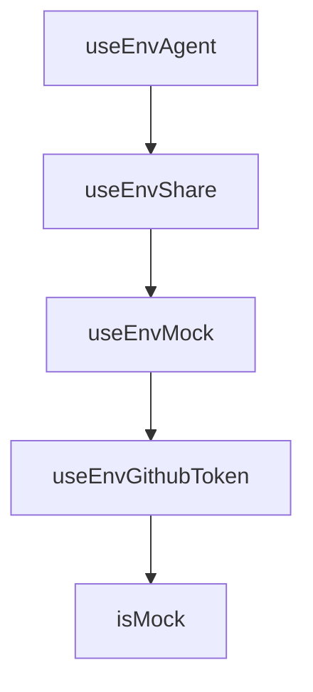

# Chapter 2: Architecture and Agent Loop

Welcome to **Chapter 2: Architecture and Agent Loop**. In this part of **OpenCode Tutorial: Open-Source Terminal Coding Agent at Scale**, you will build an intuitive mental model first, then move into concrete implementation details and practical production tradeoffs.


OpenCode is built around an interactive coding-agent loop optimized for terminal-native development.

## Core Loop



## Key Components

| Component | Role |
|:----------|:-----|
| client UI | terminal interaction and control |
| agent runtime | planning + execution orchestration |
| tool system | file, shell, and search operations |
| provider layer | model routing and inference integration |

## Why This Matters

Understanding this loop helps you tune OpenCode behavior without relying on trial and error.

## Source References

- [OpenCode Repository](https://github.com/anomalyco/opencode)
- [OpenCode Docs](https://opencode.ai/docs)

## Summary

You now have the architecture mental model required for safe customization.

Next: [Chapter 3: Model and Provider Routing](03-model-and-provider-routing.md)

## Depth Expansion Playbook

## Source Code Walkthrough

### `github/index.ts`

The `useEnvAgent` function in [`github/index.ts`](https://github.com/anomalyco/opencode/blob/HEAD/github/index.ts) handles a key part of this chapter's functionality:

```ts
}

function useEnvAgent() {
  return process.env["AGENT"] || undefined
}

function useEnvShare() {
  const value = process.env["SHARE"]
  if (!value) return undefined
  if (value === "true") return true
  if (value === "false") return false
  throw new Error(`Invalid share value: ${value}. Share must be a boolean.`)
}

function useEnvMock() {
  return {
    mockEvent: process.env["MOCK_EVENT"],
    mockToken: process.env["MOCK_TOKEN"],
  }
}

function useEnvGithubToken() {
  return process.env["TOKEN"]
}

function isMock() {
  const { mockEvent, mockToken } = useEnvMock()
  return Boolean(mockEvent || mockToken)
}

function isPullRequest() {
  const context = useContext()
```

This function is important because it defines how OpenCode Tutorial: Open-Source Terminal Coding Agent at Scale implements the patterns covered in this chapter.

### `github/index.ts`

The `useEnvShare` function in [`github/index.ts`](https://github.com/anomalyco/opencode/blob/HEAD/github/index.ts) handles a key part of this chapter's functionality:

```ts
  await subscribeSessionEvents()
  shareId = await (async () => {
    if (useEnvShare() === false) return
    if (!useEnvShare() && repoData.data.private) return
    await client.session.share<true>({ path: session })
    return session.id.slice(-8)
  })()
  console.log("opencode session", session.id)
  if (shareId) {
    console.log("Share link:", `${useShareUrl()}/s/${shareId}`)
  }

  // Handle 3 cases
  // 1. Issue
  // 2. Local PR
  // 3. Fork PR
  if (isPullRequest()) {
    const prData = await fetchPR()
    // Local PR
    if (prData.headRepository.nameWithOwner === prData.baseRepository.nameWithOwner) {
      await checkoutLocalBranch(prData)
      const dataPrompt = buildPromptDataForPR(prData)
      const response = await chat(`${userPrompt}\n\n${dataPrompt}`, promptFiles)
      if (await branchIsDirty()) {
        const summary = await summarize(response)
        await pushToLocalBranch(summary)
      }
      const hasShared = prData.comments.nodes.some((c) => c.body.includes(`${useShareUrl()}/s/${shareId}`))
      await updateComment(`${response}${footer({ image: !hasShared })}`)
    }
    // Fork PR
    else {
```

This function is important because it defines how OpenCode Tutorial: Open-Source Terminal Coding Agent at Scale implements the patterns covered in this chapter.

### `github/index.ts`

The `useEnvMock` function in [`github/index.ts`](https://github.com/anomalyco/opencode/blob/HEAD/github/index.ts) handles a key part of this chapter's functionality:

```ts
}

function useEnvMock() {
  return {
    mockEvent: process.env["MOCK_EVENT"],
    mockToken: process.env["MOCK_TOKEN"],
  }
}

function useEnvGithubToken() {
  return process.env["TOKEN"]
}

function isMock() {
  const { mockEvent, mockToken } = useEnvMock()
  return Boolean(mockEvent || mockToken)
}

function isPullRequest() {
  const context = useContext()
  const payload = context.payload as IssueCommentEvent
  return Boolean(payload.issue.pull_request)
}

function useContext() {
  return isMock() ? (JSON.parse(useEnvMock().mockEvent!) as GitHubContext) : github.context
}

function useIssueId() {
  const payload = useContext().payload as IssueCommentEvent
  return payload.issue.number
}
```

This function is important because it defines how OpenCode Tutorial: Open-Source Terminal Coding Agent at Scale implements the patterns covered in this chapter.

### `github/index.ts`

The `useEnvGithubToken` function in [`github/index.ts`](https://github.com/anomalyco/opencode/blob/HEAD/github/index.ts) handles a key part of this chapter's functionality:

```ts
}

function useEnvGithubToken() {
  return process.env["TOKEN"]
}

function isMock() {
  const { mockEvent, mockToken } = useEnvMock()
  return Boolean(mockEvent || mockToken)
}

function isPullRequest() {
  const context = useContext()
  const payload = context.payload as IssueCommentEvent
  return Boolean(payload.issue.pull_request)
}

function useContext() {
  return isMock() ? (JSON.parse(useEnvMock().mockEvent!) as GitHubContext) : github.context
}

function useIssueId() {
  const payload = useContext().payload as IssueCommentEvent
  return payload.issue.number
}

function useShareUrl() {
  return isMock() ? "https://dev.opencode.ai" : "https://opencode.ai"
}

async function getAccessToken() {
  const { repo } = useContext()
```

This function is important because it defines how OpenCode Tutorial: Open-Source Terminal Coding Agent at Scale implements the patterns covered in this chapter.


## How These Components Connect


