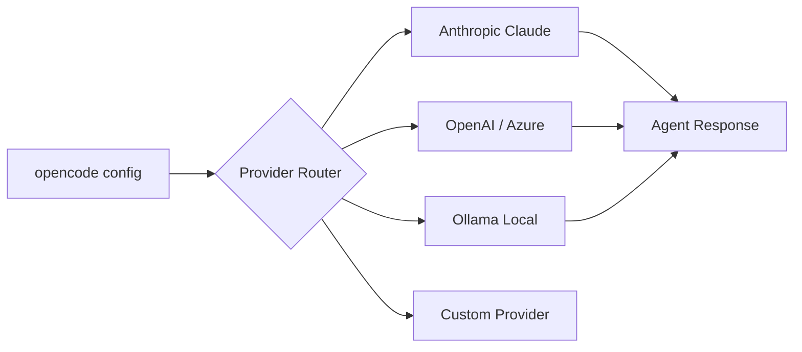

# Chapter 3: Model and Provider Routing

Welcome to **Chapter 3: Model and Provider Routing**. In this part of **OpenCode Tutorial: Open-Source Terminal Coding Agent at Scale**, you will build an intuitive mental model first, then move into concrete implementation details and practical production tradeoffs.

OpenCode is provider-agnostic by design. A strong routing strategy controls quality, cost, and latency.

## Routing Strategy

| Workload | Recommended Model Class |
|:---------|:------------------------|
| repo analysis | high-context reasoning model |
| code edits | fast coding-focused model |
| long refactors | stable high-accuracy model |
| follow-up fixes | low-latency model |

## Practical Controls

- use explicit model defaults for repetitive workflows
- define fallback providers for outage resilience
- separate experimentation profiles from production defaults

## Common Failure Modes

- oscillating output quality due to unpinned model selection
- silent cost spikes from oversized model defaults
- context-window mismatches for large monorepos

## Source References

- [OpenCode Docs](https://opencode.ai/docs)
- [OpenCode FAQ in README](https://github.com/anomalyco/opencode/blob/dev/README.md)

## Summary

You now know how to build a provider strategy instead of relying on a single default model.

Next: [Chapter 4: Tools, Permissions, and Execution](04-tools-permissions-and-execution.md)

## How These Components Connect

