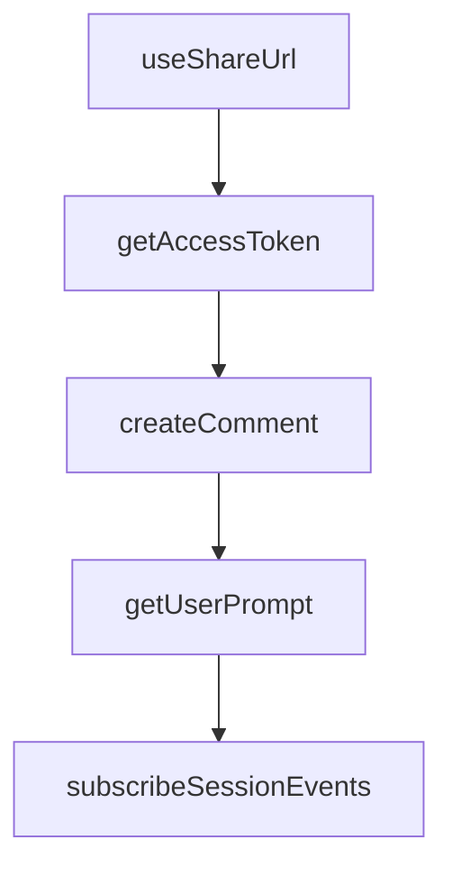

# Chapter 3: Model and Provider Routing

Welcome to **Chapter 3: Model and Provider Routing**. In this part of **OpenCode Tutorial: Open-Source Terminal Coding Agent at Scale**, you will build an intuitive mental model first, then move into concrete implementation details and practical production tradeoffs.


OpenCode is provider-agnostic by design. A strong routing strategy controls quality, cost, and latency.

## Routing Strategy

| Workload | Recommended Model Class |
|:---------|:------------------------|
| repo analysis | high-context reasoning model |
| code edits | fast coding-focused model |
| long refactors | stable high-accuracy model |
| follow-up fixes | low-latency model |

## Practical Controls

- use explicit model defaults for repetitive workflows
- define fallback providers for outage resilience
- separate experimentation profiles from production defaults

## Common Failure Modes

- oscillating output quality due to unpinned model selection
- silent cost spikes from oversized model defaults
- context-window mismatches for large monorepos

## Source References

- [OpenCode Docs](https://opencode.ai/docs)
- [OpenCode FAQ in README](https://github.com/anomalyco/opencode/blob/dev/README.md)

## Summary

You now know how to build a provider strategy instead of relying on a single default model.

Next: [Chapter 4: Tools, Permissions, and Execution](04-tools-permissions-and-execution.md)

## Depth Expansion Playbook

## Source Code Walkthrough

### `github/index.ts`

The `useShareUrl` function in [`github/index.ts`](https://github.com/anomalyco/opencode/blob/HEAD/github/index.ts) handles a key part of this chapter's functionality:

```ts
  console.log("opencode session", session.id)
  if (shareId) {
    console.log("Share link:", `${useShareUrl()}/s/${shareId}`)
  }

  // Handle 3 cases
  // 1. Issue
  // 2. Local PR
  // 3. Fork PR
  if (isPullRequest()) {
    const prData = await fetchPR()
    // Local PR
    if (prData.headRepository.nameWithOwner === prData.baseRepository.nameWithOwner) {
      await checkoutLocalBranch(prData)
      const dataPrompt = buildPromptDataForPR(prData)
      const response = await chat(`${userPrompt}\n\n${dataPrompt}`, promptFiles)
      if (await branchIsDirty()) {
        const summary = await summarize(response)
        await pushToLocalBranch(summary)
      }
      const hasShared = prData.comments.nodes.some((c) => c.body.includes(`${useShareUrl()}/s/${shareId}`))
      await updateComment(`${response}${footer({ image: !hasShared })}`)
    }
    // Fork PR
    else {
      await checkoutForkBranch(prData)
      const dataPrompt = buildPromptDataForPR(prData)
      const response = await chat(`${userPrompt}\n\n${dataPrompt}`, promptFiles)
      if (await branchIsDirty()) {
        const summary = await summarize(response)
        await pushToForkBranch(summary, prData)
      }
```

This function is important because it defines how OpenCode Tutorial: Open-Source Terminal Coding Agent at Scale implements the patterns covered in this chapter.

### `github/index.ts`

The `getAccessToken` function in [`github/index.ts`](https://github.com/anomalyco/opencode/blob/HEAD/github/index.ts) handles a key part of this chapter's functionality:

```ts
  await assertOpencodeConnected()

  accessToken = await getAccessToken()
  octoRest = new Octokit({ auth: accessToken })
  octoGraph = graphql.defaults({
    headers: { authorization: `token ${accessToken}` },
  })

  const { userPrompt, promptFiles } = await getUserPrompt()
  await configureGit(accessToken)
  await assertPermissions()

  const comment = await createComment()
  commentId = comment.data.id

  // Setup opencode session
  const repoData = await fetchRepo()
  session = await client.session.create<true>().then((r) => r.data)
  await subscribeSessionEvents()
  shareId = await (async () => {
    if (useEnvShare() === false) return
    if (!useEnvShare() && repoData.data.private) return
    await client.session.share<true>({ path: session })
    return session.id.slice(-8)
  })()
  console.log("opencode session", session.id)
  if (shareId) {
    console.log("Share link:", `${useShareUrl()}/s/${shareId}`)
  }

  // Handle 3 cases
  // 1. Issue
```

This function is important because it defines how OpenCode Tutorial: Open-Source Terminal Coding Agent at Scale implements the patterns covered in this chapter.

### `github/index.ts`

The `createComment` function in [`github/index.ts`](https://github.com/anomalyco/opencode/blob/HEAD/github/index.ts) handles a key part of this chapter's functionality:

```ts
  await assertPermissions()

  const comment = await createComment()
  commentId = comment.data.id

  // Setup opencode session
  const repoData = await fetchRepo()
  session = await client.session.create<true>().then((r) => r.data)
  await subscribeSessionEvents()
  shareId = await (async () => {
    if (useEnvShare() === false) return
    if (!useEnvShare() && repoData.data.private) return
    await client.session.share<true>({ path: session })
    return session.id.slice(-8)
  })()
  console.log("opencode session", session.id)
  if (shareId) {
    console.log("Share link:", `${useShareUrl()}/s/${shareId}`)
  }

  // Handle 3 cases
  // 1. Issue
  // 2. Local PR
  // 3. Fork PR
  if (isPullRequest()) {
    const prData = await fetchPR()
    // Local PR
    if (prData.headRepository.nameWithOwner === prData.baseRepository.nameWithOwner) {
      await checkoutLocalBranch(prData)
      const dataPrompt = buildPromptDataForPR(prData)
      const response = await chat(`${userPrompt}\n\n${dataPrompt}`, promptFiles)
      if (await branchIsDirty()) {
```

This function is important because it defines how OpenCode Tutorial: Open-Source Terminal Coding Agent at Scale implements the patterns covered in this chapter.

### `github/index.ts`

The `getUserPrompt` function in [`github/index.ts`](https://github.com/anomalyco/opencode/blob/HEAD/github/index.ts) handles a key part of this chapter's functionality:

```ts
let shareId: string | undefined
let exitCode = 0
type PromptFiles = Awaited<ReturnType<typeof getUserPrompt>>["promptFiles"]

try {
  assertContextEvent("issue_comment", "pull_request_review_comment")
  assertPayloadKeyword()
  await assertOpencodeConnected()

  accessToken = await getAccessToken()
  octoRest = new Octokit({ auth: accessToken })
  octoGraph = graphql.defaults({
    headers: { authorization: `token ${accessToken}` },
  })

  const { userPrompt, promptFiles } = await getUserPrompt()
  await configureGit(accessToken)
  await assertPermissions()

  const comment = await createComment()
  commentId = comment.data.id

  // Setup opencode session
  const repoData = await fetchRepo()
  session = await client.session.create<true>().then((r) => r.data)
  await subscribeSessionEvents()
  shareId = await (async () => {
    if (useEnvShare() === false) return
    if (!useEnvShare() && repoData.data.private) return
    await client.session.share<true>({ path: session })
    return session.id.slice(-8)
  })()
```

This function is important because it defines how OpenCode Tutorial: Open-Source Terminal Coding Agent at Scale implements the patterns covered in this chapter.


## How These Components Connect


