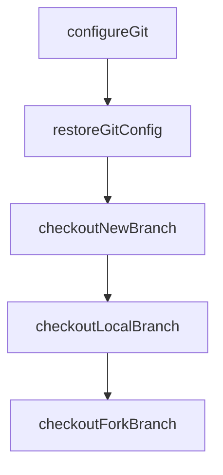

# Chapter 4: Tools, Permissions, and Execution

Welcome to **Chapter 4: Tools, Permissions, and Execution**. In this part of **OpenCode Tutorial: Open-Source Terminal Coding Agent at Scale**, you will build an intuitive mental model first, then move into concrete implementation details and practical production tradeoffs.


The tool layer determines whether OpenCode is safe and reliable in real repositories.

## Execution Safety Model

| Layer | Control |
|:------|:--------|
| command scope | allowlist or reviewed command boundaries |
| file edits | review before apply |
| high-risk ops | explicit confirmation |
| audit trail | structured log of actions |

## Best Practices

- keep destructive operations behind explicit review
- treat shell commands as privileged actions
- enforce small, reversible edit batches
- run tests/lint after non-trivial patches

## Team Policy Pattern

1. define approved command families
2. require review for package and infra changes
3. log all executed operations in CI contexts
4. rotate credentials and avoid implicit env leakage

## Source References

- [OpenCode Agents Docs](https://opencode.ai/docs/agents)
- [OpenCode README](https://github.com/anomalyco/opencode/blob/dev/README.md)

## Summary

You now have a practical safety baseline for running OpenCode against important codebases.

Next: [Chapter 5: Agents, Subagents, and Planning](05-agents-subagents-and-planning.md)

## Depth Expansion Playbook

## Source Code Walkthrough

### `github/index.ts`

The `configureGit` function in [`github/index.ts`](https://github.com/anomalyco/opencode/blob/HEAD/github/index.ts) handles a key part of this chapter's functionality:

```ts

  const { userPrompt, promptFiles } = await getUserPrompt()
  await configureGit(accessToken)
  await assertPermissions()

  const comment = await createComment()
  commentId = comment.data.id

  // Setup opencode session
  const repoData = await fetchRepo()
  session = await client.session.create<true>().then((r) => r.data)
  await subscribeSessionEvents()
  shareId = await (async () => {
    if (useEnvShare() === false) return
    if (!useEnvShare() && repoData.data.private) return
    await client.session.share<true>({ path: session })
    return session.id.slice(-8)
  })()
  console.log("opencode session", session.id)
  if (shareId) {
    console.log("Share link:", `${useShareUrl()}/s/${shareId}`)
  }

  // Handle 3 cases
  // 1. Issue
  // 2. Local PR
  // 3. Fork PR
  if (isPullRequest()) {
    const prData = await fetchPR()
    // Local PR
    if (prData.headRepository.nameWithOwner === prData.baseRepository.nameWithOwner) {
      await checkoutLocalBranch(prData)
```

This function is important because it defines how OpenCode Tutorial: Open-Source Terminal Coding Agent at Scale implements the patterns covered in this chapter.

### `github/index.ts`

The `restoreGitConfig` function in [`github/index.ts`](https://github.com/anomalyco/opencode/blob/HEAD/github/index.ts) handles a key part of this chapter's functionality:

```ts
} finally {
  server.close()
  await restoreGitConfig()
  await revokeAppToken()
}
process.exit(exitCode)

function createOpencode() {
  const host = "127.0.0.1"
  const port = 4096
  const url = `http://${host}:${port}`
  const proc = spawn(`opencode`, [`serve`, `--hostname=${host}`, `--port=${port}`])
  const client = createOpencodeClient({ baseUrl: url })

  return {
    server: { url, close: () => proc.kill() },
    client,
  }
}

function assertPayloadKeyword() {
  const payload = useContext().payload as IssueCommentEvent | PullRequestReviewCommentEvent
  const body = payload.comment.body.trim()
  if (!body.match(/(?:^|\s)(?:\/opencode|\/oc)(?=$|\s)/)) {
    throw new Error("Comments must mention `/opencode` or `/oc`")
  }
}

function getReviewCommentContext() {
  const context = useContext()
  if (context.eventName !== "pull_request_review_comment") {
    return null
```

This function is important because it defines how OpenCode Tutorial: Open-Source Terminal Coding Agent at Scale implements the patterns covered in this chapter.

### `github/index.ts`

The `checkoutNewBranch` function in [`github/index.ts`](https://github.com/anomalyco/opencode/blob/HEAD/github/index.ts) handles a key part of this chapter's functionality:

```ts
  // Issue
  else {
    const branch = await checkoutNewBranch()
    const issueData = await fetchIssue()
    const dataPrompt = buildPromptDataForIssue(issueData)
    const response = await chat(`${userPrompt}\n\n${dataPrompt}`, promptFiles)
    if (await branchIsDirty()) {
      const summary = await summarize(response)
      await pushToNewBranch(summary, branch)
      const pr = await createPR(
        repoData.data.default_branch,
        branch,
        summary,
        `${response}\n\nCloses #${useIssueId()}${footer({ image: true })}`,
      )
      await updateComment(`Created PR #${pr}${footer({ image: true })}`)
    } else {
      await updateComment(`${response}${footer({ image: true })}`)
    }
  }
} catch (e: any) {
  exitCode = 1
  console.error(e)
  let msg = e
  if (e instanceof $.ShellError) {
    msg = e.stderr.toString()
  } else if (e instanceof Error) {
    msg = e.message
  }
  await updateComment(`${msg}${footer()}`)
  core.setFailed(msg)
  // Also output the clean error message for the action to capture
```

This function is important because it defines how OpenCode Tutorial: Open-Source Terminal Coding Agent at Scale implements the patterns covered in this chapter.

### `github/index.ts`

The `checkoutLocalBranch` function in [`github/index.ts`](https://github.com/anomalyco/opencode/blob/HEAD/github/index.ts) handles a key part of this chapter's functionality:

```ts
    // Local PR
    if (prData.headRepository.nameWithOwner === prData.baseRepository.nameWithOwner) {
      await checkoutLocalBranch(prData)
      const dataPrompt = buildPromptDataForPR(prData)
      const response = await chat(`${userPrompt}\n\n${dataPrompt}`, promptFiles)
      if (await branchIsDirty()) {
        const summary = await summarize(response)
        await pushToLocalBranch(summary)
      }
      const hasShared = prData.comments.nodes.some((c) => c.body.includes(`${useShareUrl()}/s/${shareId}`))
      await updateComment(`${response}${footer({ image: !hasShared })}`)
    }
    // Fork PR
    else {
      await checkoutForkBranch(prData)
      const dataPrompt = buildPromptDataForPR(prData)
      const response = await chat(`${userPrompt}\n\n${dataPrompt}`, promptFiles)
      if (await branchIsDirty()) {
        const summary = await summarize(response)
        await pushToForkBranch(summary, prData)
      }
      const hasShared = prData.comments.nodes.some((c) => c.body.includes(`${useShareUrl()}/s/${shareId}`))
      await updateComment(`${response}${footer({ image: !hasShared })}`)
    }
  }
  // Issue
  else {
    const branch = await checkoutNewBranch()
    const issueData = await fetchIssue()
    const dataPrompt = buildPromptDataForIssue(issueData)
    const response = await chat(`${userPrompt}\n\n${dataPrompt}`, promptFiles)
    if (await branchIsDirty()) {
```

This function is important because it defines how OpenCode Tutorial: Open-Source Terminal Coding Agent at Scale implements the patterns covered in this chapter.


## How These Components Connect


