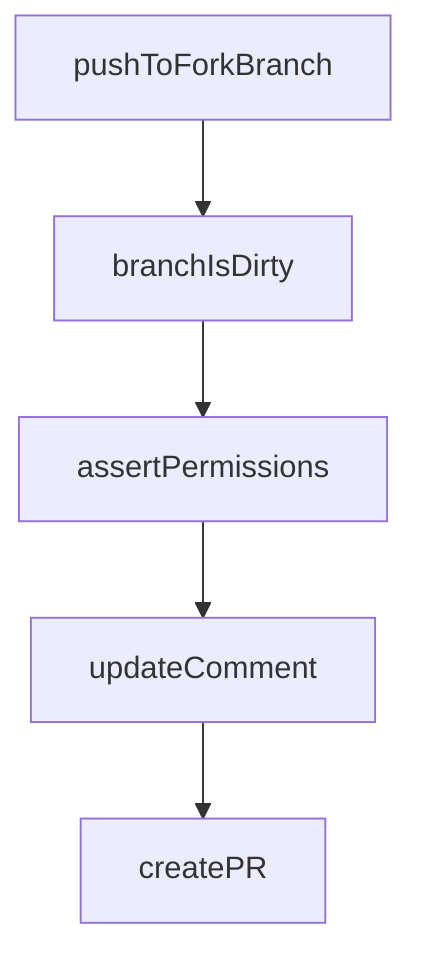

# Chapter 5: Agents, Subagents, and Planning

Welcome to **Chapter 5: Agents, Subagents, and Planning**. In this part of **OpenCode Tutorial: Open-Source Terminal Coding Agent at Scale**, you will build an intuitive mental model first, then move into concrete implementation details and practical production tradeoffs.


OpenCode includes distinct agent behaviors that should be chosen intentionally by task type.

## Built-in Agent Modes

| Agent | Strength |
|:------|:---------|
| build | full-access implementation and execution |
| plan | read-only analysis and exploration |
| general (subagent) | complex search and multi-step discovery |

## Mode Selection Heuristic

- use `plan` for unfamiliar codebases and risk analysis
- switch to `build` only when plan quality is acceptable
- use `general` for deep discovery and context prep

## Review Pattern

1. ask `plan` to map scope and risks
2. confirm constraints and test strategy
3. hand off to `build` for implementation
4. validate and finalize with tests and diff review

## Source References

- [OpenCode Agents Documentation](https://opencode.ai/docs/agents)
- [OpenCode README](https://github.com/anomalyco/opencode/blob/dev/README.md)

## Summary

You can now use OpenCode modes as a controlled workflow, not just a toggle.

Next: [Chapter 6: Client/Server and Remote Workflows](06-client-server-and-remote-workflows.md)

## Depth Expansion Playbook

## Source Code Walkthrough

### `github/index.ts`

The `pushToForkBranch` function in [`github/index.ts`](https://github.com/anomalyco/opencode/blob/HEAD/github/index.ts) handles a key part of this chapter's functionality:

```ts
      if (await branchIsDirty()) {
        const summary = await summarize(response)
        await pushToForkBranch(summary, prData)
      }
      const hasShared = prData.comments.nodes.some((c) => c.body.includes(`${useShareUrl()}/s/${shareId}`))
      await updateComment(`${response}${footer({ image: !hasShared })}`)
    }
  }
  // Issue
  else {
    const branch = await checkoutNewBranch()
    const issueData = await fetchIssue()
    const dataPrompt = buildPromptDataForIssue(issueData)
    const response = await chat(`${userPrompt}\n\n${dataPrompt}`, promptFiles)
    if (await branchIsDirty()) {
      const summary = await summarize(response)
      await pushToNewBranch(summary, branch)
      const pr = await createPR(
        repoData.data.default_branch,
        branch,
        summary,
        `${response}\n\nCloses #${useIssueId()}${footer({ image: true })}`,
      )
      await updateComment(`Created PR #${pr}${footer({ image: true })}`)
    } else {
      await updateComment(`${response}${footer({ image: true })}`)
    }
  }
} catch (e: any) {
  exitCode = 1
  console.error(e)
  let msg = e
```

This function is important because it defines how OpenCode Tutorial: Open-Source Terminal Coding Agent at Scale implements the patterns covered in this chapter.

### `github/index.ts`

The `branchIsDirty` function in [`github/index.ts`](https://github.com/anomalyco/opencode/blob/HEAD/github/index.ts) handles a key part of this chapter's functionality:

```ts
      const dataPrompt = buildPromptDataForPR(prData)
      const response = await chat(`${userPrompt}\n\n${dataPrompt}`, promptFiles)
      if (await branchIsDirty()) {
        const summary = await summarize(response)
        await pushToLocalBranch(summary)
      }
      const hasShared = prData.comments.nodes.some((c) => c.body.includes(`${useShareUrl()}/s/${shareId}`))
      await updateComment(`${response}${footer({ image: !hasShared })}`)
    }
    // Fork PR
    else {
      await checkoutForkBranch(prData)
      const dataPrompt = buildPromptDataForPR(prData)
      const response = await chat(`${userPrompt}\n\n${dataPrompt}`, promptFiles)
      if (await branchIsDirty()) {
        const summary = await summarize(response)
        await pushToForkBranch(summary, prData)
      }
      const hasShared = prData.comments.nodes.some((c) => c.body.includes(`${useShareUrl()}/s/${shareId}`))
      await updateComment(`${response}${footer({ image: !hasShared })}`)
    }
  }
  // Issue
  else {
    const branch = await checkoutNewBranch()
    const issueData = await fetchIssue()
    const dataPrompt = buildPromptDataForIssue(issueData)
    const response = await chat(`${userPrompt}\n\n${dataPrompt}`, promptFiles)
    if (await branchIsDirty()) {
      const summary = await summarize(response)
      await pushToNewBranch(summary, branch)
      const pr = await createPR(
```

This function is important because it defines how OpenCode Tutorial: Open-Source Terminal Coding Agent at Scale implements the patterns covered in this chapter.

### `github/index.ts`

The `assertPermissions` function in [`github/index.ts`](https://github.com/anomalyco/opencode/blob/HEAD/github/index.ts) handles a key part of this chapter's functionality:

```ts
  const { userPrompt, promptFiles } = await getUserPrompt()
  await configureGit(accessToken)
  await assertPermissions()

  const comment = await createComment()
  commentId = comment.data.id

  // Setup opencode session
  const repoData = await fetchRepo()
  session = await client.session.create<true>().then((r) => r.data)
  await subscribeSessionEvents()
  shareId = await (async () => {
    if (useEnvShare() === false) return
    if (!useEnvShare() && repoData.data.private) return
    await client.session.share<true>({ path: session })
    return session.id.slice(-8)
  })()
  console.log("opencode session", session.id)
  if (shareId) {
    console.log("Share link:", `${useShareUrl()}/s/${shareId}`)
  }

  // Handle 3 cases
  // 1. Issue
  // 2. Local PR
  // 3. Fork PR
  if (isPullRequest()) {
    const prData = await fetchPR()
    // Local PR
    if (prData.headRepository.nameWithOwner === prData.baseRepository.nameWithOwner) {
      await checkoutLocalBranch(prData)
      const dataPrompt = buildPromptDataForPR(prData)
```

This function is important because it defines how OpenCode Tutorial: Open-Source Terminal Coding Agent at Scale implements the patterns covered in this chapter.

### `github/index.ts`

The `updateComment` function in [`github/index.ts`](https://github.com/anomalyco/opencode/blob/HEAD/github/index.ts) handles a key part of this chapter's functionality:

```ts
      }
      const hasShared = prData.comments.nodes.some((c) => c.body.includes(`${useShareUrl()}/s/${shareId}`))
      await updateComment(`${response}${footer({ image: !hasShared })}`)
    }
    // Fork PR
    else {
      await checkoutForkBranch(prData)
      const dataPrompt = buildPromptDataForPR(prData)
      const response = await chat(`${userPrompt}\n\n${dataPrompt}`, promptFiles)
      if (await branchIsDirty()) {
        const summary = await summarize(response)
        await pushToForkBranch(summary, prData)
      }
      const hasShared = prData.comments.nodes.some((c) => c.body.includes(`${useShareUrl()}/s/${shareId}`))
      await updateComment(`${response}${footer({ image: !hasShared })}`)
    }
  }
  // Issue
  else {
    const branch = await checkoutNewBranch()
    const issueData = await fetchIssue()
    const dataPrompt = buildPromptDataForIssue(issueData)
    const response = await chat(`${userPrompt}\n\n${dataPrompt}`, promptFiles)
    if (await branchIsDirty()) {
      const summary = await summarize(response)
      await pushToNewBranch(summary, branch)
      const pr = await createPR(
        repoData.data.default_branch,
        branch,
        summary,
        `${response}\n\nCloses #${useIssueId()}${footer({ image: true })}`,
      )
```

This function is important because it defines how OpenCode Tutorial: Open-Source Terminal Coding Agent at Scale implements the patterns covered in this chapter.


## How These Components Connect


