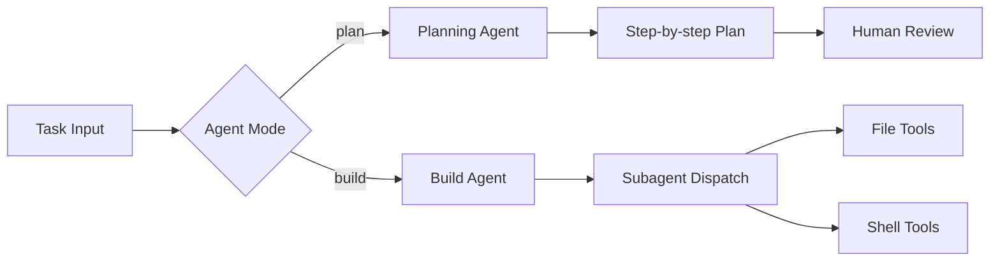

# Chapter 5: Agents, Subagents, and Planning

Welcome to **Chapter 5: Agents, Subagents, and Planning**. In this part of **OpenCode Tutorial: Open-Source Terminal Coding Agent at Scale**, you will build an intuitive mental model first, then move into concrete implementation details and practical production tradeoffs.

OpenCode includes distinct agent behaviors that should be chosen intentionally by task type.

## Built-in Agent Modes

| Agent | Strength |
|:------|:---------|
| build | full-access implementation and execution |
| plan | read-only analysis and exploration |
| general (subagent) | complex search and multi-step discovery |

## Mode Selection Heuristic

- use `plan` for unfamiliar codebases and risk analysis
- switch to `build` only when plan quality is acceptable
- use `general` for deep discovery and context prep

## Review Pattern

1. ask `plan` to map scope and risks
2. confirm constraints and test strategy
3. hand off to `build` for implementation
4. validate and finalize with tests and diff review

## Source References

- [OpenCode Agents Documentation](https://opencode.ai/docs/agents)
- [OpenCode README](https://github.com/anomalyco/opencode/blob/dev/README.md)

## Summary

You can now use OpenCode modes as a controlled workflow, not just a toggle.

Next: [Chapter 6: Client/Server and Remote Workflows](06-client-server-and-remote-workflows.md)

## How These Components Connect

