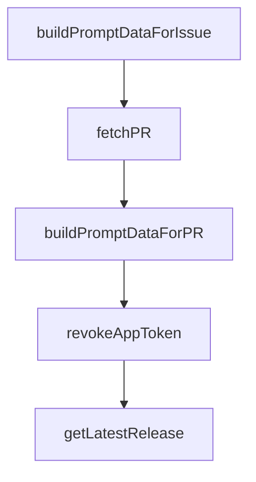

# Chapter 6: Client/Server and Remote Workflows

Welcome to **Chapter 6: Client/Server and Remote Workflows**. In this part of **OpenCode Tutorial: Open-Source Terminal Coding Agent at Scale**, you will build an intuitive mental model first, then move into concrete implementation details and practical production tradeoffs.


OpenCode's client/server architecture enables remote control patterns beyond a single terminal session.

## Why This Matters

Remote-capable architecture supports:

- persistent coding sessions
- device handoff workflows
- desktop/mobile companion clients
- shared team operations patterns

## Operational Design Considerations

| Concern | Practice |
|:--------|:---------|
| session persistence | define lifecycle and timeout policy |
| auth | short-lived credentials and rotation |
| transport security | encrypted channel and boundary controls |
| remote execution risk | policy-gated command surfaces |

## Source References

- [OpenCode README (client/server mention)](https://github.com/anomalyco/opencode/blob/dev/README.md)
- [OpenCode Docs](https://opencode.ai/docs)

## Summary

You now understand how OpenCode can evolve from local tooling into a remote-capable agent platform.

Next: [Chapter 7: Integrations: MCP, LSP, and Extensions](07-integrations-mcp-lsp-and-extensions.md)

## Depth Expansion Playbook

## Source Code Walkthrough

### `github/index.ts`

The `buildPromptDataForIssue` function in [`github/index.ts`](https://github.com/anomalyco/opencode/blob/HEAD/github/index.ts) handles a key part of this chapter's functionality:

```ts
    const branch = await checkoutNewBranch()
    const issueData = await fetchIssue()
    const dataPrompt = buildPromptDataForIssue(issueData)
    const response = await chat(`${userPrompt}\n\n${dataPrompt}`, promptFiles)
    if (await branchIsDirty()) {
      const summary = await summarize(response)
      await pushToNewBranch(summary, branch)
      const pr = await createPR(
        repoData.data.default_branch,
        branch,
        summary,
        `${response}\n\nCloses #${useIssueId()}${footer({ image: true })}`,
      )
      await updateComment(`Created PR #${pr}${footer({ image: true })}`)
    } else {
      await updateComment(`${response}${footer({ image: true })}`)
    }
  }
} catch (e: any) {
  exitCode = 1
  console.error(e)
  let msg = e
  if (e instanceof $.ShellError) {
    msg = e.stderr.toString()
  } else if (e instanceof Error) {
    msg = e.message
  }
  await updateComment(`${msg}${footer()}`)
  core.setFailed(msg)
  // Also output the clean error message for the action to capture
  //core.setOutput("prepare_error", e.message);
} finally {
```

This function is important because it defines how OpenCode Tutorial: Open-Source Terminal Coding Agent at Scale implements the patterns covered in this chapter.

### `github/index.ts`

The `fetchPR` function in [`github/index.ts`](https://github.com/anomalyco/opencode/blob/HEAD/github/index.ts) handles a key part of this chapter's functionality:

```ts
  // 3. Fork PR
  if (isPullRequest()) {
    const prData = await fetchPR()
    // Local PR
    if (prData.headRepository.nameWithOwner === prData.baseRepository.nameWithOwner) {
      await checkoutLocalBranch(prData)
      const dataPrompt = buildPromptDataForPR(prData)
      const response = await chat(`${userPrompt}\n\n${dataPrompt}`, promptFiles)
      if (await branchIsDirty()) {
        const summary = await summarize(response)
        await pushToLocalBranch(summary)
      }
      const hasShared = prData.comments.nodes.some((c) => c.body.includes(`${useShareUrl()}/s/${shareId}`))
      await updateComment(`${response}${footer({ image: !hasShared })}`)
    }
    // Fork PR
    else {
      await checkoutForkBranch(prData)
      const dataPrompt = buildPromptDataForPR(prData)
      const response = await chat(`${userPrompt}\n\n${dataPrompt}`, promptFiles)
      if (await branchIsDirty()) {
        const summary = await summarize(response)
        await pushToForkBranch(summary, prData)
      }
      const hasShared = prData.comments.nodes.some((c) => c.body.includes(`${useShareUrl()}/s/${shareId}`))
      await updateComment(`${response}${footer({ image: !hasShared })}`)
    }
  }
  // Issue
  else {
    const branch = await checkoutNewBranch()
    const issueData = await fetchIssue()
```

This function is important because it defines how OpenCode Tutorial: Open-Source Terminal Coding Agent at Scale implements the patterns covered in this chapter.

### `github/index.ts`

The `buildPromptDataForPR` function in [`github/index.ts`](https://github.com/anomalyco/opencode/blob/HEAD/github/index.ts) handles a key part of this chapter's functionality:

```ts
    if (prData.headRepository.nameWithOwner === prData.baseRepository.nameWithOwner) {
      await checkoutLocalBranch(prData)
      const dataPrompt = buildPromptDataForPR(prData)
      const response = await chat(`${userPrompt}\n\n${dataPrompt}`, promptFiles)
      if (await branchIsDirty()) {
        const summary = await summarize(response)
        await pushToLocalBranch(summary)
      }
      const hasShared = prData.comments.nodes.some((c) => c.body.includes(`${useShareUrl()}/s/${shareId}`))
      await updateComment(`${response}${footer({ image: !hasShared })}`)
    }
    // Fork PR
    else {
      await checkoutForkBranch(prData)
      const dataPrompt = buildPromptDataForPR(prData)
      const response = await chat(`${userPrompt}\n\n${dataPrompt}`, promptFiles)
      if (await branchIsDirty()) {
        const summary = await summarize(response)
        await pushToForkBranch(summary, prData)
      }
      const hasShared = prData.comments.nodes.some((c) => c.body.includes(`${useShareUrl()}/s/${shareId}`))
      await updateComment(`${response}${footer({ image: !hasShared })}`)
    }
  }
  // Issue
  else {
    const branch = await checkoutNewBranch()
    const issueData = await fetchIssue()
    const dataPrompt = buildPromptDataForIssue(issueData)
    const response = await chat(`${userPrompt}\n\n${dataPrompt}`, promptFiles)
    if (await branchIsDirty()) {
      const summary = await summarize(response)
```

This function is important because it defines how OpenCode Tutorial: Open-Source Terminal Coding Agent at Scale implements the patterns covered in this chapter.

### `github/index.ts`

The `revokeAppToken` function in [`github/index.ts`](https://github.com/anomalyco/opencode/blob/HEAD/github/index.ts) handles a key part of this chapter's functionality:

```ts
  server.close()
  await restoreGitConfig()
  await revokeAppToken()
}
process.exit(exitCode)

function createOpencode() {
  const host = "127.0.0.1"
  const port = 4096
  const url = `http://${host}:${port}`
  const proc = spawn(`opencode`, [`serve`, `--hostname=${host}`, `--port=${port}`])
  const client = createOpencodeClient({ baseUrl: url })

  return {
    server: { url, close: () => proc.kill() },
    client,
  }
}

function assertPayloadKeyword() {
  const payload = useContext().payload as IssueCommentEvent | PullRequestReviewCommentEvent
  const body = payload.comment.body.trim()
  if (!body.match(/(?:^|\s)(?:\/opencode|\/oc)(?=$|\s)/)) {
    throw new Error("Comments must mention `/opencode` or `/oc`")
  }
}

function getReviewCommentContext() {
  const context = useContext()
  if (context.eventName !== "pull_request_review_comment") {
    return null
  }
```

This function is important because it defines how OpenCode Tutorial: Open-Source Terminal Coding Agent at Scale implements the patterns covered in this chapter.


## How These Components Connect


