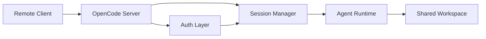

# Chapter 6: Client/Server and Remote Workflows

Welcome to **Chapter 6: Client/Server and Remote Workflows**. In this part of **OpenCode Tutorial: Open-Source Terminal Coding Agent at Scale**, you will build an intuitive mental model first, then move into concrete implementation details and practical production tradeoffs.

OpenCode's client/server architecture enables remote control patterns beyond a single terminal session.

## Why This Matters

Remote-capable architecture supports:

- persistent coding sessions
- device handoff workflows
- desktop/mobile companion clients
- shared team operations patterns

## Operational Design Considerations

| Concern | Practice |
|:--------|:---------|
| session persistence | define lifecycle and timeout policy |
| auth | short-lived credentials and rotation |
| transport security | encrypted channel and boundary controls |
| remote execution risk | policy-gated command surfaces |

## Source References

- [OpenCode README (client/server mention)](https://github.com/anomalyco/opencode/blob/dev/README.md)
- [OpenCode Docs](https://opencode.ai/docs)

## Summary

You now understand how OpenCode can evolve from local tooling into a remote-capable agent platform.

Next: [Chapter 7: Integrations: MCP, LSP, and Extensions](07-integrations-mcp-lsp-and-extensions.md)

## How These Components Connect

