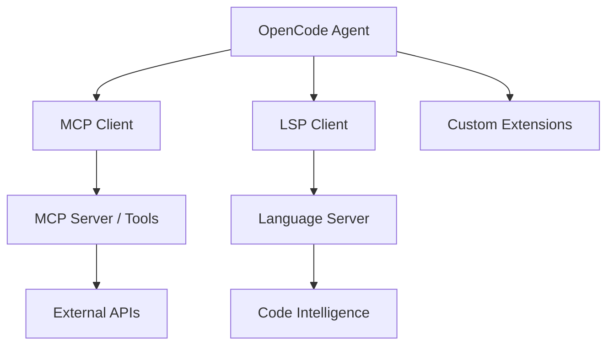

# Chapter 7: Integrations: MCP, LSP, and Extensions

Welcome to **Chapter 7: Integrations: MCP, LSP, and Extensions**. In this part of **OpenCode Tutorial: Open-Source Terminal Coding Agent at Scale**, you will build an intuitive mental model first, then move into concrete implementation details and practical production tradeoffs.

OpenCode gains leverage when integrated with MCP servers, language tooling, and repository-specific workflows.

## Integration Surfaces

| Surface | Outcome |
|:--------|:--------|
| LSP tooling | better semantic code understanding |
| MCP servers | external tool and resource access |
| repo scripts | project-native lint/test/deploy pipelines |

## Integration Pattern

1. start with repository-local build/test tools
2. add LSP-backed code navigation flows
3. integrate MCP only for high-value external systems
4. enforce policy checks on integration boundaries

## Source References

- [OpenCode Docs](https://opencode.ai/docs)
- [MCP Servers Tutorial](../mcp-servers-tutorial/)

## Summary

You now have a blueprint for extending OpenCode safely and effectively across your stack.

Next: [Chapter 8: Production Operations and Security](08-production-operations-security.md)

## How These Components Connect

