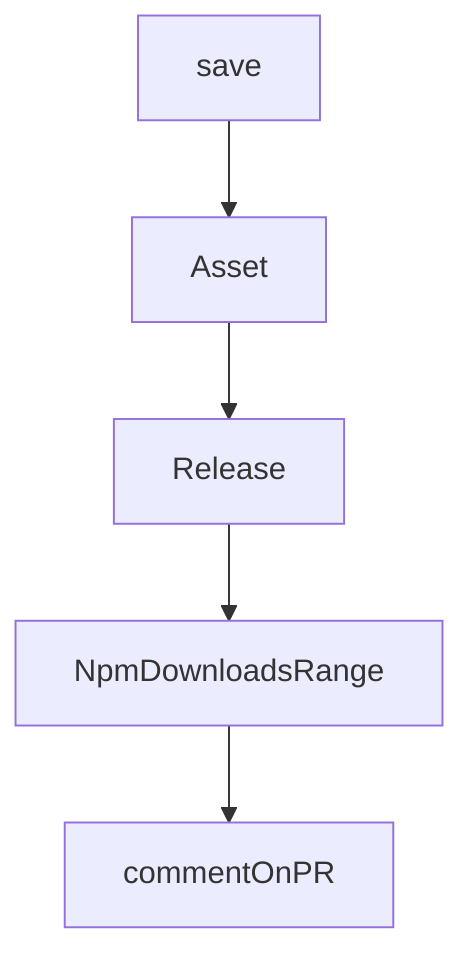

# Chapter 8: Production Operations and Security

Welcome to **Chapter 8: Production Operations and Security**. In this part of **OpenCode Tutorial: Open-Source Terminal Coding Agent at Scale**, you will build an intuitive mental model first, then move into concrete implementation details and practical production tradeoffs.


This chapter turns OpenCode from a local assistant into an operational platform component.

## Production Checklist

- explicit command and file-edit policies
- traceable audit logs for agent actions
- model/provider fallback strategy
- regular dependency and key-rotation cadence
- rollback path for failed agent-generated changes

## Metrics to Track

| Area | Metrics |
|:-----|:--------|
| quality | accepted patch rate, rollback rate |
| safety | blocked high-risk commands, policy violations |
| efficiency | time-to-first-useful-patch |
| reliability | provider failure rate, retry rate |

## Incident Classes

| Incident | First Response |
|:---------|:---------------|
| unsafe command suggestion | block + review policy drift |
| provider outage | route to fallback model profile |
| broad incorrect edits | revert patch set and narrow scope |

## Source References

- [OpenCode Releases](https://github.com/anomalyco/opencode/releases)
- [OpenCode Docs](https://opencode.ai/docs)

## Summary

You now have an operations baseline for running OpenCode in serious development environments.

## Depth Expansion Playbook

## Source Code Walkthrough

### `script/stats.ts`

The `save` function in [`script/stats.ts`](https://github.com/anomalyco/opencode/blob/HEAD/script/stats.ts) handles a key part of this chapter's functionality:

```ts
}

async function save(githubTotal: number, npmDownloads: number) {
  const file = "STATS.md"
  const date = new Date().toISOString().split("T")[0]
  const total = githubTotal + npmDownloads

  let previousGithub = 0
  let previousNpm = 0
  let previousTotal = 0
  let content = ""

  try {
    content = await Bun.file(file).text()
    const lines = content.trim().split("\n")

    for (let i = lines.length - 1; i >= 0; i--) {
      const line = lines[i].trim()
      if (line.startsWith("|") && !line.includes("Date") && !line.includes("---")) {
        const match = line.match(
          /\|\s*[\d-]+\s*\|\s*([\d,]+)\s*(?:\([^)]*\))?\s*\|\s*([\d,]+)\s*(?:\([^)]*\))?\s*\|\s*([\d,]+)\s*(?:\([^)]*\))?\s*\|/,
        )
        if (match) {
          previousGithub = parseInt(match[1].replace(/,/g, ""))
          previousNpm = parseInt(match[2].replace(/,/g, ""))
          previousTotal = parseInt(match[3].replace(/,/g, ""))
          break
        }
      }
    }
  } catch {
    content =
```

This function is important because it defines how OpenCode Tutorial: Open-Source Terminal Coding Agent at Scale implements the patterns covered in this chapter.

### `script/stats.ts`

The `Asset` interface in [`script/stats.ts`](https://github.com/anomalyco/opencode/blob/HEAD/script/stats.ts) handles a key part of this chapter's functionality:

```ts
}

interface Asset {
  name: string
  download_count: number
}

interface Release {
  tag_name: string
  name: string
  assets: Asset[]
}

interface NpmDownloadsRange {
  start: string
  end: string
  package: string
  downloads: Array<{
    downloads: number
    day: string
  }>
}

async function fetchNpmDownloads(packageName: string): Promise<number> {
  try {
    // Use a range from 2020 to current year + 5 years to ensure it works forever
    const currentYear = new Date().getFullYear()
    const endYear = currentYear + 5
    const response = await fetch(`https://api.npmjs.org/downloads/range/2020-01-01:${endYear}-12-31/${packageName}`)
    if (!response.ok) {
      console.warn(`Failed to fetch npm downloads for ${packageName}: ${response.status}`)
      return 0
```

This interface is important because it defines how OpenCode Tutorial: Open-Source Terminal Coding Agent at Scale implements the patterns covered in this chapter.

### `script/stats.ts`

The `Release` interface in [`script/stats.ts`](https://github.com/anomalyco/opencode/blob/HEAD/script/stats.ts) handles a key part of this chapter's functionality:

```ts
}

interface Release {
  tag_name: string
  name: string
  assets: Asset[]
}

interface NpmDownloadsRange {
  start: string
  end: string
  package: string
  downloads: Array<{
    downloads: number
    day: string
  }>
}

async function fetchNpmDownloads(packageName: string): Promise<number> {
  try {
    // Use a range from 2020 to current year + 5 years to ensure it works forever
    const currentYear = new Date().getFullYear()
    const endYear = currentYear + 5
    const response = await fetch(`https://api.npmjs.org/downloads/range/2020-01-01:${endYear}-12-31/${packageName}`)
    if (!response.ok) {
      console.warn(`Failed to fetch npm downloads for ${packageName}: ${response.status}`)
      return 0
    }
    const data: NpmDownloadsRange = await response.json()
    return data.downloads.reduce((total, day) => total + day.downloads, 0)
  } catch (error) {
    console.warn(`Error fetching npm downloads for ${packageName}:`, error)
```

This interface is important because it defines how OpenCode Tutorial: Open-Source Terminal Coding Agent at Scale implements the patterns covered in this chapter.

### `script/stats.ts`

The `NpmDownloadsRange` interface in [`script/stats.ts`](https://github.com/anomalyco/opencode/blob/HEAD/script/stats.ts) handles a key part of this chapter's functionality:

```ts
}

interface NpmDownloadsRange {
  start: string
  end: string
  package: string
  downloads: Array<{
    downloads: number
    day: string
  }>
}

async function fetchNpmDownloads(packageName: string): Promise<number> {
  try {
    // Use a range from 2020 to current year + 5 years to ensure it works forever
    const currentYear = new Date().getFullYear()
    const endYear = currentYear + 5
    const response = await fetch(`https://api.npmjs.org/downloads/range/2020-01-01:${endYear}-12-31/${packageName}`)
    if (!response.ok) {
      console.warn(`Failed to fetch npm downloads for ${packageName}: ${response.status}`)
      return 0
    }
    const data: NpmDownloadsRange = await response.json()
    return data.downloads.reduce((total, day) => total + day.downloads, 0)
  } catch (error) {
    console.warn(`Error fetching npm downloads for ${packageName}:`, error)
    return 0
  }
}

async function fetchReleases(): Promise<Release[]> {
  const releases: Release[] = []
```

This interface is important because it defines how OpenCode Tutorial: Open-Source Terminal Coding Agent at Scale implements the patterns covered in this chapter.


## How These Components Connect


