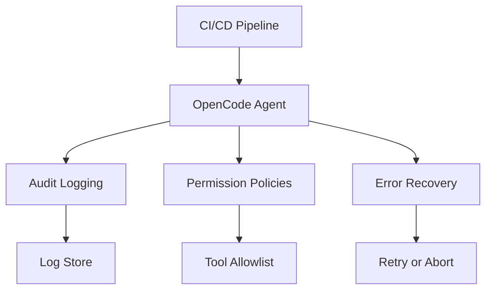

# Chapter 8: Production Operations and Security

Welcome to **Chapter 8: Production Operations and Security**. In this part of **OpenCode Tutorial: Open-Source Terminal Coding Agent at Scale**, you will build an intuitive mental model first, then move into concrete implementation details and practical production tradeoffs.

This chapter turns OpenCode from a local assistant into an operational platform component.

## Production Checklist

- explicit command and file-edit policies
- traceable audit logs for agent actions
- model/provider fallback strategy
- regular dependency and key-rotation cadence
- rollback path for failed agent-generated changes

## Metrics to Track

| Area | Metrics |
|:-----|:--------|
| quality | accepted patch rate, rollback rate |
| safety | blocked high-risk commands, policy violations |
| efficiency | time-to-first-useful-patch |
| reliability | provider failure rate, retry rate |

## Incident Classes

| Incident | First Response |
|:---------|:---------------|
| unsafe command suggestion | block + review policy drift |
| provider outage | route to fallback model profile |
| broad incorrect edits | revert patch set and narrow scope |

## Source References

- [OpenCode Releases](https://github.com/anomalyco/opencode/releases)
- [OpenCode Docs](https://opencode.ai/docs)

## Summary

You now have an operations baseline for running OpenCode in serious development environments.

## How These Components Connect

