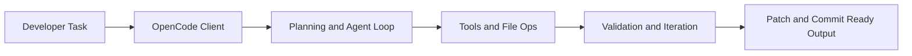

# OpenCode Tutorial: Open-Source Terminal Coding Agent at Scale

> Learn how to use `anomalyco/opencode` to run terminal-native coding agents with provider flexibility, strong tool control, and production-grade workflows.

## Why This Track Matters

OpenCode is one of the fastest-growing open-source coding agents. It combines a powerful TUI, provider-agnostic model support, and a client/server architecture that can scale beyond a single terminal session.

This track focuses on:

- building reliable coding-agent workflows in the terminal
- controlling tool execution, permissions, and safety boundaries
- integrating LSP/MCP capabilities into real developer loops
- operating OpenCode for teams and production environments

## Current Snapshot (Verified February 11, 2026)

- repository: [`anomalyco/opencode`](https://github.com/anomalyco/opencode)
- stars: about **102.6k**
- latest release: [`v1.1.59`](https://github.com/anomalyco/opencode/releases/tag/v1.1.59)
- development activity: very active with same-day updates
- project positioning: open-source terminal coding agent with desktop and remote-oriented architecture

## Mental Model

## Chapter Guide

| Chapter | Key Question | Outcome |
|:--------|:-------------|:--------|
| [01 - Getting Started](01-getting-started.md) | How do I install and run OpenCode fast? | Stable local baseline |
| [02 - Architecture and Agent Loop](02-architecture-agent-loop.md) | How does OpenCode orchestrate coding tasks internally? | Strong execution mental model |
| [03 - Model and Provider Routing](03-model-and-provider-routing.md) | How do I configure providers and routing safely? | Reliable model strategy |
| [04 - Tools, Permissions, and Execution](04-tools-permissions-and-execution.md) | How do I control shell/file tools securely? | Safer automation boundaries |
| [05 - Agents, Subagents, and Planning](05-agents-subagents-and-planning.md) | How do build/plan/general agent modes differ? | Better task decomposition decisions |
| [06 - Client/Server and Remote Workflows](06-client-server-and-remote-workflows.md) | How do I run beyond a single local session? | Remote-capable operating model |
| [07 - Integrations: MCP, LSP, and Extensions](07-integrations-mcp-lsp-and-extensions.md) | How does OpenCode fit broader toolchains? | Integration strategy |
| [08 - Production Operations and Security](08-production-operations-security.md) | How do I run OpenCode in teams and CI safely? | Production runbook baseline |

## What You Will Learn

- how to run OpenCode as a daily driver coding agent
- how to tune model/provider and tool execution behavior
- how to integrate OpenCode into MCP/LSP-enabled development stacks
- how to operate secure, repeatable coding-agent workflows in production

## Source References

- [OpenCode Repository](https://github.com/anomalyco/opencode)
- [OpenCode Releases](https://github.com/anomalyco/opencode/releases)
- [OpenCode Docs](https://opencode.ai/docs)
- [OpenCode Agents Docs](https://opencode.ai/docs/agents)

## Related Tutorials

- [Cline Tutorial](../cline-tutorial/)
- [Roo Code Tutorial](../roo-code-tutorial/)
- [Aider Tutorial](../aider-tutorial/)
- [OpenHands Tutorial](../openhands-tutorial/)

---

Start with [Chapter 1: Getting Started](01-getting-started.md).
