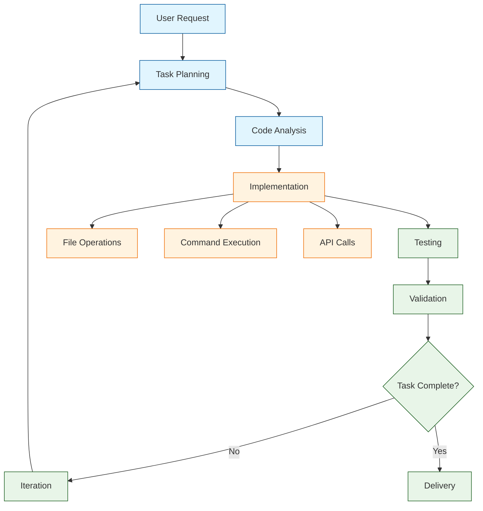

# OpenHands Tutorial: AI Software Engineering Agent

> Master OpenHands (formerly OpenDevin) - the autonomous AI agent that can write code, run commands, and solve complex software engineering tasks.

<div align="center">

**🤖 Autonomous AI Software Engineer**

[](https://github.com/OpenHands/OpenHands)

</div>

---

## 🎯 What is OpenHands?

**OpenHands**<sup>[View Repo](https://github.com/OpenHands/OpenHands)</sup> (formerly OpenDevin) is an autonomous AI software engineering agent that can perform complex coding tasks. It combines advanced reasoning with practical execution capabilities, allowing it to write code, run tests, fix bugs, and deploy applications - all autonomously.

### OpenHands Capabilities

| Capability | Description |
|:-----------|:------------|
| **Code Generation** | Write production-quality code from natural language descriptions |
| **Bug Fixing** | Identify and fix bugs in existing codebases |
| **Testing** | Write and execute comprehensive test suites |
| **Refactoring** | Improve code structure and performance |
| **Documentation** | Generate READMEs, API docs, and inline comments |
| **Deployment** | Set up CI/CD pipelines and container deployments |
| **Research** | Analyze codebases and provide architectural insights |



## Core Architecture

### Agent Components

**Planner**: Analyzes requests and creates structured task plans
**Coder**: Writes and modifies code with precision
**Runner**: Executes commands and manages environments
**Debugger**: Identifies and fixes issues systematically
**Validator**: Ensures code quality and functionality

### Execution Environment

OpenHands operates in secure sandboxed environments with:
- **Isolated File Systems**: Safe code execution without host system access
- **Command Execution**: Running shell commands, scripts, and tools
- **Package Management**: Installing dependencies and managing environments
- **Network Access**: Controlled API calls and external service integration

## Tutorial Chapters

1. **[Chapter 1: Getting Started](01-getting-started.md)** - Installation, setup, and your first autonomous coding task
2. **[Chapter 2: Basic Operations](02-basic-operations.md)** - File operations, command execution, and environment management
3. **[Chapter 3: Code Generation](03-code-generation.md)** - Writing functions, classes, and complete applications
4. **[Chapter 4: Bug Fixing](04-bug-fixing.md)** - Identifying, diagnosing, and resolving code issues
5. **[Chapter 5: Testing](05-testing.md)** - Writing tests, running test suites, and quality assurance
6. **[Chapter 6: Refactoring](06-refactoring.md)** - Code improvement, optimization, and modernization
7. **[Chapter 7: Integration](07-integration.md)** - API integration, database connections, and external services
8. **[Chapter 8: Advanced Projects](08-advanced-projects.md)** - Full-stack applications, microservices, and deployment

## What You'll Learn

- **Autonomous Development** - Let AI handle complete software engineering workflows
- **Code Quality** - Production-ready code with proper testing and documentation
- **System Integration** - Connecting applications with databases, APIs, and services
- **Debugging Mastery** - Systematic approaches to identifying and fixing complex issues
- **Architectural Design** - Building scalable, maintainable software systems

## Prerequisites

- Python 3.10+
- Basic programming knowledge
- Understanding of software development concepts
- Familiarity with command-line interfaces

## Quick Start

```bash
# Install OpenHands
pip install openhands

# Basic usage
from openhands import OpenHands

# Initialize agent
agent = OpenHands()

# Execute a coding task
result = agent.run(
    task="Create a Python function that calculates fibonacci numbers efficiently",
    workspace="./my_project"
)

print("Generated code:")
print(result.code)
print("\nExecution result:")
print(result.output)
```

## Example: Complete Web Application

```python
from openhands import OpenHands

agent = OpenHands()

# Build a complete task management web app
result = agent.run("""
Create a full-stack task management application with:
1. FastAPI backend with SQLAlchemy
2. React frontend with modern UI
3. SQLite database
4. REST API endpoints
5. Basic CRUD operations
6. Input validation
7. Error handling
8. Unit tests
9. Docker containerization
""")

# The agent will:
# - Plan the application architecture
# - Create backend API with FastAPI
# - Set up database models and migrations
# - Build React frontend components
# - Implement CRUD operations
# - Add input validation and error handling
# - Write comprehensive tests
# - Create Dockerfile and docker-compose.yml
# - Generate documentation
```

## Key Features

### Intelligent Planning
- **Task Decomposition**: Breaks complex requests into manageable steps
- **Dependency Analysis**: Identifies required components and their relationships
- **Risk Assessment**: Evaluates potential issues and mitigation strategies

### Code Excellence
- **Best Practices**: Follows industry standards and conventions
- **Type Safety**: Adds appropriate type hints and validation
- **Documentation**: Generates comprehensive docstrings and comments
- **Security**: Implements secure coding practices

### Execution Control
- **Safe Operations**: Sandboxed execution prevents system damage
- **Rollback Capability**: Can undo changes if issues arise
- **Progress Tracking**: Real-time updates on task completion
- **Resource Management**: Efficient use of computational resources

## Learning Path

### 🟢 Beginner Track
1. Chapters 1-2: Setup and basic operations
2. Simple code generation tasks

### 🟡 Intermediate Track
1. Chapters 3-4: Code generation and bug fixing
2. Building complete applications

### 🔴 Advanced Track
1. Chapters 5-8: Testing, refactoring, integration, and complex projects
2. Enterprise software development

---

**Ready to have an AI software engineer? Let's begin with [Chapter 1: Getting Started](01-getting-started.md)!**

*Generated for [Awesome Code Docs](https://github.com/johnxie/awesome-code-docs)*
