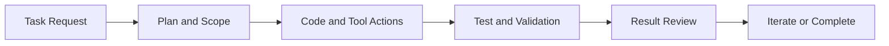

# OpenHands Tutorial: Autonomous Software Engineering Workflows

> Learn how to operate `OpenHands/OpenHands` across local GUI, CLI, and SDK workflows with production-minded safety, validation, and integration patterns.

## Why This Track Matters

OpenHands is one of the most capable open autonomous engineering agents. Teams need clear operating guidance to avoid unsafe or low-quality automation.

This track focuses on:

- bounded autonomous execution with human checkpoints
- reproducible bugfix and refactor loops
- reliable test and integration workflows
- practical scaling from local usage to team operations

## Current Snapshot (auto-updated)

- repository: [`OpenHands/OpenHands`](https://github.com/OpenHands/OpenHands)
- stars: about **67.8k**
- latest release: [`1.3.0`](https://github.com/OpenHands/OpenHands/releases/tag/1.3.0) (published February 2, 2026)
- Python package version in source: `1.3.0` (`pyproject.toml`)
- docs surface includes SDK, CLI mode, local setup, and cloud/enterprise guidance

## Mental Model

## Chapter Guide

| Chapter | Key Question | Outcome |
|:--------|:-------------|:--------|
| [01 - Getting Started](01-getting-started.md) | How do I install and run OpenHands safely? | Working local baseline |
| [02 - Basic Operations](02-basic-operations.md) | How do file, command, and workspace operations work? | Controlled execution patterns |
| [03 - Code Generation](03-code-generation.md) | How do I generate production-ready code? | Better generation quality and structure |
| [04 - Bug Fixing](04-bug-fixing.md) | How do I drive deterministic debugging loops? | Repeatable RCA and fix process |
| [05 - Testing](05-testing.md) | How do I validate output rigorously? | Comprehensive QA workflows |
| [06 - Refactoring](06-refactoring.md) | How do I modernize code safely? | Structured refactor strategy |
| [07 - Integration](07-integration.md) | How do I connect external services and systems? | Integration governance patterns |
| [08 - Advanced Projects](08-advanced-projects.md) | How do I apply OpenHands to larger systems? | End-to-end project orchestration |

## What You Will Learn

- how to run autonomous coding workflows with explicit safety boundaries
- how to combine generation, debugging, testing, and refactoring loops effectively
- how to integrate OpenHands into realistic engineering delivery pipelines
- how to scale usage from solo workflows to team operations

## Source References

- [OpenHands Repository](https://github.com/OpenHands/OpenHands)
- [OpenHands Docs](https://docs.openhands.dev/)
- [OpenHands Releases](https://github.com/OpenHands/OpenHands/releases)

## Related Tutorials

- [OpenClaw Tutorial](../openclaw-tutorial/)
- [Cline Tutorial](../cline-tutorial/)
- [Roo Code Tutorial](../roo-code-tutorial/)
- [Continue Tutorial](../continue-tutorial/)

---

Start with [Chapter 1: Getting Started](01-getting-started.md).

## Navigation & Backlinks

- [Start Here: Chapter 1: Getting Started with OpenHands](01-getting-started.md)
- [Back to Main Catalog](../../README.md#-tutorial-catalog)
- [Browse A-Z Tutorial Directory](../../discoverability/tutorial-directory.md)
- [Search by Intent](../../discoverability/query-hub.md)
- [Explore Category Hubs](../../README.md#category-hubs)

## Full Chapter Map

1. [Chapter 1: Getting Started with OpenHands](01-getting-started.md)
2. [Chapter 2: Basic Operations - Files, Commands, and Environments](02-basic-operations.md)
3. [Chapter 3: Code Generation - Creating Production-Ready Code](03-code-generation.md)
4. [Chapter 4: Bug Fixing - Autonomous Debugging and Resolution](04-bug-fixing.md)
5. [Chapter 5: Testing - Comprehensive Test Suite Generation and Quality Assurance](05-testing.md)
6. [Chapter 6: Refactoring - Code Structure Improvement and Modernization](06-refactoring.md)
7. [Chapter 7: Integration - Connecting Applications with External Services](07-integration.md)
8. [Chapter 8: Advanced Projects - Complete Applications and System Architectures](08-advanced-projects.md)

*Generated by [AI Codebase Knowledge Builder](https://github.com/The-Pocket/Tutorial-Codebase-Knowledge)*
