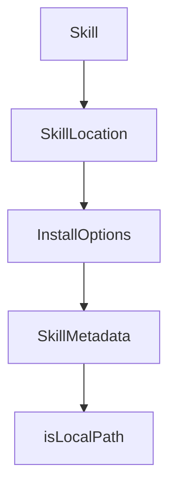

# Chapter 1: Getting Started

Welcome to **Chapter 1: Getting Started**. In this part of **OpenSkills Tutorial: Universal Skill Loading for Coding Agents**, you will build an intuitive mental model first, then move into concrete implementation details and practical production tradeoffs.


This chapter gets OpenSkills installed and synchronizing skills into your agent environment.

## Quick Start

```bash
npx openskills install anthropics/skills
npx openskills sync
```

## Learning Goals

- install first skills package
- generate/update `AGENTS.md` skill block
- verify `openskills read` invocation

## Summary

You now have OpenSkills running with a synced baseline skill set.

Next: [Chapter 2: Skill Format and Loader Architecture](02-skill-format-and-loader-architecture.md)

## Depth Expansion Playbook

## Source Code Walkthrough

### `src/types.ts`

The `Skill` interface in [`src/types.ts`](https://github.com/numman-ali/openskills/blob/HEAD/src/types.ts) handles a key part of this chapter's functionality:

```ts
export interface Skill {
  name: string;
  description: string;
  location: 'project' | 'global';
  path: string;
}

export interface SkillLocation {
  path: string;
  baseDir: string;
  source: string;
}

export interface InstallOptions {
  global?: boolean;
  universal?: boolean;
  yes?: boolean;
}

export interface SkillMetadata {
  name: string;
  description: string;
  context?: string;
}

```

This interface is important because it defines how OpenSkills Tutorial: Universal Skill Loading for Coding Agents implements the patterns covered in this chapter.

### `src/types.ts`

The `SkillLocation` interface in [`src/types.ts`](https://github.com/numman-ali/openskills/blob/HEAD/src/types.ts) handles a key part of this chapter's functionality:

```ts
}

export interface SkillLocation {
  path: string;
  baseDir: string;
  source: string;
}

export interface InstallOptions {
  global?: boolean;
  universal?: boolean;
  yes?: boolean;
}

export interface SkillMetadata {
  name: string;
  description: string;
  context?: string;
}

```

This interface is important because it defines how OpenSkills Tutorial: Universal Skill Loading for Coding Agents implements the patterns covered in this chapter.

### `src/types.ts`

The `InstallOptions` interface in [`src/types.ts`](https://github.com/numman-ali/openskills/blob/HEAD/src/types.ts) handles a key part of this chapter's functionality:

```ts
}

export interface InstallOptions {
  global?: boolean;
  universal?: boolean;
  yes?: boolean;
}

export interface SkillMetadata {
  name: string;
  description: string;
  context?: string;
}

```

This interface is important because it defines how OpenSkills Tutorial: Universal Skill Loading for Coding Agents implements the patterns covered in this chapter.

### `src/types.ts`

The `SkillMetadata` interface in [`src/types.ts`](https://github.com/numman-ali/openskills/blob/HEAD/src/types.ts) handles a key part of this chapter's functionality:

```ts
}

export interface SkillMetadata {
  name: string;
  description: string;
  context?: string;
}

```

This interface is important because it defines how OpenSkills Tutorial: Universal Skill Loading for Coding Agents implements the patterns covered in this chapter.


## How These Components Connect


