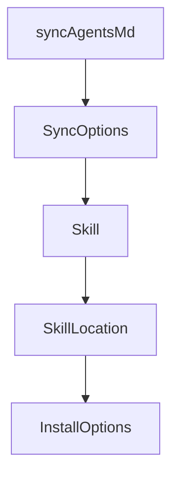

# Chapter 1: Getting Started

Welcome to **Chapter 1: Getting Started**. In this part of **OpenSkills Tutorial: Universal Skill Loading for Coding Agents**, you will build an intuitive mental model first, then move into concrete implementation details and practical production tradeoffs.


This chapter gets OpenSkills installed and synchronizing skills into your agent environment.

## Quick Start

```bash
npx openskills install anthropics/skills
npx openskills sync
```

## Learning Goals

- install first skills package
- generate/update `AGENTS.md` skill block
- verify `openskills read` invocation

## Summary

You now have OpenSkills running with a synced baseline skill set.

Next: [Chapter 2: Skill Format and Loader Architecture](02-skill-format-and-loader-architecture.md)

## Source Code Walkthrough

### `src/commands/sync.ts`

The `syncAgentsMd` function in [`src/commands/sync.ts`](https://github.com/numman-ali/openskills/blob/HEAD/src/commands/sync.ts) handles a key part of this chapter's functionality:

```ts
 * Sync installed skills to a markdown file
 */
export async function syncAgentsMd(options: SyncOptions = {}): Promise<void> {
  const outputPath = options.output || 'AGENTS.md';
  const outputName = basename(outputPath);

  // Validate output file is markdown
  if (!outputPath.endsWith('.md')) {
    console.error(chalk.red('Error: Output file must be a markdown file (.md)'));
    process.exit(1);
  }

  // Create file if it doesn't exist
  if (!existsSync(outputPath)) {
    const dir = dirname(outputPath);
    if (dir && dir !== '.' && !existsSync(dir)) {
      mkdirSync(dir, { recursive: true });
    }
    writeFileSync(outputPath, `# ${outputName.replace('.md', '')}\n\n`);
    console.log(chalk.dim(`Created ${outputPath}`));
  }

  let skills = findAllSkills();

  if (skills.length === 0) {
    console.log('No skills installed. Install skills first:');
    console.log(`  ${chalk.cyan('npx openskills install anthropics/skills --project')}`);
    return;
  }

  // Interactive mode by default (unless -y flag)
  if (!options.yes) {
```

This function is important because it defines how OpenSkills Tutorial: Universal Skill Loading for Coding Agents implements the patterns covered in this chapter.

### `src/commands/sync.ts`

The `SyncOptions` interface in [`src/commands/sync.ts`](https://github.com/numman-ali/openskills/blob/HEAD/src/commands/sync.ts) handles a key part of this chapter's functionality:

```ts
import type { Skill } from '../types.js';

export interface SyncOptions {
  yes?: boolean;
  output?: string;
}

/**
 * Sync installed skills to a markdown file
 */
export async function syncAgentsMd(options: SyncOptions = {}): Promise<void> {
  const outputPath = options.output || 'AGENTS.md';
  const outputName = basename(outputPath);

  // Validate output file is markdown
  if (!outputPath.endsWith('.md')) {
    console.error(chalk.red('Error: Output file must be a markdown file (.md)'));
    process.exit(1);
  }

  // Create file if it doesn't exist
  if (!existsSync(outputPath)) {
    const dir = dirname(outputPath);
    if (dir && dir !== '.' && !existsSync(dir)) {
      mkdirSync(dir, { recursive: true });
    }
    writeFileSync(outputPath, `# ${outputName.replace('.md', '')}\n\n`);
    console.log(chalk.dim(`Created ${outputPath}`));
  }

  let skills = findAllSkills();

```

This interface is important because it defines how OpenSkills Tutorial: Universal Skill Loading for Coding Agents implements the patterns covered in this chapter.

### `src/types.ts`

The `Skill` interface in [`src/types.ts`](https://github.com/numman-ali/openskills/blob/HEAD/src/types.ts) handles a key part of this chapter's functionality:

```ts
export interface Skill {
  name: string;
  description: string;
  location: 'project' | 'global';
  path: string;
}

export interface SkillLocation {
  path: string;
  baseDir: string;
  source: string;
}

export interface InstallOptions {
  global?: boolean;
  universal?: boolean;
  yes?: boolean;
}

export interface SkillMetadata {
  name: string;
  description: string;
  context?: string;
}

```

This interface is important because it defines how OpenSkills Tutorial: Universal Skill Loading for Coding Agents implements the patterns covered in this chapter.

### `src/types.ts`

The `SkillLocation` interface in [`src/types.ts`](https://github.com/numman-ali/openskills/blob/HEAD/src/types.ts) handles a key part of this chapter's functionality:

```ts
}

export interface SkillLocation {
  path: string;
  baseDir: string;
  source: string;
}

export interface InstallOptions {
  global?: boolean;
  universal?: boolean;
  yes?: boolean;
}

export interface SkillMetadata {
  name: string;
  description: string;
  context?: string;
}

```

This interface is important because it defines how OpenSkills Tutorial: Universal Skill Loading for Coding Agents implements the patterns covered in this chapter.


## How These Components Connect


