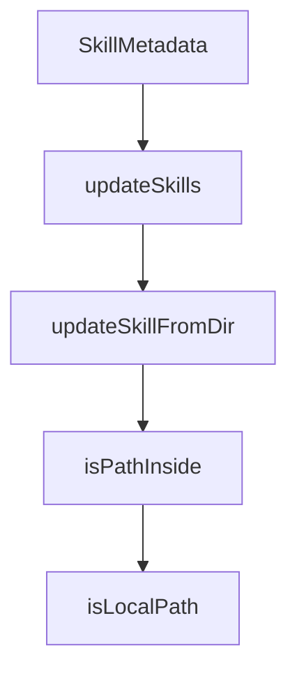

# Chapter 2: Skill Format and Loader Architecture

Welcome to **Chapter 2: Skill Format and Loader Architecture**. In this part of **OpenSkills Tutorial: Universal Skill Loading for Coding Agents**, you will build an intuitive mental model first, then move into concrete implementation details and practical production tradeoffs.


OpenSkills uses Claude-style `SKILL.md` and generates an agent-readable skills registry in `AGENTS.md`.

## Architecture Highlights

| Layer | Role |
|:------|:-----|
| skill package | instruction + resources |
| loader | install/read/update lifecycle |
| sync engine | writes `<available_skills>` manifest |

## Summary

You now understand how OpenSkills maps skill files into runtime-usable metadata.

Next: [Chapter 3: Installation Sources and Trust Model](03-installation-sources-and-trust-model.md)

## Source Code Walkthrough

### `src/types.ts`

The `SkillMetadata` interface in [`src/types.ts`](https://github.com/numman-ali/openskills/blob/HEAD/src/types.ts) handles a key part of this chapter's functionality:

```ts
}

export interface SkillMetadata {
  name: string;
  description: string;
  context?: string;
}

```

This interface is important because it defines how OpenSkills Tutorial: Universal Skill Loading for Coding Agents implements the patterns covered in this chapter.

### `src/commands/update.ts`

The `updateSkills` function in [`src/commands/update.ts`](https://github.com/numman-ali/openskills/blob/HEAD/src/commands/update.ts) handles a key part of this chapter's functionality:

```ts
 * Update installed skills from their recorded source metadata.
 */
export async function updateSkills(skillNames: string[] | string | undefined): Promise<void> {
  const requested = normalizeSkillNames(skillNames);
  const skills = findAllSkills();

  if (skills.length === 0) {
    console.log('No skills installed.\n');
    console.log('Install skills:');
    console.log(`  ${chalk.cyan('npx openskills install anthropics/skills')}         ${chalk.dim('# Project (default)')}`);
    console.log(`  ${chalk.cyan('npx openskills install owner/skill --global')}     ${chalk.dim('# Global (advanced)')}`);
    return;
  }

  let targets = skills;

  if (requested.length > 0) {
    const requestedSet = new Set(requested);
    targets = skills.filter((skill) => requestedSet.has(skill.name));

    const missing = requested.filter((name) => !skills.some((skill) => skill.name === name));
    if (missing.length > 0) {
      console.log(chalk.yellow(`Skipping missing skills: ${missing.join(', ')}`));
    }
  } else {
    // Default to updating all installed skills
    targets = skills;
  }

  if (targets.length === 0) {
    console.log(chalk.yellow('No matching skills to update.'));
    return;
```

This function is important because it defines how OpenSkills Tutorial: Universal Skill Loading for Coding Agents implements the patterns covered in this chapter.

### `src/commands/update.ts`

The `updateSkillFromDir` function in [`src/commands/update.ts`](https://github.com/numman-ali/openskills/blob/HEAD/src/commands/update.ts) handles a key part of this chapter's functionality:

```ts
        continue;
      }
      updateSkillFromDir(skill.path, localPath);
      writeSkillMetadata(skill.path, { ...metadata, installedAt: new Date().toISOString() });
      console.log(chalk.green(`✅ Updated: ${skill.name}`));
      updated++;
      continue;
    }

    if (!metadata.repoUrl) {
      console.log(chalk.yellow(`Skipped: ${skill.name} (missing repo URL metadata)`));
      missingRepoUrl.push(skill.name);
      skipped++;
      continue;
    }

    const tempDir = join(homedir(), `.openskills-temp-${Date.now()}`);
    mkdirSync(tempDir, { recursive: true });

    const spinner = ora(`Updating ${skill.name}...`).start();
    try {
      execSync(`git clone --depth 1 --quiet "${metadata.repoUrl}" "${tempDir}/repo"`, { stdio: 'pipe' });
      const repoDir = join(tempDir, 'repo');
      const subpath = metadata.subpath && metadata.subpath !== '.' ? metadata.subpath : '';
      const sourceDir = subpath ? join(repoDir, subpath) : repoDir;

      if (!existsSync(join(sourceDir, 'SKILL.md'))) {
        spinner.fail(`SKILL.md missing for ${skill.name}`);
        console.log(chalk.yellow(`Skipped: ${skill.name} (SKILL.md not found in repo at ${subpath || '.'})`));
        missingRepoSkillFile.push({ name: skill.name, subpath: subpath || '.' });
        skipped++;
        continue;
```

This function is important because it defines how OpenSkills Tutorial: Universal Skill Loading for Coding Agents implements the patterns covered in this chapter.

### `src/commands/update.ts`

The `isPathInside` function in [`src/commands/update.ts`](https://github.com/numman-ali/openskills/blob/HEAD/src/commands/update.ts) handles a key part of this chapter's functionality:

```ts
  mkdirSync(targetDir, { recursive: true });

  if (!isPathInside(targetPath, targetDir)) {
    console.error(chalk.red('Security error: Installation path outside target directory'));
    process.exit(1);
  }

  rmSync(targetPath, { recursive: true, force: true });
  cpSync(sourceDir, targetPath, { recursive: true, dereference: true });
}

function isPathInside(targetPath: string, targetDir: string): boolean {
  const resolvedTargetPath = resolve(targetPath);
  const resolvedTargetDir = resolve(targetDir);
  const resolvedTargetDirWithSep = resolvedTargetDir.endsWith(sep)
    ? resolvedTargetDir
    : resolvedTargetDir + sep;
  return resolvedTargetPath.startsWith(resolvedTargetDirWithSep);
}

```

This function is important because it defines how OpenSkills Tutorial: Universal Skill Loading for Coding Agents implements the patterns covered in this chapter.


## How These Components Connect


