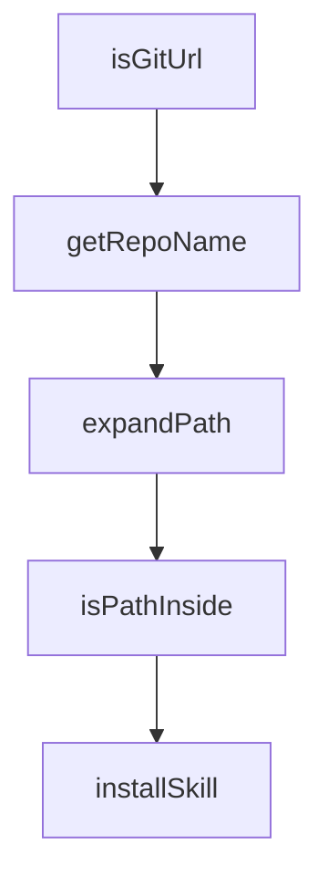

# Chapter 3: Installation Sources and Trust Model

Welcome to **Chapter 3: Installation Sources and Trust Model**. In this part of **OpenSkills Tutorial: Universal Skill Loading for Coding Agents**, you will build an intuitive mental model first, then move into concrete implementation details and practical production tradeoffs.


OpenSkills can install from public repos, private repos, and local paths. Trust boundaries should be explicit.

## Source Types

| Source | Risk Consideration |
|:-------|:-------------------|
| public GitHub | provenance and maintenance quality |
| private Git | access controls and branch policy |
| local path | internal review quality |

## Summary

You now have a trust model for safe skill installation.

Next: [Chapter 4: Sync and AGENTS.md Integration](04-sync-and-agents-md-integration.md)

## Source Code Walkthrough

### `src/commands/install.ts`

The `isGitUrl` function in [`src/commands/install.ts`](https://github.com/numman-ali/openskills/blob/HEAD/src/commands/install.ts) handles a key part of this chapter's functionality:

```ts
 * Check if source is a git URL (SSH, git://, or HTTPS)
 */
function isGitUrl(source: string): boolean {
  return (
    source.startsWith('git@') ||
    source.startsWith('git://') ||
    source.startsWith('http://') ||
    source.startsWith('https://') ||
    source.endsWith('.git')
  );
}

/**
 * Extract repo name from a git URL
 */
function getRepoName(repoUrl: string): string | null {
  const cleaned = repoUrl.replace(/\.git$/, '');
  const lastPart = cleaned.split('/').pop();
  if (!lastPart) return null;
  const maybeRepo = lastPart.includes(':') ? lastPart.split(':').pop() : lastPart;
  return maybeRepo || null;
}

/**
 * Expand ~ to home directory
 */
function expandPath(source: string): string {
  if (source.startsWith('~/')) {
    return join(homedir(), source.slice(2));
  }
  return resolve(source);
}
```

This function is important because it defines how OpenSkills Tutorial: Universal Skill Loading for Coding Agents implements the patterns covered in this chapter.

### `src/commands/install.ts`

The `getRepoName` function in [`src/commands/install.ts`](https://github.com/numman-ali/openskills/blob/HEAD/src/commands/install.ts) handles a key part of this chapter's functionality:

```ts
 * Extract repo name from a git URL
 */
function getRepoName(repoUrl: string): string | null {
  const cleaned = repoUrl.replace(/\.git$/, '');
  const lastPart = cleaned.split('/').pop();
  if (!lastPart) return null;
  const maybeRepo = lastPart.includes(':') ? lastPart.split(':').pop() : lastPart;
  return maybeRepo || null;
}

/**
 * Expand ~ to home directory
 */
function expandPath(source: string): string {
  if (source.startsWith('~/')) {
    return join(homedir(), source.slice(2));
  }
  return resolve(source);
}

/**
 * Ensure target path stays within target directory
 */
function isPathInside(targetPath: string, targetDir: string): boolean {
  const resolvedTargetPath = resolve(targetPath);
  const resolvedTargetDir = resolve(targetDir);
  const resolvedTargetDirWithSep = resolvedTargetDir.endsWith(sep)
    ? resolvedTargetDir
    : resolvedTargetDir + sep;
  return resolvedTargetPath.startsWith(resolvedTargetDirWithSep);
}

```

This function is important because it defines how OpenSkills Tutorial: Universal Skill Loading for Coding Agents implements the patterns covered in this chapter.

### `src/commands/install.ts`

The `expandPath` function in [`src/commands/install.ts`](https://github.com/numman-ali/openskills/blob/HEAD/src/commands/install.ts) handles a key part of this chapter's functionality:

```ts
 * Expand ~ to home directory
 */
function expandPath(source: string): string {
  if (source.startsWith('~/')) {
    return join(homedir(), source.slice(2));
  }
  return resolve(source);
}

/**
 * Ensure target path stays within target directory
 */
function isPathInside(targetPath: string, targetDir: string): boolean {
  const resolvedTargetPath = resolve(targetPath);
  const resolvedTargetDir = resolve(targetDir);
  const resolvedTargetDirWithSep = resolvedTargetDir.endsWith(sep)
    ? resolvedTargetDir
    : resolvedTargetDir + sep;
  return resolvedTargetPath.startsWith(resolvedTargetDirWithSep);
}

/**
 * Install skill from local path, GitHub, or Git URL
 */
export async function installSkill(source: string, options: InstallOptions): Promise<void> {
  const folder = options.universal ? '.agent/skills' : '.claude/skills';
  const isProject = !options.global; // Default to project unless --global specified
  const targetDir = isProject
    ? join(process.cwd(), folder)
    : join(homedir(), folder);

  const location = isProject
```

This function is important because it defines how OpenSkills Tutorial: Universal Skill Loading for Coding Agents implements the patterns covered in this chapter.

### `src/commands/install.ts`

The `isPathInside` function in [`src/commands/install.ts`](https://github.com/numman-ali/openskills/blob/HEAD/src/commands/install.ts) handles a key part of this chapter's functionality:

```ts
 * Ensure target path stays within target directory
 */
function isPathInside(targetPath: string, targetDir: string): boolean {
  const resolvedTargetPath = resolve(targetPath);
  const resolvedTargetDir = resolve(targetDir);
  const resolvedTargetDirWithSep = resolvedTargetDir.endsWith(sep)
    ? resolvedTargetDir
    : resolvedTargetDir + sep;
  return resolvedTargetPath.startsWith(resolvedTargetDirWithSep);
}

/**
 * Install skill from local path, GitHub, or Git URL
 */
export async function installSkill(source: string, options: InstallOptions): Promise<void> {
  const folder = options.universal ? '.agent/skills' : '.claude/skills';
  const isProject = !options.global; // Default to project unless --global specified
  const targetDir = isProject
    ? join(process.cwd(), folder)
    : join(homedir(), folder);

  const location = isProject
    ? chalk.blue(`project (${folder})`)
    : chalk.dim(`global (~/${folder})`);

  const projectLocation = `./${folder}`;
  const globalLocation = `~/${folder}`;

  console.log(`Installing from: ${chalk.cyan(source)}`);
  console.log(`Location: ${location}`);
  if (isProject) {
    console.log(
```

This function is important because it defines how OpenSkills Tutorial: Universal Skill Loading for Coding Agents implements the patterns covered in this chapter.


## How These Components Connect


