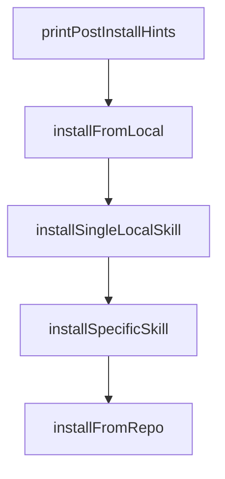

# Chapter 3: Installation Sources and Trust Model

Welcome to **Chapter 3: Installation Sources and Trust Model**. In this part of **OpenSkills Tutorial: Universal Skill Loading for Coding Agents**, you will build an intuitive mental model first, then move into concrete implementation details and practical production tradeoffs.


OpenSkills can install from public repos, private repos, and local paths. Trust boundaries should be explicit.

## Source Types

| Source | Risk Consideration |
|:-------|:-------------------|
| public GitHub | provenance and maintenance quality |
| private Git | access controls and branch policy |
| local path | internal review quality |

## Summary

You now have a trust model for safe skill installation.

Next: [Chapter 4: Sync and AGENTS.md Integration](04-sync-and-agents-md-integration.md)

## Depth Expansion Playbook

## Source Code Walkthrough

### `src/commands/install.ts`

The `printPostInstallHints` function in [`src/commands/install.ts`](https://github.com/numman-ali/openskills/blob/HEAD/src/commands/install.ts) handles a key part of this chapter's functionality:

```ts
    };
    await installFromLocal(localPath, targetDir, options, sourceInfo);
    printPostInstallHints(isProject);
    return;
  }

  // Parse git source
  let repoUrl: string;
  let skillSubpath: string = '';

  if (isGitUrl(source)) {
    // Full git URL (SSH, HTTPS, git://)
    repoUrl = source;
  } else {
    // GitHub shorthand: owner/repo or owner/repo/skill-path
    const parts = source.split('/');
    if (parts.length === 2) {
      repoUrl = `https://github.com/${source}`;
    } else if (parts.length > 2) {
      repoUrl = `https://github.com/${parts[0]}/${parts[1]}`;
      skillSubpath = parts.slice(2).join('/');
    } else {
      console.error(chalk.red('Error: Invalid source format'));
      console.error('Expected: owner/repo, owner/repo/skill-name, git URL, or local path');
      process.exit(1);
    }
  }

  // Clone and install from git
  const tempDir = join(homedir(), `.openskills-temp-${Date.now()}`);
  mkdirSync(tempDir, { recursive: true });
  const sourceInfo: InstallSourceInfo = {
```

This function is important because it defines how OpenSkills Tutorial: Universal Skill Loading for Coding Agents implements the patterns covered in this chapter.

### `src/commands/install.ts`

The `installFromLocal` function in [`src/commands/install.ts`](https://github.com/numman-ali/openskills/blob/HEAD/src/commands/install.ts) handles a key part of this chapter's functionality:

```ts
      localRoot: localPath,
    };
    await installFromLocal(localPath, targetDir, options, sourceInfo);
    printPostInstallHints(isProject);
    return;
  }

  // Parse git source
  let repoUrl: string;
  let skillSubpath: string = '';

  if (isGitUrl(source)) {
    // Full git URL (SSH, HTTPS, git://)
    repoUrl = source;
  } else {
    // GitHub shorthand: owner/repo or owner/repo/skill-path
    const parts = source.split('/');
    if (parts.length === 2) {
      repoUrl = `https://github.com/${source}`;
    } else if (parts.length > 2) {
      repoUrl = `https://github.com/${parts[0]}/${parts[1]}`;
      skillSubpath = parts.slice(2).join('/');
    } else {
      console.error(chalk.red('Error: Invalid source format'));
      console.error('Expected: owner/repo, owner/repo/skill-name, git URL, or local path');
      process.exit(1);
    }
  }

  // Clone and install from git
  const tempDir = join(homedir(), `.openskills-temp-${Date.now()}`);
  mkdirSync(tempDir, { recursive: true });
```

This function is important because it defines how OpenSkills Tutorial: Universal Skill Loading for Coding Agents implements the patterns covered in this chapter.

### `src/commands/install.ts`

The `installSingleLocalSkill` function in [`src/commands/install.ts`](https://github.com/numman-ali/openskills/blob/HEAD/src/commands/install.ts) handles a key part of this chapter's functionality:

```ts
    // Single skill directory
    const isProject = targetDir.includes(process.cwd());
    await installSingleLocalSkill(localPath, targetDir, isProject, options, sourceInfo);
  } else {
    // Directory containing multiple skills
    await installFromRepo(localPath, targetDir, options, undefined, sourceInfo);
  }
}

/**
 * Install a single local skill directory
 */
async function installSingleLocalSkill(
  skillDir: string,
  targetDir: string,
  isProject: boolean,
  options: InstallOptions,
  sourceInfo: InstallSourceInfo
): Promise<void> {
  const skillMdPath = join(skillDir, 'SKILL.md');
  const content = readFileSync(skillMdPath, 'utf-8');

  if (!hasValidFrontmatter(content)) {
    console.error(chalk.red('Error: Invalid SKILL.md (missing YAML frontmatter)'));
    process.exit(1);
  }

  const skillName = basename(skillDir);
  const targetPath = join(targetDir, skillName);

  const shouldInstall = await warnIfConflict(skillName, targetPath, isProject, options.yes);
  if (!shouldInstall) {
```

This function is important because it defines how OpenSkills Tutorial: Universal Skill Loading for Coding Agents implements the patterns covered in this chapter.

### `src/commands/install.ts`

The `installSpecificSkill` function in [`src/commands/install.ts`](https://github.com/numman-ali/openskills/blob/HEAD/src/commands/install.ts) handles a key part of this chapter's functionality:

```ts

    if (skillSubpath) {
      await installSpecificSkill(repoDir, skillSubpath, targetDir, isProject, options, sourceInfo);
    } else {
      const repoName = getRepoName(repoUrl);
      await installFromRepo(repoDir, targetDir, options, repoName || undefined, sourceInfo);
    }
  } finally {
    rmSync(tempDir, { recursive: true, force: true });
  }

  printPostInstallHints(isProject);
}

/**
 * Print post-install hints
 */
function printPostInstallHints(isProject: boolean): void {
  console.log(`\n${chalk.dim('Read skill:')} ${chalk.cyan('npx openskills read <skill-name>')}`);
  if (isProject) {
    console.log(`${chalk.dim('Sync to AGENTS.md:')} ${chalk.cyan('npx openskills sync')}`);
  }
}

/**
 * Install from local path (directory containing skills or single skill)
 */
async function installFromLocal(
  localPath: string,
  targetDir: string,
  options: InstallOptions,
  sourceInfo: InstallSourceInfo
```

This function is important because it defines how OpenSkills Tutorial: Universal Skill Loading for Coding Agents implements the patterns covered in this chapter.


## How These Components Connect


