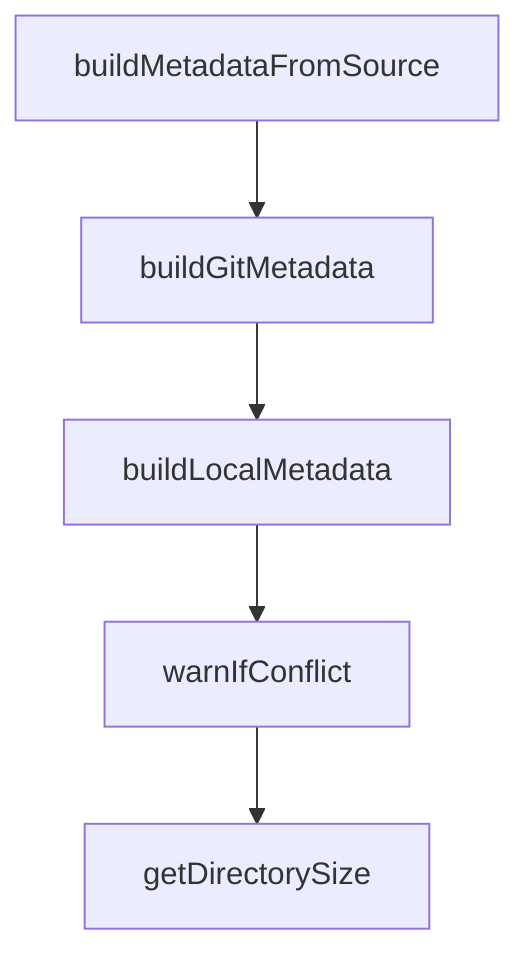

# Chapter 4: Sync and AGENTS.md Integration

Welcome to **Chapter 4: Sync and AGENTS.md Integration**. In this part of **OpenSkills Tutorial: Universal Skill Loading for Coding Agents**, you will build an intuitive mental model first, then move into concrete implementation details and practical production tradeoffs.


`openskills sync` keeps `AGENTS.md` aligned with installed skills so agent clients can discover them.

## Integration Pattern

1. install/update skills
2. sync into `AGENTS.md`
3. verify `<available_skills>` entries
4. invoke with `openskills read <skill>`

## Summary

You now know how to keep skill metadata synchronized and discoverable.

Next: [Chapter 5: Universal Mode and Multi-Agent Setups](05-universal-mode-and-multi-agent-setups.md)

## Depth Expansion Playbook

## Source Code Walkthrough

### `src/commands/install.ts`

The `buildMetadataFromSource` function in [`src/commands/install.ts`](https://github.com/numman-ali/openskills/blob/HEAD/src/commands/install.ts) handles a key part of this chapter's functionality:

```ts
    }
    cpSync(info.skillDir, info.targetPath, { recursive: true, dereference: true });
    writeSkillMetadata(info.targetPath, buildMetadataFromSource(sourceInfo, info.skillDir, repoDir));

    console.log(chalk.green(`✅ Installed: ${info.skillName}`));
    installedCount++;
  }

  console.log(chalk.green(`\n✅ Installation complete: ${installedCount} skill(s) installed`));
}

function buildMetadataFromSource(
  sourceInfo: InstallSourceInfo,
  skillDir: string,
  repoDir: string
): SkillSourceMetadata {
  if (sourceInfo.sourceType === 'local') {
    return buildLocalMetadata(sourceInfo, skillDir);
  }
  const subpath = relative(repoDir, skillDir);
  const normalizedSubpath = subpath === '' ? '' : subpath;
  return buildGitMetadata(sourceInfo, normalizedSubpath);
}

function buildGitMetadata(sourceInfo: InstallSourceInfo, subpath: string): SkillSourceMetadata {
  return {
    source: sourceInfo.source,
    sourceType: 'git',
    repoUrl: sourceInfo.repoUrl,
    subpath,
    installedAt: new Date().toISOString(),
  };
```

This function is important because it defines how OpenSkills Tutorial: Universal Skill Loading for Coding Agents implements the patterns covered in this chapter.

### `src/commands/install.ts`

The `buildGitMetadata` function in [`src/commands/install.ts`](https://github.com/numman-ali/openskills/blob/HEAD/src/commands/install.ts) handles a key part of this chapter's functionality:

```ts
  }
  cpSync(skillDir, targetPath, { recursive: true, dereference: true });
  writeSkillMetadata(targetPath, buildGitMetadata(sourceInfo, skillSubpath));

  console.log(chalk.green(`✅ Installed: ${skillName}`));
  console.log(`   Location: ${targetPath}`);
}

/**
 * Install from repository (with interactive selection unless -y flag)
 */
async function installFromRepo(
  repoDir: string,
  targetDir: string,
  options: InstallOptions,
  repoName: string | undefined,
  sourceInfo: InstallSourceInfo
): Promise<void> {
  const rootSkillPath = join(repoDir, 'SKILL.md');
  let skillInfos: Array<{
    skillDir: string;
    skillName: string;
    description: string;
    targetPath: string;
    size: number;
  }> = [];

  if (existsSync(rootSkillPath)) {
    const content = readFileSync(rootSkillPath, 'utf-8');
    if (!hasValidFrontmatter(content)) {
      console.error(chalk.red('Error: Invalid SKILL.md (missing YAML frontmatter)'));
      process.exit(1);
```

This function is important because it defines how OpenSkills Tutorial: Universal Skill Loading for Coding Agents implements the patterns covered in this chapter.

### `src/commands/install.ts`

The `buildLocalMetadata` function in [`src/commands/install.ts`](https://github.com/numman-ali/openskills/blob/HEAD/src/commands/install.ts) handles a key part of this chapter's functionality:

```ts

  cpSync(skillDir, targetPath, { recursive: true, dereference: true });
  writeSkillMetadata(targetPath, buildLocalMetadata(sourceInfo, skillDir));

  console.log(chalk.green(`✅ Installed: ${skillName}`));
  console.log(`   Location: ${targetPath}`);
}

/**
 * Install specific skill from subpath (no interaction needed)
 */
async function installSpecificSkill(
  repoDir: string,
  skillSubpath: string,
  targetDir: string,
  isProject: boolean,
  options: InstallOptions,
  sourceInfo: InstallSourceInfo
): Promise<void> {
  const skillDir = join(repoDir, skillSubpath);
  const skillMdPath = join(skillDir, 'SKILL.md');

  if (!existsSync(skillMdPath)) {
    console.error(chalk.red(`Error: SKILL.md not found at ${skillSubpath}`));
    process.exit(1);
  }

  // Validate
  const content = readFileSync(skillMdPath, 'utf-8');
  if (!hasValidFrontmatter(content)) {
    console.error(chalk.red('Error: Invalid SKILL.md (missing YAML frontmatter)'));
    process.exit(1);
```

This function is important because it defines how OpenSkills Tutorial: Universal Skill Loading for Coding Agents implements the patterns covered in this chapter.

### `src/commands/install.ts`

The `warnIfConflict` function in [`src/commands/install.ts`](https://github.com/numman-ali/openskills/blob/HEAD/src/commands/install.ts) handles a key part of this chapter's functionality:

```ts
  const targetPath = join(targetDir, skillName);

  const shouldInstall = await warnIfConflict(skillName, targetPath, isProject, options.yes);
  if (!shouldInstall) {
    console.log(chalk.yellow(`Skipped: ${skillName}`));
    return;
  }

  mkdirSync(targetDir, { recursive: true });
  // Security: ensure target path stays within target directory
  if (!isPathInside(targetPath, targetDir)) {
    console.error(chalk.red(`Security error: Installation path outside target directory`));
    process.exit(1);
  }

  cpSync(skillDir, targetPath, { recursive: true, dereference: true });
  writeSkillMetadata(targetPath, buildLocalMetadata(sourceInfo, skillDir));

  console.log(chalk.green(`✅ Installed: ${skillName}`));
  console.log(`   Location: ${targetPath}`);
}

/**
 * Install specific skill from subpath (no interaction needed)
 */
async function installSpecificSkill(
  repoDir: string,
  skillSubpath: string,
  targetDir: string,
  isProject: boolean,
  options: InstallOptions,
  sourceInfo: InstallSourceInfo
```

This function is important because it defines how OpenSkills Tutorial: Universal Skill Loading for Coding Agents implements the patterns covered in this chapter.


## How These Components Connect


