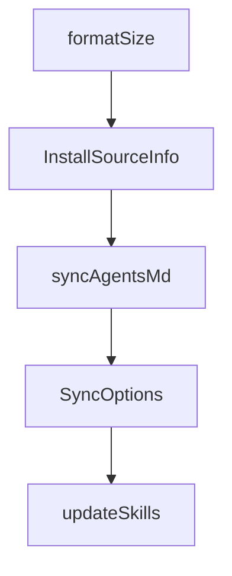

# Chapter 5: Universal Mode and Multi-Agent Setups

Welcome to **Chapter 5: Universal Mode and Multi-Agent Setups**. In this part of **OpenSkills Tutorial: Universal Skill Loading for Coding Agents**, you will build an intuitive mental model first, then move into concrete implementation details and practical production tradeoffs.


Universal mode helps avoid folder conflicts when multiple agent tools coexist.

## Priority Order

- `./.agent/skills/`
- `~/.agent/skills/`
- `./.claude/skills/`
- `~/.claude/skills/`

## Summary

You now understand multi-agent layout strategy for stable cross-tool skill usage.

Next: [Chapter 6: Skill Authoring and Packaging](06-skill-authoring-and-packaging.md)

## Depth Expansion Playbook

## Source Code Walkthrough

### `src/commands/install.ts`

The `formatSize` function in [`src/commands/install.ts`](https://github.com/numman-ali/openskills/blob/HEAD/src/commands/install.ts) handles a key part of this chapter's functionality:

```ts
    try {
      const choices = skillInfos.map((info) => ({
        name: `${chalk.bold(info.skillName.padEnd(25))} ${chalk.dim(formatSize(info.size))}`,
        value: info.skillName,
        description: info.description.slice(0, 80),
        checked: true, // Check all by default
      }));

      const selected = await checkbox({
        message: 'Select skills to install',
        choices,
        pageSize: 15,
      });

      if (selected.length === 0) {
        console.log(chalk.yellow('No skills selected. Installation cancelled.'));
        return;
      }

      skillsToInstall = skillInfos.filter((info) => selected.includes(info.skillName));
    } catch (error) {
      if (error instanceof ExitPromptError) {
        console.log(chalk.yellow('\n\nCancelled by user'));
        process.exit(0);
      }
      throw error;
    }
  }

  // Install selected skills
  const isProject = targetDir.startsWith(process.cwd());
  let installedCount = 0;
```

This function is important because it defines how OpenSkills Tutorial: Universal Skill Loading for Coding Agents implements the patterns covered in this chapter.

### `src/commands/install.ts`

The `InstallSourceInfo` interface in [`src/commands/install.ts`](https://github.com/numman-ali/openskills/blob/HEAD/src/commands/install.ts) handles a key part of this chapter's functionality:

```ts
import type { SkillSourceMetadata, SkillSourceType } from '../utils/skill-metadata.js';

interface InstallSourceInfo {
  source: string;
  sourceType: SkillSourceType;
  repoUrl?: string;
  localRoot?: string;
}

/**
 * Check if source is a local path
 */
function isLocalPath(source: string): boolean {
  return (
    source.startsWith('/') ||
    source.startsWith('./') ||
    source.startsWith('../') ||
    source.startsWith('~/')
  );
}

/**
 * Check if source is a git URL (SSH, git://, or HTTPS)
 */
function isGitUrl(source: string): boolean {
  return (
    source.startsWith('git@') ||
    source.startsWith('git://') ||
    source.startsWith('http://') ||
    source.startsWith('https://') ||
    source.endsWith('.git')
  );
```

This interface is important because it defines how OpenSkills Tutorial: Universal Skill Loading for Coding Agents implements the patterns covered in this chapter.

### `src/commands/sync.ts`

The `syncAgentsMd` function in [`src/commands/sync.ts`](https://github.com/numman-ali/openskills/blob/HEAD/src/commands/sync.ts) handles a key part of this chapter's functionality:

```ts
 * Sync installed skills to a markdown file
 */
export async function syncAgentsMd(options: SyncOptions = {}): Promise<void> {
  const outputPath = options.output || 'AGENTS.md';
  const outputName = basename(outputPath);

  // Validate output file is markdown
  if (!outputPath.endsWith('.md')) {
    console.error(chalk.red('Error: Output file must be a markdown file (.md)'));
    process.exit(1);
  }

  // Create file if it doesn't exist
  if (!existsSync(outputPath)) {
    const dir = dirname(outputPath);
    if (dir && dir !== '.' && !existsSync(dir)) {
      mkdirSync(dir, { recursive: true });
    }
    writeFileSync(outputPath, `# ${outputName.replace('.md', '')}\n\n`);
    console.log(chalk.dim(`Created ${outputPath}`));
  }

  let skills = findAllSkills();

  if (skills.length === 0) {
    console.log('No skills installed. Install skills first:');
    console.log(`  ${chalk.cyan('npx openskills install anthropics/skills --project')}`);
    return;
  }

  // Interactive mode by default (unless -y flag)
  if (!options.yes) {
```

This function is important because it defines how OpenSkills Tutorial: Universal Skill Loading for Coding Agents implements the patterns covered in this chapter.

### `src/commands/sync.ts`

The `SyncOptions` interface in [`src/commands/sync.ts`](https://github.com/numman-ali/openskills/blob/HEAD/src/commands/sync.ts) handles a key part of this chapter's functionality:

```ts
import type { Skill } from '../types.js';

export interface SyncOptions {
  yes?: boolean;
  output?: string;
}

/**
 * Sync installed skills to a markdown file
 */
export async function syncAgentsMd(options: SyncOptions = {}): Promise<void> {
  const outputPath = options.output || 'AGENTS.md';
  const outputName = basename(outputPath);

  // Validate output file is markdown
  if (!outputPath.endsWith('.md')) {
    console.error(chalk.red('Error: Output file must be a markdown file (.md)'));
    process.exit(1);
  }

  // Create file if it doesn't exist
  if (!existsSync(outputPath)) {
    const dir = dirname(outputPath);
    if (dir && dir !== '.' && !existsSync(dir)) {
      mkdirSync(dir, { recursive: true });
    }
    writeFileSync(outputPath, `# ${outputName.replace('.md', '')}\n\n`);
    console.log(chalk.dim(`Created ${outputPath}`));
  }

  let skills = findAllSkills();

```

This interface is important because it defines how OpenSkills Tutorial: Universal Skill Loading for Coding Agents implements the patterns covered in this chapter.


## How These Components Connect


