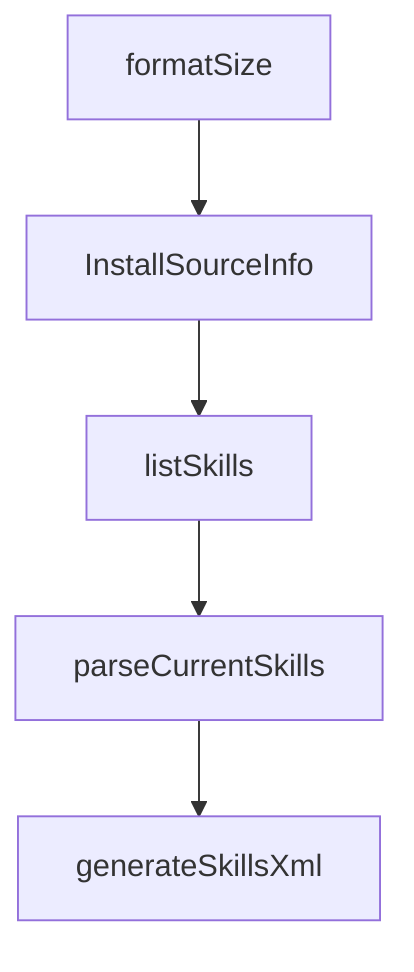

# Chapter 6: Skill Authoring and Packaging

Welcome to **Chapter 6: Skill Authoring and Packaging**. In this part of **OpenSkills Tutorial: Universal Skill Loading for Coding Agents**, you will build an intuitive mental model first, then move into concrete implementation details and practical production tradeoffs.


Great skills are concise, composable, and resource-backed.

## Authoring Checklist

- clear `name` and `description`
- explicit invocation instructions
- optional `references/`, `scripts/`, `assets/` for depth
- deterministic, testable operational steps

## Summary

You now have a quality baseline for authoring reusable skills.

Next: [Chapter 7: Updates, Versioning, and Governance](07-updates-versioning-and-governance.md)

## Source Code Walkthrough

### `src/commands/install.ts`

The `formatSize` function in [`src/commands/install.ts`](https://github.com/numman-ali/openskills/blob/HEAD/src/commands/install.ts) handles a key part of this chapter's functionality:

```ts
    try {
      const choices = skillInfos.map((info) => ({
        name: `${chalk.bold(info.skillName.padEnd(25))} ${chalk.dim(formatSize(info.size))}`,
        value: info.skillName,
        description: info.description.slice(0, 80),
        checked: true, // Check all by default
      }));

      const selected = await checkbox({
        message: 'Select skills to install',
        choices,
        pageSize: 15,
      });

      if (selected.length === 0) {
        console.log(chalk.yellow('No skills selected. Installation cancelled.'));
        return;
      }

      skillsToInstall = skillInfos.filter((info) => selected.includes(info.skillName));
    } catch (error) {
      if (error instanceof ExitPromptError) {
        console.log(chalk.yellow('\n\nCancelled by user'));
        process.exit(0);
      }
      throw error;
    }
  }

  // Install selected skills
  const isProject = targetDir.startsWith(process.cwd());
  let installedCount = 0;
```

This function is important because it defines how OpenSkills Tutorial: Universal Skill Loading for Coding Agents implements the patterns covered in this chapter.

### `src/commands/install.ts`

The `InstallSourceInfo` interface in [`src/commands/install.ts`](https://github.com/numman-ali/openskills/blob/HEAD/src/commands/install.ts) handles a key part of this chapter's functionality:

```ts
import type { SkillSourceMetadata, SkillSourceType } from '../utils/skill-metadata.js';

interface InstallSourceInfo {
  source: string;
  sourceType: SkillSourceType;
  repoUrl?: string;
  localRoot?: string;
}

/**
 * Check if source is a local path
 */
function isLocalPath(source: string): boolean {
  return (
    source.startsWith('/') ||
    source.startsWith('./') ||
    source.startsWith('../') ||
    source.startsWith('~/')
  );
}

/**
 * Check if source is a git URL (SSH, git://, or HTTPS)
 */
function isGitUrl(source: string): boolean {
  return (
    source.startsWith('git@') ||
    source.startsWith('git://') ||
    source.startsWith('http://') ||
    source.startsWith('https://') ||
    source.endsWith('.git')
  );
```

This interface is important because it defines how OpenSkills Tutorial: Universal Skill Loading for Coding Agents implements the patterns covered in this chapter.

### `src/commands/list.ts`

The `listSkills` function in [`src/commands/list.ts`](https://github.com/numman-ali/openskills/blob/HEAD/src/commands/list.ts) handles a key part of this chapter's functionality:

```ts
 * List all installed skills
 */
export function listSkills(): void {
  console.log(chalk.bold('Available Skills:\n'));

  const skills = findAllSkills();

  if (skills.length === 0) {
    console.log('No skills installed.\n');
    console.log('Install skills:');
    console.log(`  ${chalk.cyan('npx openskills install anthropics/skills')}         ${chalk.dim('# Project (default)')}`);
    console.log(`  ${chalk.cyan('npx openskills install owner/skill --global')}     ${chalk.dim('# Global (advanced)')}`);
    return;
  }

  // Sort: project skills first, then global, alphabetically within each
  const sorted = skills.sort((a, b) => {
    if (a.location !== b.location) {
      return a.location === 'project' ? -1 : 1;
    }
    return a.name.localeCompare(b.name);
  });

  // Display with inline location labels
  for (const skill of sorted) {
    const locationLabel = skill.location === 'project'
      ? chalk.blue('(project)')
      : chalk.dim('(global)');

    console.log(`  ${chalk.bold(skill.name.padEnd(25))} ${locationLabel}`);
    console.log(`    ${chalk.dim(skill.description)}\n`);
  }
```

This function is important because it defines how OpenSkills Tutorial: Universal Skill Loading for Coding Agents implements the patterns covered in this chapter.

### `src/utils/agents-md.ts`

The `parseCurrentSkills` function in [`src/utils/agents-md.ts`](https://github.com/numman-ali/openskills/blob/HEAD/src/utils/agents-md.ts) handles a key part of this chapter's functionality:

```ts
 * Parse skill names currently in AGENTS.md
 */
export function parseCurrentSkills(content: string): string[] {
  const skillNames: string[] = [];

  // Match <skill><name>skill-name</name>...</skill>
  const skillRegex = /<skill>[\s\S]*?<name>([^<]+)<\/name>[\s\S]*?<\/skill>/g;

  let match;
  while ((match = skillRegex.exec(content)) !== null) {
    skillNames.push(match[1].trim());
  }

  return skillNames;
}

/**
 * Generate skills XML section for AGENTS.md
 */
export function generateSkillsXml(skills: Skill[]): string {
  const skillTags = skills
    .map(
      (s) => `<skill>
<name>${s.name}</name>
<description>${s.description}</description>
<location>${s.location}</location>
</skill>`
    )
    .join('\n\n');

  return `<skills_system priority="1">

```

This function is important because it defines how OpenSkills Tutorial: Universal Skill Loading for Coding Agents implements the patterns covered in this chapter.


## How These Components Connect


