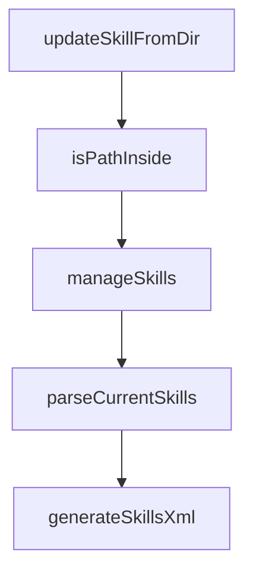

# Chapter 6: Skill Authoring and Packaging

Welcome to **Chapter 6: Skill Authoring and Packaging**. In this part of **OpenSkills Tutorial: Universal Skill Loading for Coding Agents**, you will build an intuitive mental model first, then move into concrete implementation details and practical production tradeoffs.


Great skills are concise, composable, and resource-backed.

## Authoring Checklist

- clear `name` and `description`
- explicit invocation instructions
- optional `references/`, `scripts/`, `assets/` for depth
- deterministic, testable operational steps

## Summary

You now have a quality baseline for authoring reusable skills.

Next: [Chapter 7: Updates, Versioning, and Governance](07-updates-versioning-and-governance.md)

## Depth Expansion Playbook

## Source Code Walkthrough

### `src/commands/update.ts`

The `updateSkillFromDir` function in [`src/commands/update.ts`](https://github.com/numman-ali/openskills/blob/HEAD/src/commands/update.ts) handles a key part of this chapter's functionality:

```ts
        continue;
      }
      updateSkillFromDir(skill.path, localPath);
      writeSkillMetadata(skill.path, { ...metadata, installedAt: new Date().toISOString() });
      console.log(chalk.green(`✅ Updated: ${skill.name}`));
      updated++;
      continue;
    }

    if (!metadata.repoUrl) {
      console.log(chalk.yellow(`Skipped: ${skill.name} (missing repo URL metadata)`));
      missingRepoUrl.push(skill.name);
      skipped++;
      continue;
    }

    const tempDir = join(homedir(), `.openskills-temp-${Date.now()}`);
    mkdirSync(tempDir, { recursive: true });

    const spinner = ora(`Updating ${skill.name}...`).start();
    try {
      execSync(`git clone --depth 1 --quiet "${metadata.repoUrl}" "${tempDir}/repo"`, { stdio: 'pipe' });
      const repoDir = join(tempDir, 'repo');
      const subpath = metadata.subpath && metadata.subpath !== '.' ? metadata.subpath : '';
      const sourceDir = subpath ? join(repoDir, subpath) : repoDir;

      if (!existsSync(join(sourceDir, 'SKILL.md'))) {
        spinner.fail(`SKILL.md missing for ${skill.name}`);
        console.log(chalk.yellow(`Skipped: ${skill.name} (SKILL.md not found in repo at ${subpath || '.'})`));
        missingRepoSkillFile.push({ name: skill.name, subpath: subpath || '.' });
        skipped++;
        continue;
```

This function is important because it defines how OpenSkills Tutorial: Universal Skill Loading for Coding Agents implements the patterns covered in this chapter.

### `src/commands/update.ts`

The `isPathInside` function in [`src/commands/update.ts`](https://github.com/numman-ali/openskills/blob/HEAD/src/commands/update.ts) handles a key part of this chapter's functionality:

```ts
  mkdirSync(targetDir, { recursive: true });

  if (!isPathInside(targetPath, targetDir)) {
    console.error(chalk.red('Security error: Installation path outside target directory'));
    process.exit(1);
  }

  rmSync(targetPath, { recursive: true, force: true });
  cpSync(sourceDir, targetPath, { recursive: true, dereference: true });
}

function isPathInside(targetPath: string, targetDir: string): boolean {
  const resolvedTargetPath = resolve(targetPath);
  const resolvedTargetDir = resolve(targetDir);
  const resolvedTargetDirWithSep = resolvedTargetDir.endsWith(sep)
    ? resolvedTargetDir
    : resolvedTargetDir + sep;
  return resolvedTargetPath.startsWith(resolvedTargetDirWithSep);
}

```

This function is important because it defines how OpenSkills Tutorial: Universal Skill Loading for Coding Agents implements the patterns covered in this chapter.

### `src/commands/manage.ts`

The `manageSkills` function in [`src/commands/manage.ts`](https://github.com/numman-ali/openskills/blob/HEAD/src/commands/manage.ts) handles a key part of this chapter's functionality:

```ts
 * Interactively manage (remove) installed skills
 */
export async function manageSkills(): Promise<void> {
  const skills = findAllSkills();

  if (skills.length === 0) {
    console.log('No skills installed.');
    return;
  }

  try {
    // Sort: project first
    const sorted = skills.sort((a, b) => {
      if (a.location !== b.location) {
        return a.location === 'project' ? -1 : 1;
      }
      return a.name.localeCompare(b.name);
    });

    const choices = sorted.map((skill) => ({
      name: `${chalk.bold(skill.name.padEnd(25))} ${skill.location === 'project' ? chalk.blue('(project)') : chalk.dim('(global)')}`,
      value: skill.name,
      checked: false, // Nothing checked by default
    }));

    const toRemove = await checkbox({
      message: 'Select skills to remove',
      choices,
      pageSize: 15,
    });

    if (toRemove.length === 0) {
```

This function is important because it defines how OpenSkills Tutorial: Universal Skill Loading for Coding Agents implements the patterns covered in this chapter.

### `src/utils/agents-md.ts`

The `parseCurrentSkills` function in [`src/utils/agents-md.ts`](https://github.com/numman-ali/openskills/blob/HEAD/src/utils/agents-md.ts) handles a key part of this chapter's functionality:

```ts
 * Parse skill names currently in AGENTS.md
 */
export function parseCurrentSkills(content: string): string[] {
  const skillNames: string[] = [];

  // Match <skill><name>skill-name</name>...</skill>
  const skillRegex = /<skill>[\s\S]*?<name>([^<]+)<\/name>[\s\S]*?<\/skill>/g;

  let match;
  while ((match = skillRegex.exec(content)) !== null) {
    skillNames.push(match[1].trim());
  }

  return skillNames;
}

/**
 * Generate skills XML section for AGENTS.md
 */
export function generateSkillsXml(skills: Skill[]): string {
  const skillTags = skills
    .map(
      (s) => `<skill>
<name>${s.name}</name>
<description>${s.description}</description>
<location>${s.location}</location>
</skill>`
    )
    .join('\n\n');

  return `<skills_system priority="1">

```

This function is important because it defines how OpenSkills Tutorial: Universal Skill Loading for Coding Agents implements the patterns covered in this chapter.


## How These Components Connect


