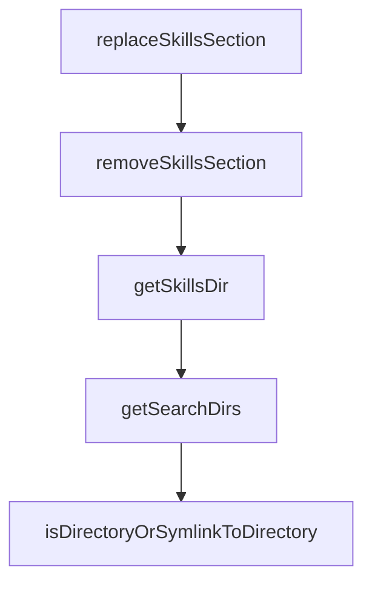

# Chapter 7: Updates, Versioning, and Governance

Welcome to **Chapter 7: Updates, Versioning, and Governance**. In this part of **OpenSkills Tutorial: Universal Skill Loading for Coding Agents**, you will build an intuitive mental model first, then move into concrete implementation details and practical production tradeoffs.


Skill libraries need explicit update and governance policy to avoid drift.

## Governance Pattern

| Control | Purpose |
|:--------|:--------|
| pinned source refs | reproducibility |
| scheduled updates | predictable maintenance |
| diff review of skill changes | quality and safety |

## Summary

You now have a lifecycle process for maintaining shared skill repositories.

Next: [Chapter 8: Production Security and Operations](08-production-security-and-operations.md)

## Source Code Walkthrough

### `src/utils/agents-md.ts`

The `replaceSkillsSection` function in [`src/utils/agents-md.ts`](https://github.com/numman-ali/openskills/blob/HEAD/src/utils/agents-md.ts) handles a key part of this chapter's functionality:

```ts
 * Replace or add skills section in AGENTS.md
 */
export function replaceSkillsSection(content: string, newSection: string): string {
  const startMarker = '<skills_system';
  const endMarker = '</skills_system>';

  // Check for XML markers
  if (content.includes(startMarker)) {
    const regex = /<skills_system[^>]*>[\s\S]*?<\/skills_system>/;
    return content.replace(regex, newSection);
  }

  // Fallback to HTML comments
  const htmlStartMarker = '<!-- SKILLS_TABLE_START -->';
  const htmlEndMarker = '<!-- SKILLS_TABLE_END -->';

  if (content.includes(htmlStartMarker)) {
    // Extract content without outer XML wrapper
    const innerContent = newSection.replace(/<skills_system[^>]*>|<\/skills_system>/g, '');
    const regex = new RegExp(
      `${htmlStartMarker}[\\s\\S]*?${htmlEndMarker}`,
      'g'
    );
    return content.replace(regex, `${htmlStartMarker}\n${innerContent}\n${htmlEndMarker}`);
  }

  // No markers found - append to end of file
  return content.trimEnd() + '\n\n' + newSection + '\n';
}

/**
 * Remove skills section from AGENTS.md
```

This function is important because it defines how OpenSkills Tutorial: Universal Skill Loading for Coding Agents implements the patterns covered in this chapter.

### `src/utils/agents-md.ts`

The `removeSkillsSection` function in [`src/utils/agents-md.ts`](https://github.com/numman-ali/openskills/blob/HEAD/src/utils/agents-md.ts) handles a key part of this chapter's functionality:

```ts
 * Remove skills section from AGENTS.md
 */
export function removeSkillsSection(content: string): string {
  const startMarker = '<skills_system';
  const endMarker = '</skills_system>';

  // Check for XML markers
  if (content.includes(startMarker)) {
    const regex = /<skills_system[^>]*>[\s\S]*?<\/skills_system>/;
    return content.replace(regex, '<!-- Skills section removed -->');
  }

  // Fallback to HTML comments
  const htmlStartMarker = '<!-- SKILLS_TABLE_START -->';
  const htmlEndMarker = '<!-- SKILLS_TABLE_END -->';

  if (content.includes(htmlStartMarker)) {
    const regex = new RegExp(
      `${htmlStartMarker}[\\s\\S]*?${htmlEndMarker}`,
      'g'
    );
    return content.replace(regex, `${htmlStartMarker}\n<!-- Skills section removed -->\n${htmlEndMarker}`);
  }

  // No markers found - nothing to remove
  return content;
}

```

This function is important because it defines how OpenSkills Tutorial: Universal Skill Loading for Coding Agents implements the patterns covered in this chapter.

### `src/utils/dirs.ts`

The `getSkillsDir` function in [`src/utils/dirs.ts`](https://github.com/numman-ali/openskills/blob/HEAD/src/utils/dirs.ts) handles a key part of this chapter's functionality:

```ts
 * Get skills directory path
 */
export function getSkillsDir(projectLocal: boolean = false, universal: boolean = false): string {
  const folder = universal ? '.agent/skills' : '.claude/skills';
  return projectLocal
    ? join(process.cwd(), folder)
    : join(homedir(), folder);
}

/**
 * Get all searchable skill directories in priority order
 * Priority: project .agent > global .agent > project .claude > global .claude
 */
export function getSearchDirs(): string[] {
  return [
    join(process.cwd(), '.agent/skills'),   // 1. Project universal (.agent)
    join(homedir(), '.agent/skills'),        // 2. Global universal (.agent)
    join(process.cwd(), '.claude/skills'),  // 3. Project claude
    join(homedir(), '.claude/skills'),       // 4. Global claude
  ];
}

```

This function is important because it defines how OpenSkills Tutorial: Universal Skill Loading for Coding Agents implements the patterns covered in this chapter.

### `src/utils/dirs.ts`

The `getSearchDirs` function in [`src/utils/dirs.ts`](https://github.com/numman-ali/openskills/blob/HEAD/src/utils/dirs.ts) handles a key part of this chapter's functionality:

```ts
 * Priority: project .agent > global .agent > project .claude > global .claude
 */
export function getSearchDirs(): string[] {
  return [
    join(process.cwd(), '.agent/skills'),   // 1. Project universal (.agent)
    join(homedir(), '.agent/skills'),        // 2. Global universal (.agent)
    join(process.cwd(), '.claude/skills'),  // 3. Project claude
    join(homedir(), '.claude/skills'),       // 4. Global claude
  ];
}

```

This function is important because it defines how OpenSkills Tutorial: Universal Skill Loading for Coding Agents implements the patterns covered in this chapter.


## How These Components Connect


