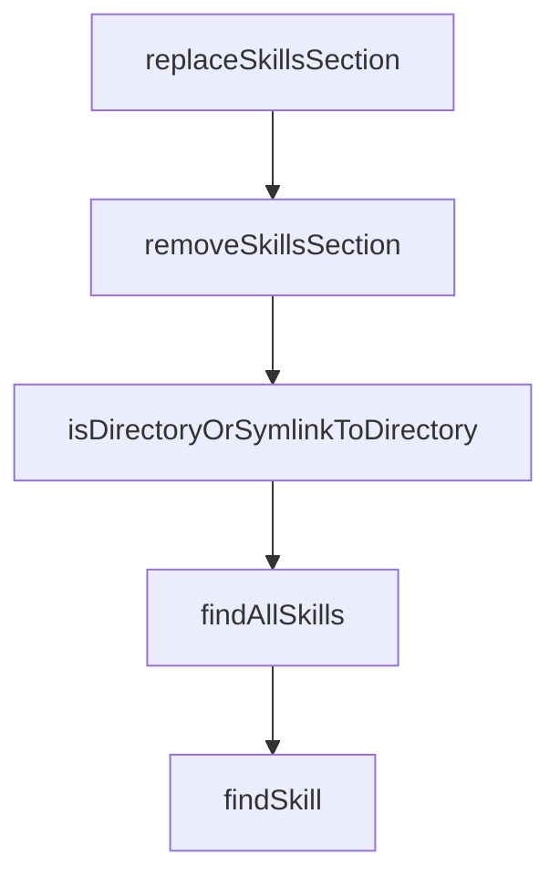

# Chapter 7: Updates, Versioning, and Governance

Welcome to **Chapter 7: Updates, Versioning, and Governance**. In this part of **OpenSkills Tutorial: Universal Skill Loading for Coding Agents**, you will build an intuitive mental model first, then move into concrete implementation details and practical production tradeoffs.


Skill libraries need explicit update and governance policy to avoid drift.

## Governance Pattern

| Control | Purpose |
|:--------|:--------|
| pinned source refs | reproducibility |
| scheduled updates | predictable maintenance |
| diff review of skill changes | quality and safety |

## Summary

You now have a lifecycle process for maintaining shared skill repositories.

Next: [Chapter 8: Production Security and Operations](08-production-security-and-operations.md)

## Depth Expansion Playbook

## Source Code Walkthrough

### `src/utils/agents-md.ts`

The `replaceSkillsSection` function in [`src/utils/agents-md.ts`](https://github.com/numman-ali/openskills/blob/HEAD/src/utils/agents-md.ts) handles a key part of this chapter's functionality:

```ts
 * Replace or add skills section in AGENTS.md
 */
export function replaceSkillsSection(content: string, newSection: string): string {
  const startMarker = '<skills_system';
  const endMarker = '</skills_system>';

  // Check for XML markers
  if (content.includes(startMarker)) {
    const regex = /<skills_system[^>]*>[\s\S]*?<\/skills_system>/;
    return content.replace(regex, newSection);
  }

  // Fallback to HTML comments
  const htmlStartMarker = '<!-- SKILLS_TABLE_START -->';
  const htmlEndMarker = '<!-- SKILLS_TABLE_END -->';

  if (content.includes(htmlStartMarker)) {
    // Extract content without outer XML wrapper
    const innerContent = newSection.replace(/<skills_system[^>]*>|<\/skills_system>/g, '');
    const regex = new RegExp(
      `${htmlStartMarker}[\\s\\S]*?${htmlEndMarker}`,
      'g'
    );
    return content.replace(regex, `${htmlStartMarker}\n${innerContent}\n${htmlEndMarker}`);
  }

  // No markers found - append to end of file
  return content.trimEnd() + '\n\n' + newSection + '\n';
}

/**
 * Remove skills section from AGENTS.md
```

This function is important because it defines how OpenSkills Tutorial: Universal Skill Loading for Coding Agents implements the patterns covered in this chapter.

### `src/utils/agents-md.ts`

The `removeSkillsSection` function in [`src/utils/agents-md.ts`](https://github.com/numman-ali/openskills/blob/HEAD/src/utils/agents-md.ts) handles a key part of this chapter's functionality:

```ts
 * Remove skills section from AGENTS.md
 */
export function removeSkillsSection(content: string): string {
  const startMarker = '<skills_system';
  const endMarker = '</skills_system>';

  // Check for XML markers
  if (content.includes(startMarker)) {
    const regex = /<skills_system[^>]*>[\s\S]*?<\/skills_system>/;
    return content.replace(regex, '<!-- Skills section removed -->');
  }

  // Fallback to HTML comments
  const htmlStartMarker = '<!-- SKILLS_TABLE_START -->';
  const htmlEndMarker = '<!-- SKILLS_TABLE_END -->';

  if (content.includes(htmlStartMarker)) {
    const regex = new RegExp(
      `${htmlStartMarker}[\\s\\S]*?${htmlEndMarker}`,
      'g'
    );
    return content.replace(regex, `${htmlStartMarker}\n<!-- Skills section removed -->\n${htmlEndMarker}`);
  }

  // No markers found - nothing to remove
  return content;
}

```

This function is important because it defines how OpenSkills Tutorial: Universal Skill Loading for Coding Agents implements the patterns covered in this chapter.

### `src/utils/skills.ts`

The `isDirectoryOrSymlinkToDirectory` function in [`src/utils/skills.ts`](https://github.com/numman-ali/openskills/blob/HEAD/src/utils/skills.ts) handles a key part of this chapter's functionality:

```ts
 * Check if a directory entry is a directory or a symlink pointing to a directory
 */
function isDirectoryOrSymlinkToDirectory(entry: Dirent, parentDir: string): boolean {
  if (entry.isDirectory()) {
    return true;
  }
  if (entry.isSymbolicLink()) {
    try {
      const fullPath = join(parentDir, entry.name);
      const stats = statSync(fullPath); // statSync follows symlinks
      return stats.isDirectory();
    } catch {
      // Broken symlink or permission error
      return false;
    }
  }
  return false;
}

/**
 * Find all installed skills across directories
 */
export function findAllSkills(): Skill[] {
  const skills: Skill[] = [];
  const seen = new Set<string>();
  const dirs = getSearchDirs();

  for (const dir of dirs) {
    if (!existsSync(dir)) continue;

    const entries = readdirSync(dir, { withFileTypes: true });

```

This function is important because it defines how OpenSkills Tutorial: Universal Skill Loading for Coding Agents implements the patterns covered in this chapter.

### `src/utils/skills.ts`

The `findAllSkills` function in [`src/utils/skills.ts`](https://github.com/numman-ali/openskills/blob/HEAD/src/utils/skills.ts) handles a key part of this chapter's functionality:

```ts
 * Find all installed skills across directories
 */
export function findAllSkills(): Skill[] {
  const skills: Skill[] = [];
  const seen = new Set<string>();
  const dirs = getSearchDirs();

  for (const dir of dirs) {
    if (!existsSync(dir)) continue;

    const entries = readdirSync(dir, { withFileTypes: true });

    for (const entry of entries) {
      if (isDirectoryOrSymlinkToDirectory(entry, dir)) {
        // Deduplicate: only add if we haven't seen this skill name yet
        if (seen.has(entry.name)) continue;

        const skillPath = join(dir, entry.name, 'SKILL.md');
        if (existsSync(skillPath)) {
          const content = readFileSync(skillPath, 'utf-8');
          const isProjectLocal = dir.includes(process.cwd());

          skills.push({
            name: entry.name,
            description: extractYamlField(content, 'description'),
            location: isProjectLocal ? 'project' : 'global',
            path: join(dir, entry.name),
          });

          seen.add(entry.name);
        }
      }
```

This function is important because it defines how OpenSkills Tutorial: Universal Skill Loading for Coding Agents implements the patterns covered in this chapter.


## How These Components Connect


