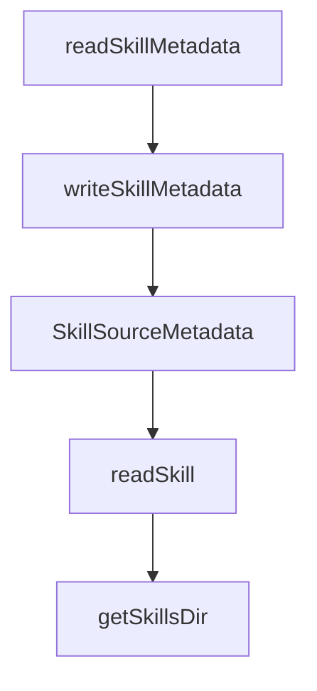

# Chapter 8: Production Security and Operations

Welcome to **Chapter 8: Production Security and Operations**. In this part of **OpenSkills Tutorial: Universal Skill Loading for Coding Agents**, you will build an intuitive mental model first, then move into concrete implementation details and practical production tradeoffs.


This chapter defines the baseline for operating OpenSkills at team scale.

## Security Controls

- trusted source allowlist
- signature/provenance verification where possible
- least-privilege repository access
- audit logs on skill install/update events

## Summary

You now have an operations baseline for enterprise-grade skill distribution.

## Depth Expansion Playbook

## Source Code Walkthrough

### `src/utils/skill-metadata.ts`

The `readSkillMetadata` function in [`src/utils/skill-metadata.ts`](https://github.com/numman-ali/openskills/blob/HEAD/src/utils/skill-metadata.ts) handles a key part of this chapter's functionality:

```ts
}

export function readSkillMetadata(skillDir: string): SkillSourceMetadata | null {
  const metadataPath = join(skillDir, SKILL_METADATA_FILE);
  if (!existsSync(metadataPath)) return null;

  try {
    const raw = readFileSync(metadataPath, 'utf-8');
    return JSON.parse(raw) as SkillSourceMetadata;
  } catch {
    return null;
  }
}

export function writeSkillMetadata(skillDir: string, metadata: SkillSourceMetadata): void {
  const metadataPath = join(skillDir, SKILL_METADATA_FILE);
  const payload = {
    ...metadata,
    installedAt: metadata.installedAt || new Date().toISOString(),
  };
  writeFileSync(metadataPath, JSON.stringify(payload, null, 2));
}

```

This function is important because it defines how OpenSkills Tutorial: Universal Skill Loading for Coding Agents implements the patterns covered in this chapter.

### `src/utils/skill-metadata.ts`

The `writeSkillMetadata` function in [`src/utils/skill-metadata.ts`](https://github.com/numman-ali/openskills/blob/HEAD/src/utils/skill-metadata.ts) handles a key part of this chapter's functionality:

```ts
}

export function writeSkillMetadata(skillDir: string, metadata: SkillSourceMetadata): void {
  const metadataPath = join(skillDir, SKILL_METADATA_FILE);
  const payload = {
    ...metadata,
    installedAt: metadata.installedAt || new Date().toISOString(),
  };
  writeFileSync(metadataPath, JSON.stringify(payload, null, 2));
}

```

This function is important because it defines how OpenSkills Tutorial: Universal Skill Loading for Coding Agents implements the patterns covered in this chapter.

### `src/utils/skill-metadata.ts`

The `SkillSourceMetadata` interface in [`src/utils/skill-metadata.ts`](https://github.com/numman-ali/openskills/blob/HEAD/src/utils/skill-metadata.ts) handles a key part of this chapter's functionality:

```ts
export type SkillSourceType = 'git' | 'github' | 'local';

export interface SkillSourceMetadata {
  source: string;
  sourceType: SkillSourceType;
  repoUrl?: string;
  subpath?: string;
  localPath?: string;
  installedAt: string;
}

export function readSkillMetadata(skillDir: string): SkillSourceMetadata | null {
  const metadataPath = join(skillDir, SKILL_METADATA_FILE);
  if (!existsSync(metadataPath)) return null;

  try {
    const raw = readFileSync(metadataPath, 'utf-8');
    return JSON.parse(raw) as SkillSourceMetadata;
  } catch {
    return null;
  }
}

export function writeSkillMetadata(skillDir: string, metadata: SkillSourceMetadata): void {
  const metadataPath = join(skillDir, SKILL_METADATA_FILE);
  const payload = {
    ...metadata,
    installedAt: metadata.installedAt || new Date().toISOString(),
  };
  writeFileSync(metadataPath, JSON.stringify(payload, null, 2));
}

```

This interface is important because it defines how OpenSkills Tutorial: Universal Skill Loading for Coding Agents implements the patterns covered in this chapter.

### `src/commands/read.ts`

The `readSkill` function in [`src/commands/read.ts`](https://github.com/numman-ali/openskills/blob/HEAD/src/commands/read.ts) handles a key part of this chapter's functionality:

```ts
 * Read skill to stdout (for AI agents)
 */
export function readSkill(skillNames: string[] | string): void {
  const names = normalizeSkillNames(skillNames);
  if (names.length === 0) {
    console.error('Error: No skill names provided');
    process.exit(1);
  }
  const resolved = [];
  const missing = [];

  for (const name of names) {
    const skill = findSkill(name);
    if (!skill) {
      missing.push(name);
      continue;
    }
    resolved.push({ name, skill });
  }

  if (missing.length > 0) {
    console.error(`Error: Skill(s) not found: ${missing.join(', ')}`);
    console.error('\nSearched:');
    console.error('  .agent/skills/ (project universal)');
    console.error('  ~/.agent/skills/ (global universal)');
    console.error('  .claude/skills/ (project)');
    console.error('  ~/.claude/skills/ (global)');
    console.error('\nInstall skills: npx openskills install owner/repo');
    process.exit(1);
  }

  for (const { name, skill } of resolved) {
```

This function is important because it defines how OpenSkills Tutorial: Universal Skill Loading for Coding Agents implements the patterns covered in this chapter.


## How These Components Connect


