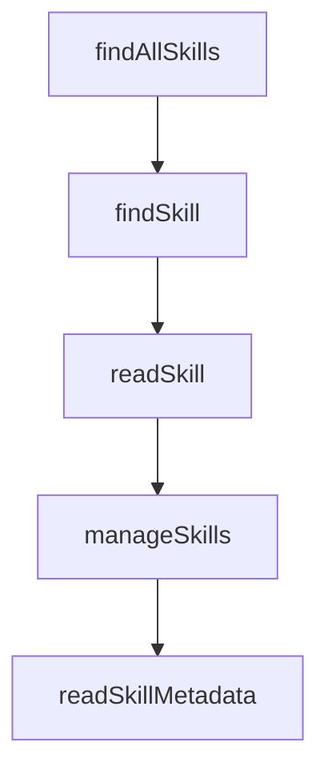

# Chapter 8: Production Security and Operations

Welcome to **Chapter 8: Production Security and Operations**. In this part of **OpenSkills Tutorial: Universal Skill Loading for Coding Agents**, you will build an intuitive mental model first, then move into concrete implementation details and practical production tradeoffs.


This chapter defines the baseline for operating OpenSkills at team scale.

## Security Controls

- trusted source allowlist
- signature/provenance verification where possible
- least-privilege repository access
- audit logs on skill install/update events

## Summary

You now have an operations baseline for enterprise-grade skill distribution.

## Source Code Walkthrough

### `src/utils/skills.ts`

The `findAllSkills` function in [`src/utils/skills.ts`](https://github.com/numman-ali/openskills/blob/HEAD/src/utils/skills.ts) handles a key part of this chapter's functionality:

```ts
 * Find all installed skills across directories
 */
export function findAllSkills(): Skill[] {
  const skills: Skill[] = [];
  const seen = new Set<string>();
  const dirs = getSearchDirs();

  for (const dir of dirs) {
    if (!existsSync(dir)) continue;

    const entries = readdirSync(dir, { withFileTypes: true });

    for (const entry of entries) {
      if (isDirectoryOrSymlinkToDirectory(entry, dir)) {
        // Deduplicate: only add if we haven't seen this skill name yet
        if (seen.has(entry.name)) continue;

        const skillPath = join(dir, entry.name, 'SKILL.md');
        if (existsSync(skillPath)) {
          const content = readFileSync(skillPath, 'utf-8');
          const isProjectLocal = dir.includes(process.cwd());

          skills.push({
            name: entry.name,
            description: extractYamlField(content, 'description'),
            location: isProjectLocal ? 'project' : 'global',
            path: join(dir, entry.name),
          });

          seen.add(entry.name);
        }
      }
```

This function is important because it defines how OpenSkills Tutorial: Universal Skill Loading for Coding Agents implements the patterns covered in this chapter.

### `src/utils/skills.ts`

The `findSkill` function in [`src/utils/skills.ts`](https://github.com/numman-ali/openskills/blob/HEAD/src/utils/skills.ts) handles a key part of this chapter's functionality:

```ts
 * Find specific skill by name
 */
export function findSkill(skillName: string): SkillLocation | null {
  const dirs = getSearchDirs();

  for (const dir of dirs) {
    const skillPath = join(dir, skillName, 'SKILL.md');
    if (existsSync(skillPath)) {
      return {
        path: skillPath,
        baseDir: join(dir, skillName),
        source: dir,
      };
    }
  }

  return null;
}

```

This function is important because it defines how OpenSkills Tutorial: Universal Skill Loading for Coding Agents implements the patterns covered in this chapter.

### `src/commands/read.ts`

The `readSkill` function in [`src/commands/read.ts`](https://github.com/numman-ali/openskills/blob/HEAD/src/commands/read.ts) handles a key part of this chapter's functionality:

```ts
 * Read skill to stdout (for AI agents)
 */
export function readSkill(skillNames: string[] | string): void {
  const names = normalizeSkillNames(skillNames);
  if (names.length === 0) {
    console.error('Error: No skill names provided');
    process.exit(1);
  }
  const resolved = [];
  const missing = [];

  for (const name of names) {
    const skill = findSkill(name);
    if (!skill) {
      missing.push(name);
      continue;
    }
    resolved.push({ name, skill });
  }

  if (missing.length > 0) {
    console.error(`Error: Skill(s) not found: ${missing.join(', ')}`);
    console.error('\nSearched:');
    console.error('  .agent/skills/ (project universal)');
    console.error('  ~/.agent/skills/ (global universal)');
    console.error('  .claude/skills/ (project)');
    console.error('  ~/.claude/skills/ (global)');
    console.error('\nInstall skills: npx openskills install owner/repo');
    process.exit(1);
  }

  for (const { name, skill } of resolved) {
```

This function is important because it defines how OpenSkills Tutorial: Universal Skill Loading for Coding Agents implements the patterns covered in this chapter.

### `src/commands/manage.ts`

The `manageSkills` function in [`src/commands/manage.ts`](https://github.com/numman-ali/openskills/blob/HEAD/src/commands/manage.ts) handles a key part of this chapter's functionality:

```ts
 * Interactively manage (remove) installed skills
 */
export async function manageSkills(): Promise<void> {
  const skills = findAllSkills();

  if (skills.length === 0) {
    console.log('No skills installed.');
    return;
  }

  try {
    // Sort: project first
    const sorted = skills.sort((a, b) => {
      if (a.location !== b.location) {
        return a.location === 'project' ? -1 : 1;
      }
      return a.name.localeCompare(b.name);
    });

    const choices = sorted.map((skill) => ({
      name: `${chalk.bold(skill.name.padEnd(25))} ${skill.location === 'project' ? chalk.blue('(project)') : chalk.dim('(global)')}`,
      value: skill.name,
      checked: false, // Nothing checked by default
    }));

    const toRemove = await checkbox({
      message: 'Select skills to remove',
      choices,
      pageSize: 15,
    });

    if (toRemove.length === 0) {
```

This function is important because it defines how OpenSkills Tutorial: Universal Skill Loading for Coding Agents implements the patterns covered in this chapter.


## How These Components Connect


