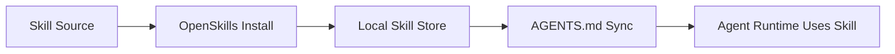

# OpenSkills Tutorial: Universal Skill Loading for Coding Agents

> Learn how to use `numman-ali/openskills` to install, synchronize, and operate reusable `SKILL.md` packs across Claude Code, Cursor, Codex, Aider, and other agent environments.

## Why This Track Matters

Teams using multiple coding agents often duplicate skill prompts and lose consistency. OpenSkills provides a universal skill loader that keeps agent instructions portable and versionable.

This track focuses on:

- skill installation and synchronization workflows
- `AGENTS.md` integration patterns
- universal mode for multi-agent environments
- governance for shared skill libraries

## Current Snapshot (auto-updated)

- repository: [`numman-ali/openskills`](https://github.com/numman-ali/openskills)
- stars: about **8.2k**
- latest release: [`v1.5.0`](https://github.com/numman-ali/openskills/releases/tag/v1.5.0)
- development activity: active with recent updates
- project positioning: universal loader for Claude-style skills across coding agents

## Mental Model

## Chapter Guide

| Chapter | Key Question | Outcome |
|:--------|:-------------|:--------|
| [01 - Getting Started](01-getting-started.md) | How do I install and run OpenSkills quickly? | Working baseline |
| [02 - Skill Format and Loader Architecture](02-skill-format-and-loader-architecture.md) | How does OpenSkills map SKILL.md into agent-friendly metadata? | Strong architecture model |
| [03 - Installation Sources and Trust Model](03-installation-sources-and-trust-model.md) | How do I safely install skills from public/private/local sources? | Better supply-chain hygiene |
| [04 - Sync and AGENTS.md Integration](04-sync-and-agents-md-integration.md) | How does OpenSkills expose skills to agent prompts? | Reliable integration flow |
| [05 - Universal Mode and Multi-Agent Setups](05-universal-mode-and-multi-agent-setups.md) | How do I avoid conflicts across agent ecosystems? | Cleaner multi-agent compatibility |
| [06 - Skill Authoring and Packaging](06-skill-authoring-and-packaging.md) | How do I design high-quality reusable skills? | Better skill quality |
| [07 - Updates, Versioning, and Governance](07-updates-versioning-and-governance.md) | How do teams manage evolving skill libraries? | Maintainable lifecycle process |
| [08 - Production Security and Operations](08-production-security-and-operations.md) | How do I run OpenSkills at team/enterprise scale? | Ops baseline |

## What You Will Learn

- how to install and distribute skills across agent tools
- how to standardize `AGENTS.md` skill exposure patterns
- how to govern versioning and updates for shared skill packs
- how to run skill systems securely in team environments

## Source References

- [OpenSkills Repository](https://github.com/numman-ali/openskills)
- [OpenSkills Releases](https://github.com/numman-ali/openskills/releases)
- [OpenSkills npm package](https://www.npmjs.com/package/openskills)

## Related Tutorials

- [MCP Servers Tutorial](../mcp-servers-tutorial/)
- [Cline Tutorial](../cline-tutorial/)
- [OpenCode Tutorial](../opencode-tutorial/)
- [HumanLayer Tutorial](../humanlayer-tutorial/)

---

Start with [Chapter 1: Getting Started](01-getting-started.md).

## Navigation & Backlinks

- [Start Here: Chapter 1: Getting Started](01-getting-started.md)
- [Back to Main Catalog](../../README.md#-tutorial-catalog)
- [Browse A-Z Tutorial Directory](../../discoverability/tutorial-directory.md)
- [Search by Intent](../../discoverability/query-hub.md)
- [Explore Category Hubs](../../README.md#category-hubs)

## Full Chapter Map

1. [Chapter 1: Getting Started](01-getting-started.md)
2. [Chapter 2: Skill Format and Loader Architecture](02-skill-format-and-loader-architecture.md)
3. [Chapter 3: Installation Sources and Trust Model](03-installation-sources-and-trust-model.md)
4. [Chapter 4: Sync and AGENTS.md Integration](04-sync-and-agents-md-integration.md)
5. [Chapter 5: Universal Mode and Multi-Agent Setups](05-universal-mode-and-multi-agent-setups.md)
6. [Chapter 6: Skill Authoring and Packaging](06-skill-authoring-and-packaging.md)
7. [Chapter 7: Updates, Versioning, and Governance](07-updates-versioning-and-governance.md)
8. [Chapter 8: Production Security and Operations](08-production-security-and-operations.md)

*Generated by [AI Codebase Knowledge Builder](https://github.com/The-Pocket/Tutorial-Codebase-Knowledge)*
