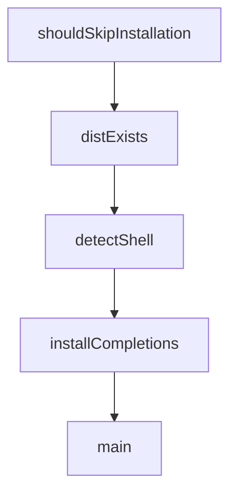

# Chapter 1: Getting Started and OPSX Basics

Welcome to **Chapter 1: Getting Started and OPSX Basics**. In this part of **OpenSpec Tutorial: Spec-Driven Workflows for AI Coding Agents**, you will build an intuitive mental model first, then move into concrete implementation details and practical production tradeoffs.


This chapter establishes a reliable OpenSpec baseline and clarifies the core OPSX command model.

## Learning Goals

- install OpenSpec with supported package managers
- initialize a project and generate workflow assets
- run first OPSX commands with clean expectations

## Prerequisites

| Requirement | Why It Matters |
|:------------|:---------------|
| Node.js 20.19.0+ | minimum runtime requirement |
| an AI coding assistant client | OPSX commands are consumed through tool integrations |
| writable project directory | OpenSpec generates artifact and skill files |

## Install and Initialize

```bash
npm install -g @fission-ai/openspec@latest
cd your-project
openspec init
```

`openspec init` creates an `openspec/` directory and configures selected tool integrations.

## First Workflow Loop

1. `/opsx:new <change-name>`
2. `/opsx:ff` or `/opsx:continue`
3. `/opsx:apply`
4. `/opsx:archive`

## Baseline Validation

| Check | Command |
|:------|:--------|
| version installed | `openspec --version` |
| current change status | `openspec status` |
| generated structure | inspect `openspec/specs` and `openspec/changes` |

## Source References

- [README Quick Start](https://github.com/Fission-AI/OpenSpec/blob/main/README.md)
- [Installation Guide](https://github.com/Fission-AI/OpenSpec/blob/main/docs/installation.md)
- [Getting Started Guide](https://github.com/Fission-AI/OpenSpec/blob/main/docs/getting-started.md)

## Summary

You now have a working OpenSpec environment with the core workflow entry points.

Next: [Chapter 2: Artifact Graph and Change Lifecycle](02-artifact-graph-and-change-lifecycle.md)

## Source Code Walkthrough

### `scripts/postinstall.js`

The `shouldSkipInstallation` function in [`scripts/postinstall.js`](https://github.com/Fission-AI/OpenSpec/blob/HEAD/scripts/postinstall.js) handles a key part of this chapter's functionality:

```js
 * Check if we should skip installation
 */
function shouldSkipInstallation() {
  // Skip in CI environments
  if (process.env.CI === 'true' || process.env.CI === '1') {
    return { skip: true, reason: 'CI environment detected' };
  }

  // Skip if user opted out
  if (process.env.OPENSPEC_NO_COMPLETIONS === '1') {
    return { skip: true, reason: 'OPENSPEC_NO_COMPLETIONS=1 set' };
  }

  return { skip: false };
}

/**
 * Check if dist/ directory exists
 */
async function distExists() {
  const distPath = path.join(__dirname, '..', 'dist');
  try {
    const stat = await fs.stat(distPath);
    return stat.isDirectory();
  } catch {
    return false;
  }
}

/**
 * Detect the user's shell
 */
```

This function is important because it defines how OpenSpec Tutorial: Spec-Driven Workflows for AI Coding Agents implements the patterns covered in this chapter.

### `scripts/postinstall.js`

The `distExists` function in [`scripts/postinstall.js`](https://github.com/Fission-AI/OpenSpec/blob/HEAD/scripts/postinstall.js) handles a key part of this chapter's functionality:

```js
 * Check if dist/ directory exists
 */
async function distExists() {
  const distPath = path.join(__dirname, '..', 'dist');
  try {
    const stat = await fs.stat(distPath);
    return stat.isDirectory();
  } catch {
    return false;
  }
}

/**
 * Detect the user's shell
 */
async function detectShell() {
  try {
    const { detectShell } = await import('../dist/utils/shell-detection.js');
    const result = detectShell();
    return result.shell;
  } catch (error) {
    // Fail silently if detection module doesn't exist
    return undefined;
  }
}

/**
 * Install completions for the detected shell
 */
async function installCompletions(shell) {
  try {
    const { CompletionFactory } = await import('../dist/core/completions/factory.js');
```

This function is important because it defines how OpenSpec Tutorial: Spec-Driven Workflows for AI Coding Agents implements the patterns covered in this chapter.

### `scripts/postinstall.js`

The `detectShell` function in [`scripts/postinstall.js`](https://github.com/Fission-AI/OpenSpec/blob/HEAD/scripts/postinstall.js) handles a key part of this chapter's functionality:

```js
 * Detect the user's shell
 */
async function detectShell() {
  try {
    const { detectShell } = await import('../dist/utils/shell-detection.js');
    const result = detectShell();
    return result.shell;
  } catch (error) {
    // Fail silently if detection module doesn't exist
    return undefined;
  }
}

/**
 * Install completions for the detected shell
 */
async function installCompletions(shell) {
  try {
    const { CompletionFactory } = await import('../dist/core/completions/factory.js');
    const { COMMAND_REGISTRY } = await import('../dist/core/completions/command-registry.js');

    // Check if shell is supported
    if (!CompletionFactory.isSupported(shell)) {
      console.log(`\nTip: Run 'openspec completion install' for shell completions`);
      return;
    }

    // Generate completion script
    const generator = CompletionFactory.createGenerator(shell);
    const script = generator.generate(COMMAND_REGISTRY);

    // Install completion script
```

This function is important because it defines how OpenSpec Tutorial: Spec-Driven Workflows for AI Coding Agents implements the patterns covered in this chapter.

### `scripts/postinstall.js`

The `installCompletions` function in [`scripts/postinstall.js`](https://github.com/Fission-AI/OpenSpec/blob/HEAD/scripts/postinstall.js) handles a key part of this chapter's functionality:

```js
 * Install completions for the detected shell
 */
async function installCompletions(shell) {
  try {
    const { CompletionFactory } = await import('../dist/core/completions/factory.js');
    const { COMMAND_REGISTRY } = await import('../dist/core/completions/command-registry.js');

    // Check if shell is supported
    if (!CompletionFactory.isSupported(shell)) {
      console.log(`\nTip: Run 'openspec completion install' for shell completions`);
      return;
    }

    // Generate completion script
    const generator = CompletionFactory.createGenerator(shell);
    const script = generator.generate(COMMAND_REGISTRY);

    // Install completion script
    const installer = CompletionFactory.createInstaller(shell);
    const result = await installer.install(script);

    if (result.success) {
      // Show success message based on installation type
      if (result.isOhMyZsh) {
        console.log(`✓ Shell completions installed`);
        console.log(`  Restart shell: exec zsh`);
      } else if (result.zshrcConfigured) {
        console.log(`✓ Shell completions installed and configured`);
        console.log(`  Restart shell: exec zsh`);
      } else {
        console.log(`✓ Shell completions installed to ~/.zsh/completions/`);
        console.log(`  Add to ~/.zshrc: fpath=(~/.zsh/completions $fpath)`);
```

This function is important because it defines how OpenSpec Tutorial: Spec-Driven Workflows for AI Coding Agents implements the patterns covered in this chapter.


## How These Components Connect


