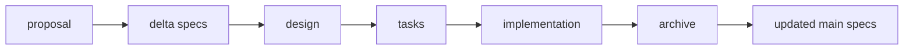

# Chapter 2: Artifact Graph and Change Lifecycle

OpenSpec is strongest when teams treat artifacts as a connected lifecycle, not isolated markdown files.

## Learning Goals

- understand the role of `specs/` vs `changes/`
- map artifact dependencies across planning and execution
- reason about when to refine vs start a new change

## Core Directory Model

```text
openspec/
  specs/                 # source of truth
  changes/<change-name>/ # proposal, specs delta, design, tasks
  config.yaml            # optional project-level rules
```

## Artifact Graph



## Lifecycle Rules of Thumb

| Situation | Action |
|:----------|:-------|
| same intent, refined approach | update existing change artifacts |
| materially different scope or intent | create a new change |
| implementation drift from specs | revise specs/design before continuing |

## Source References

- [Getting Started: Structure and Artifacts](https://github.com/Fission-AI/OpenSpec/blob/main/docs/getting-started.md)
- [Concepts](https://github.com/Fission-AI/OpenSpec/blob/main/docs/concepts.md)
- [Workflows](https://github.com/Fission-AI/OpenSpec/blob/main/docs/workflows.md)

## Summary

You now have a working model for how artifacts evolve from intent to archived behavior changes.

Next: [Chapter 3: Command Surface and Agent Workflows](03-command-surface-and-agent-workflows.md)
