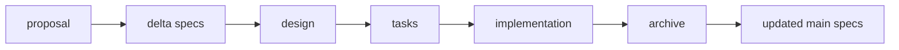
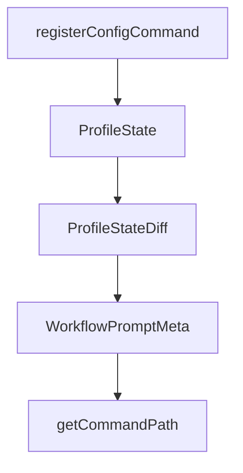

# Chapter 2: Artifact Graph and Change Lifecycle

Welcome to **Chapter 2: Artifact Graph and Change Lifecycle**. In this part of **OpenSpec Tutorial: Spec-Driven Workflows for AI Coding Agents**, you will build an intuitive mental model first, then move into concrete implementation details and practical production tradeoffs.


OpenSpec is strongest when teams treat artifacts as a connected lifecycle, not isolated markdown files.

## Learning Goals

- understand the role of `specs/` vs `changes/`
- map artifact dependencies across planning and execution
- reason about when to refine vs start a new change

## Core Directory Model

```text
openspec/
  specs/                 # source of truth
  changes/<change-name>/ # proposal, specs delta, design, tasks
  config.yaml            # optional project-level rules
```

## Artifact Graph


```mermaid
flowchart LR
    A[proposal] --> B[delta specs]
    B --> C[design]
    C --> D[tasks]
    D --> E[implementation]
    E --> F[archive]
    F --> G[updated main specs]
```

## Lifecycle Rules of Thumb

| Situation | Action |
|:----------|:-------|
| same intent, refined approach | update existing change artifacts |
| materially different scope or intent | create a new change |
| implementation drift from specs | revise specs/design before continuing |

## Source References

- [Getting Started: Structure and Artifacts](https://github.com/Fission-AI/OpenSpec/blob/main/docs/getting-started.md)
- [Concepts](https://github.com/Fission-AI/OpenSpec/blob/main/docs/concepts.md)
- [Workflows](https://github.com/Fission-AI/OpenSpec/blob/main/docs/workflows.md)

## Summary

You now have a working model for how artifacts evolve from intent to archived behavior changes.

Next: [Chapter 3: Command Surface and Agent Workflows](03-command-surface-and-agent-workflows.md)

## Source Code Walkthrough

### `src/commands/config.ts`

The `registerConfigCommand` function in [`src/commands/config.ts`](https://github.com/Fission-AI/OpenSpec/blob/HEAD/src/commands/config.ts) handles a key part of this chapter's functionality:

```ts
 * @param program - The Commander program instance
 */
export function registerConfigCommand(program: Command): void {
  const configCmd = program
    .command('config')
    .description('View and modify global OpenSpec configuration')
    .option('--scope <scope>', 'Config scope (only "global" supported currently)')
    .hook('preAction', (thisCommand) => {
      const opts = thisCommand.opts();
      if (opts.scope && opts.scope !== 'global') {
        console.error('Error: Project-local config is not yet implemented');
        process.exit(1);
      }
    });

  // config path
  configCmd
    .command('path')
    .description('Show config file location')
    .action(() => {
      console.log(getGlobalConfigPath());
    });

  // config list
  configCmd
    .command('list')
    .description('Show all current settings')
    .option('--json', 'Output as JSON')
    .action((options: { json?: boolean }) => {
      const config = getGlobalConfig();

      if (options.json) {
```

This function is important because it defines how OpenSpec Tutorial: Spec-Driven Workflows for AI Coding Agents implements the patterns covered in this chapter.

### `src/commands/config.ts`

The `ProfileState` interface in [`src/commands/config.ts`](https://github.com/Fission-AI/OpenSpec/blob/HEAD/src/commands/config.ts) handles a key part of this chapter's functionality:

```ts
type ProfileAction = 'both' | 'delivery' | 'workflows' | 'keep';

interface ProfileState {
  profile: Profile;
  delivery: Delivery;
  workflows: string[];
}

interface ProfileStateDiff {
  hasChanges: boolean;
  lines: string[];
}

interface WorkflowPromptMeta {
  name: string;
  description: string;
}

const WORKFLOW_PROMPT_META: Record<string, WorkflowPromptMeta> = {
  propose: {
    name: 'Propose change',
    description: 'Create proposal, design, and tasks from a request',
  },
  explore: {
    name: 'Explore ideas',
    description: 'Investigate a problem before implementation',
  },
  new: {
    name: 'New change',
    description: 'Create a new change scaffold quickly',
  },
  continue: {
```

This interface is important because it defines how OpenSpec Tutorial: Spec-Driven Workflows for AI Coding Agents implements the patterns covered in this chapter.

### `src/commands/config.ts`

The `ProfileStateDiff` interface in [`src/commands/config.ts`](https://github.com/Fission-AI/OpenSpec/blob/HEAD/src/commands/config.ts) handles a key part of this chapter's functionality:

```ts
}

interface ProfileStateDiff {
  hasChanges: boolean;
  lines: string[];
}

interface WorkflowPromptMeta {
  name: string;
  description: string;
}

const WORKFLOW_PROMPT_META: Record<string, WorkflowPromptMeta> = {
  propose: {
    name: 'Propose change',
    description: 'Create proposal, design, and tasks from a request',
  },
  explore: {
    name: 'Explore ideas',
    description: 'Investigate a problem before implementation',
  },
  new: {
    name: 'New change',
    description: 'Create a new change scaffold quickly',
  },
  continue: {
    name: 'Continue change',
    description: 'Resume work on an existing change',
  },
  apply: {
    name: 'Apply tasks',
    description: 'Implement tasks from the current change',
```

This interface is important because it defines how OpenSpec Tutorial: Spec-Driven Workflows for AI Coding Agents implements the patterns covered in this chapter.

### `src/commands/config.ts`

The `WorkflowPromptMeta` interface in [`src/commands/config.ts`](https://github.com/Fission-AI/OpenSpec/blob/HEAD/src/commands/config.ts) handles a key part of this chapter's functionality:

```ts
}

interface WorkflowPromptMeta {
  name: string;
  description: string;
}

const WORKFLOW_PROMPT_META: Record<string, WorkflowPromptMeta> = {
  propose: {
    name: 'Propose change',
    description: 'Create proposal, design, and tasks from a request',
  },
  explore: {
    name: 'Explore ideas',
    description: 'Investigate a problem before implementation',
  },
  new: {
    name: 'New change',
    description: 'Create a new change scaffold quickly',
  },
  continue: {
    name: 'Continue change',
    description: 'Resume work on an existing change',
  },
  apply: {
    name: 'Apply tasks',
    description: 'Implement tasks from the current change',
  },
  ff: {
    name: 'Fast-forward',
    description: 'Run a faster implementation workflow',
  },
```

This interface is important because it defines how OpenSpec Tutorial: Spec-Driven Workflows for AI Coding Agents implements the patterns covered in this chapter.


## How These Components Connect


```mermaid
flowchart TD
    A[registerConfigCommand]
    B[ProfileState]
    C[ProfileStateDiff]
    D[WorkflowPromptMeta]
    E[getCommandPath]
    A --> B
    B --> C
    C --> D
    D --> E
```
