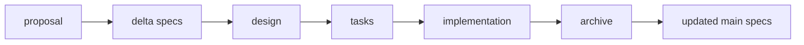
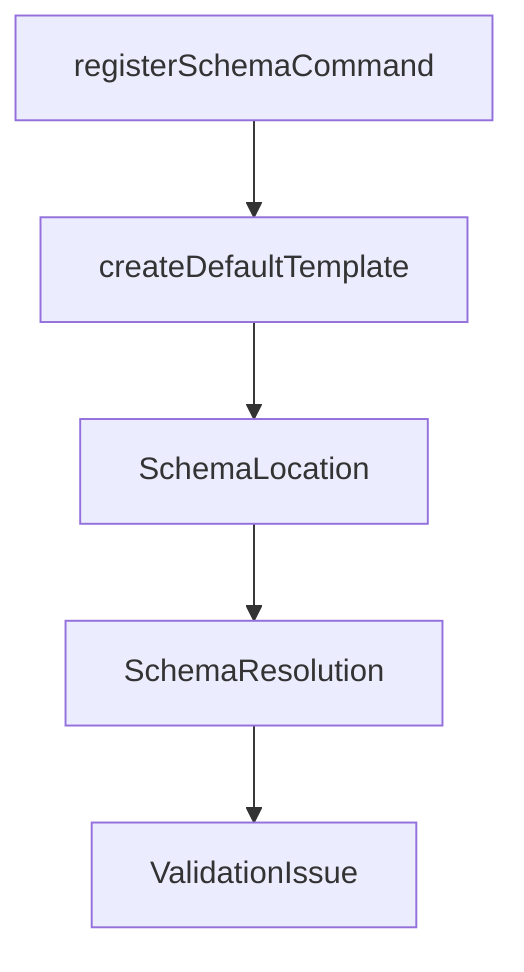

# Chapter 2: Artifact Graph and Change Lifecycle

Welcome to **Chapter 2: Artifact Graph and Change Lifecycle**. In this part of **OpenSpec Tutorial: Spec-Driven Workflows for AI Coding Agents**, you will build an intuitive mental model first, then move into concrete implementation details and practical production tradeoffs.


OpenSpec is strongest when teams treat artifacts as a connected lifecycle, not isolated markdown files.

## Learning Goals

- understand the role of `specs/` vs `changes/`
- map artifact dependencies across planning and execution
- reason about when to refine vs start a new change

## Core Directory Model

```text
openspec/
  specs/                 # source of truth
  changes/<change-name>/ # proposal, specs delta, design, tasks
  config.yaml            # optional project-level rules
```

## Artifact Graph


```mermaid
flowchart LR
    A[proposal] --> B[delta specs]
    B --> C[design]
    C --> D[tasks]
    D --> E[implementation]
    E --> F[archive]
    F --> G[updated main specs]
```

## Lifecycle Rules of Thumb

| Situation | Action |
|:----------|:-------|
| same intent, refined approach | update existing change artifacts |
| materially different scope or intent | create a new change |
| implementation drift from specs | revise specs/design before continuing |

## Source References

- [Getting Started: Structure and Artifacts](https://github.com/Fission-AI/OpenSpec/blob/main/docs/getting-started.md)
- [Concepts](https://github.com/Fission-AI/OpenSpec/blob/main/docs/concepts.md)
- [Workflows](https://github.com/Fission-AI/OpenSpec/blob/main/docs/workflows.md)

## Summary

You now have a working model for how artifacts evolve from intent to archived behavior changes.

Next: [Chapter 3: Command Surface and Agent Workflows](03-command-surface-and-agent-workflows.md)

## Depth Expansion Playbook

## Source Code Walkthrough

### `src/commands/schema.ts`

The `registerSchemaCommand` function in [`src/commands/schema.ts`](https://github.com/Fission-AI/OpenSpec/blob/HEAD/src/commands/schema.ts) handles a key part of this chapter's functionality:

```ts
 * Register the schema command and all its subcommands.
 */
export function registerSchemaCommand(program: Command): void {
  const schemaCmd = program
    .command('schema')
    .description('Manage workflow schemas [experimental]');

  // Experimental warning
  schemaCmd.hook('preAction', () => {
    console.error('Note: Schema commands are experimental and may change.');
  });

  // schema which
  schemaCmd
    .command('which [name]')
    .description('Show where a schema resolves from')
    .option('--json', 'Output as JSON')
    .option('--all', 'List all schemas with their resolution sources')
    .action(async (name?: string, options?: { json?: boolean; all?: boolean }) => {
      try {
        const projectRoot = process.cwd();

        if (options?.all) {
          // List all schemas
          const schemas = getAllSchemasWithResolution(projectRoot);

          if (options?.json) {
            console.log(JSON.stringify(schemas, null, 2));
          } else {
            if (schemas.length === 0) {
              console.log('No schemas found.');
              return;
```

This function is important because it defines how OpenSpec Tutorial: Spec-Driven Workflows for AI Coding Agents implements the patterns covered in this chapter.

### `src/commands/schema.ts`

The `createDefaultTemplate` function in [`src/commands/schema.ts`](https://github.com/Fission-AI/OpenSpec/blob/HEAD/src/commands/schema.ts) handles a key part of this chapter's functionality:

```ts

          // Create default template content
          const templateContent = createDefaultTemplate(artifact.id);
          fs.writeFileSync(templatePath, templateContent);
        }

        // Update config if --default
        if (options?.default) {
          const configPath = path.join(projectRoot, 'openspec', 'config.yaml');

          if (fs.existsSync(configPath)) {
            const { parse: parseYaml, stringify: stringifyYaml2 } = await import('yaml');
            const configContent = fs.readFileSync(configPath, 'utf-8');
            const config = parseYaml(configContent) || {};
            config.defaultSchema = name;
            fs.writeFileSync(configPath, stringifyYaml2(config));
          } else {
            // Create config file
            const configDir = path.dirname(configPath);
            if (!fs.existsSync(configDir)) {
              fs.mkdirSync(configDir, { recursive: true });
            }
            fs.writeFileSync(configPath, stringifyYaml({ defaultSchema: name }));
          }
        }

        if (spinner) spinner.succeed(`Created schema '${name}'`);

        if (options?.json) {
          console.log(JSON.stringify({
            created: true,
            path: schemaDir,
```

This function is important because it defines how OpenSpec Tutorial: Spec-Driven Workflows for AI Coding Agents implements the patterns covered in this chapter.

### `src/commands/schema.ts`

The `SchemaLocation` interface in [`src/commands/schema.ts`](https://github.com/Fission-AI/OpenSpec/blob/HEAD/src/commands/schema.ts) handles a key part of this chapter's functionality:

```ts
 * Result of checking a schema location
 */
interface SchemaLocation {
  source: SchemaSource;
  path: string;
  exists: boolean;
}

/**
 * Schema resolution info with shadowing details
 */
interface SchemaResolution {
  name: string;
  source: SchemaSource;
  path: string;
  shadows: Array<{ source: SchemaSource; path: string }>;
}

/**
 * Validation issue structure
 */
interface ValidationIssue {
  level: 'error' | 'warning';
  path: string;
  message: string;
}

/**
 * Check all three locations for a schema and return which ones exist.
 */
function checkAllLocations(
  name: string,
```

This interface is important because it defines how OpenSpec Tutorial: Spec-Driven Workflows for AI Coding Agents implements the patterns covered in this chapter.

### `src/commands/schema.ts`

The `SchemaResolution` interface in [`src/commands/schema.ts`](https://github.com/Fission-AI/OpenSpec/blob/HEAD/src/commands/schema.ts) handles a key part of this chapter's functionality:

```ts
 * Schema resolution info with shadowing details
 */
interface SchemaResolution {
  name: string;
  source: SchemaSource;
  path: string;
  shadows: Array<{ source: SchemaSource; path: string }>;
}

/**
 * Validation issue structure
 */
interface ValidationIssue {
  level: 'error' | 'warning';
  path: string;
  message: string;
}

/**
 * Check all three locations for a schema and return which ones exist.
 */
function checkAllLocations(
  name: string,
  projectRoot: string
): SchemaLocation[] {
  const locations: SchemaLocation[] = [];

  // Project location
  const projectDir = path.join(getProjectSchemasDir(projectRoot), name);
  const projectSchemaPath = path.join(projectDir, 'schema.yaml');
  locations.push({
    source: 'project',
```

This interface is important because it defines how OpenSpec Tutorial: Spec-Driven Workflows for AI Coding Agents implements the patterns covered in this chapter.


## How These Components Connect


```mermaid
flowchart TD
    A[registerSchemaCommand]
    B[createDefaultTemplate]
    C[SchemaLocation]
    D[SchemaResolution]
    E[ValidationIssue]
    A --> B
    B --> C
    C --> D
    D --> E
```
