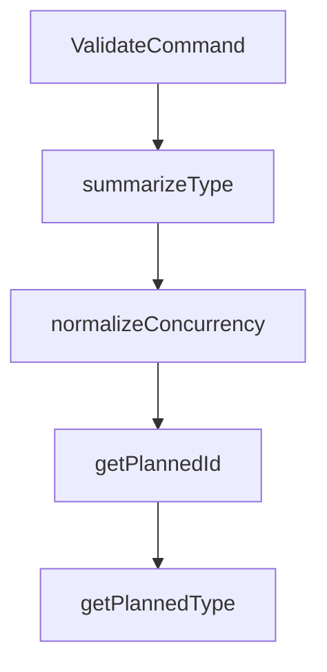

# Chapter 3: Command Surface and Agent Workflows

Welcome to **Chapter 3: Command Surface and Agent Workflows**. In this part of **OpenSpec Tutorial: Spec-Driven Workflows for AI Coding Agents**, you will build an intuitive mental model first, then move into concrete implementation details and practical production tradeoffs.


This chapter separates human CLI operations from agent-facing commands so workflows stay predictable.

## Learning Goals

- distinguish terminal-oriented CLI commands from slash workflows
- decide when to use interactive vs non-interactive command paths
- reduce ambiguity in multi-agent environments

## Two Command Planes

| Plane | Examples | Typical Owner |
|:------|:---------|:--------------|
| OPSX slash commands | `/opsx:new`, `/opsx:apply`, `/opsx:archive` | coding agent interaction loop |
| CLI commands | `openspec list`, `openspec status`, `openspec validate` | human operators and CI scripts |

## Agent-Friendly CLI Operations

OpenSpec exposes structured outputs for automation:

```bash
openspec status --json
openspec validate --all --json
openspec list --json
```

## Reliability Practices

1. keep one active change focus per implementation thread
2. run `status` before and after `/opsx:apply`
3. use `validate` in CI before merge
4. treat archive as the final state transition, not a side effect

## Source References

- [Commands Reference](https://github.com/Fission-AI/OpenSpec/blob/main/docs/commands.md)
- [CLI Reference](https://github.com/Fission-AI/OpenSpec/blob/main/docs/cli.md)
- [OPSX Workflow](https://github.com/Fission-AI/OpenSpec/blob/main/docs/opsx.md)

## Summary

You now know how to coordinate human and agent command usage without workflow collisions.

Next: [Chapter 4: Spec Authoring, Delta Patterns, and Quality](04-spec-authoring-delta-patterns-and-quality.md)

## Depth Expansion Playbook

## Source Code Walkthrough

### `src/commands/validate.ts`

The `ValidateCommand` class in [`src/commands/validate.ts`](https://github.com/Fission-AI/OpenSpec/blob/HEAD/src/commands/validate.ts) handles a key part of this chapter's functionality:

```ts
}

export class ValidateCommand {
  async execute(itemName: string | undefined, options: ExecuteOptions = {}): Promise<void> {
    const interactive = isInteractive(options);

    // Handle bulk flags first
    if (options.all || options.changes || options.specs) {
      await this.runBulkValidation({
        changes: !!options.all || !!options.changes,
        specs: !!options.all || !!options.specs,
      }, { strict: !!options.strict, json: !!options.json, concurrency: options.concurrency, noInteractive: resolveNoInteractive(options) });
      return;
    }

    // No item and no flags
    if (!itemName) {
      if (interactive) {
        await this.runInteractiveSelector({ strict: !!options.strict, json: !!options.json, concurrency: options.concurrency });
        return;
      }
      this.printNonInteractiveHint();
      process.exitCode = 1;
      return;
    }

    // Direct item validation with type detection or override
    const typeOverride = this.normalizeType(options.type);
    await this.validateDirectItem(itemName, { typeOverride, strict: !!options.strict, json: !!options.json });
  }

  private normalizeType(value?: string): ItemType | undefined {
```

This class is important because it defines how OpenSpec Tutorial: Spec-Driven Workflows for AI Coding Agents implements the patterns covered in this chapter.

### `src/commands/validate.ts`

The `summarizeType` function in [`src/commands/validate.ts`](https://github.com/Fission-AI/OpenSpec/blob/HEAD/src/commands/validate.ts) handles a key part of this chapter's functionality:

```ts
      totals: { items: results.length, passed, failed },
      byType: {
        ...(scope.changes ? { change: summarizeType(results, 'change') } : {}),
        ...(scope.specs ? { spec: summarizeType(results, 'spec') } : {}),
      },
    } as const;

    if (opts.json) {
      const out = { items: results, summary, version: '1.0' };
      console.log(JSON.stringify(out, null, 2));
    } else {
      for (const res of results) {
        if (res.valid) console.log(`✓ ${res.type}/${res.id}`);
        else console.error(`✗ ${res.type}/${res.id}`);
      }
      console.log(`Totals: ${summary.totals.passed} passed, ${summary.totals.failed} failed (${summary.totals.items} items)`);
    }

    process.exitCode = failed > 0 ? 1 : 0;
  }
}

function summarizeType(results: BulkItemResult[], type: ItemType) {
  const filtered = results.filter(r => r.type === type);
  const items = filtered.length;
  const passed = filtered.filter(r => r.valid).length;
  const failed = items - passed;
  return { items, passed, failed };
}

function normalizeConcurrency(value?: string): number | undefined {
  if (!value) return undefined;
```

This function is important because it defines how OpenSpec Tutorial: Spec-Driven Workflows for AI Coding Agents implements the patterns covered in this chapter.

### `src/commands/validate.ts`

The `normalizeConcurrency` function in [`src/commands/validate.ts`](https://github.com/Fission-AI/OpenSpec/blob/HEAD/src/commands/validate.ts) handles a key part of this chapter's functionality:

```ts
    const DEFAULT_CONCURRENCY = 6;
    const maxSuggestions = 5; // used by nearestMatches
    const concurrency = normalizeConcurrency(opts.concurrency) ?? normalizeConcurrency(process.env.OPENSPEC_CONCURRENCY) ?? DEFAULT_CONCURRENCY;
    const validator = new Validator(opts.strict);
    const queue: Array<() => Promise<BulkItemResult>> = [];

    for (const id of changeIds) {
      queue.push(async () => {
        const start = Date.now();
        const changeDir = path.join(process.cwd(), 'openspec', 'changes', id);
        const report = await validator.validateChangeDeltaSpecs(changeDir);
        const durationMs = Date.now() - start;
        return { id, type: 'change' as const, valid: report.valid, issues: report.issues, durationMs };
      });
    }
    for (const id of specIds) {
      queue.push(async () => {
        const start = Date.now();
        const file = path.join(process.cwd(), 'openspec', 'specs', id, 'spec.md');
        const report = await validator.validateSpec(file);
        const durationMs = Date.now() - start;
        return { id, type: 'spec' as const, valid: report.valid, issues: report.issues, durationMs };
      });
    }

    if (queue.length === 0) {
      spinner?.stop();

      const summary = {
        totals: { items: 0, passed: 0, failed: 0 },
        byType: {
          ...(scope.changes ? { change: { items: 0, passed: 0, failed: 0 } } : {}),
```

This function is important because it defines how OpenSpec Tutorial: Spec-Driven Workflows for AI Coding Agents implements the patterns covered in this chapter.

### `src/commands/validate.ts`

The `getPlannedId` function in [`src/commands/validate.ts`](https://github.com/Fission-AI/OpenSpec/blob/HEAD/src/commands/validate.ts) handles a key part of this chapter's functionality:

```ts
            .catch((error: any) => {
              const message = error?.message || 'Unknown error';
              const res: BulkItemResult = { id: getPlannedId(currentIndex, changeIds, specIds) ?? 'unknown', type: getPlannedType(currentIndex, changeIds, specIds) ?? 'change', valid: false, issues: [{ level: 'ERROR', path: 'file', message }], durationMs: 0 };
              results.push(res);
              failed++;
            })
            .finally(() => {
              running--;
              if (index >= queue.length && running === 0) resolve();
              else next();
            });
        }
      };
      next();
    });

    spinner?.stop();

    results.sort((a, b) => a.id.localeCompare(b.id));
    const summary = {
      totals: { items: results.length, passed, failed },
      byType: {
        ...(scope.changes ? { change: summarizeType(results, 'change') } : {}),
        ...(scope.specs ? { spec: summarizeType(results, 'spec') } : {}),
      },
    } as const;

    if (opts.json) {
      const out = { items: results, summary, version: '1.0' };
      console.log(JSON.stringify(out, null, 2));
    } else {
      for (const res of results) {
```

This function is important because it defines how OpenSpec Tutorial: Spec-Driven Workflows for AI Coding Agents implements the patterns covered in this chapter.


## How These Components Connect


