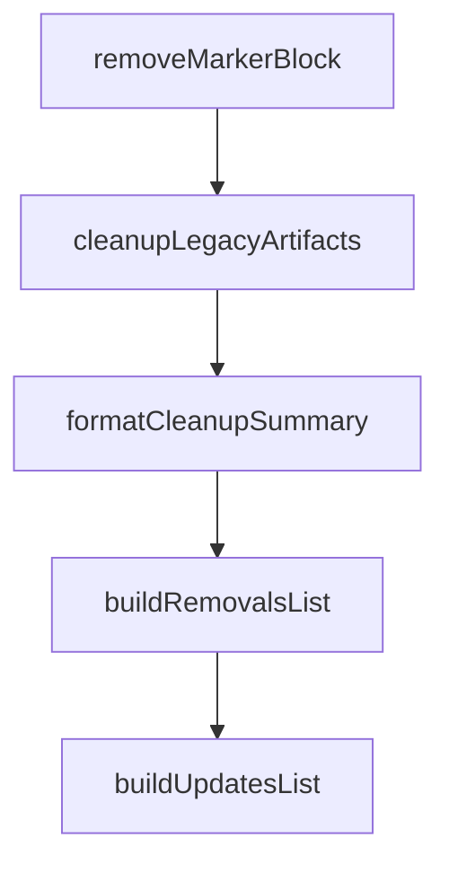

# Chapter 3: Command Surface and Agent Workflows

Welcome to **Chapter 3: Command Surface and Agent Workflows**. In this part of **OpenSpec Tutorial: Spec-Driven Workflows for AI Coding Agents**, you will build an intuitive mental model first, then move into concrete implementation details and practical production tradeoffs.


This chapter separates human CLI operations from agent-facing commands so workflows stay predictable.

## Learning Goals

- distinguish terminal-oriented CLI commands from slash workflows
- decide when to use interactive vs non-interactive command paths
- reduce ambiguity in multi-agent environments

## Two Command Planes

| Plane | Examples | Typical Owner |
|:------|:---------|:--------------|
| OPSX slash commands | `/opsx:new`, `/opsx:apply`, `/opsx:archive` | coding agent interaction loop |
| CLI commands | `openspec list`, `openspec status`, `openspec validate` | human operators and CI scripts |

## Agent-Friendly CLI Operations

OpenSpec exposes structured outputs for automation:

```bash
openspec status --json
openspec validate --all --json
openspec list --json
```

## Reliability Practices

1. keep one active change focus per implementation thread
2. run `status` before and after `/opsx:apply`
3. use `validate` in CI before merge
4. treat archive as the final state transition, not a side effect

## Source References

- [Commands Reference](https://github.com/Fission-AI/OpenSpec/blob/main/docs/commands.md)
- [CLI Reference](https://github.com/Fission-AI/OpenSpec/blob/main/docs/cli.md)
- [OPSX Workflow](https://github.com/Fission-AI/OpenSpec/blob/main/docs/opsx.md)

## Summary

You now know how to coordinate human and agent command usage without workflow collisions.

Next: [Chapter 4: Spec Authoring, Delta Patterns, and Quality](04-spec-authoring-delta-patterns-and-quality.md)

## Source Code Walkthrough

### `src/core/legacy-cleanup.ts`

The `removeMarkerBlock` function in [`src/core/legacy-cleanup.ts`](https://github.com/Fission-AI/OpenSpec/blob/HEAD/src/core/legacy-cleanup.ts) handles a key part of this chapter's functionality:

```ts
import { promises as fs } from 'fs';
import chalk from 'chalk';
import { FileSystemUtils, removeMarkerBlock as removeMarkerBlockUtil } from '../utils/file-system.js';
import { OPENSPEC_MARKERS } from './config.js';

/**
 * Legacy config file names from the old ToolRegistry.
 * These were config files created at project root with OpenSpec markers.
 */
export const LEGACY_CONFIG_FILES = [
  'CLAUDE.md',
  'CLINE.md',
  'CODEBUDDY.md',
  'COSTRICT.md',
  'QODER.md',
  'IFLOW.md',
  'AGENTS.md', // root AGENTS.md (not openspec/AGENTS.md)
  'QWEN.md',
] as const;

/**
 * Legacy slash command patterns from the old SlashCommandRegistry.
 * These map toolId to the path pattern where legacy commands were created.
 * Some tools used a directory structure, others used individual files.
 */
export const LEGACY_SLASH_COMMAND_PATHS: Record<string, LegacySlashCommandPattern> = {
  // Directory-based: .tooldir/commands/openspec/ or .tooldir/commands/openspec/*.md
  'claude': { type: 'directory', path: '.claude/commands/openspec' },
  'codebuddy': { type: 'directory', path: '.codebuddy/commands/openspec' },
  'qoder': { type: 'directory', path: '.qoder/commands/openspec' },
  'crush': { type: 'directory', path: '.crush/commands/openspec' },
  'gemini': { type: 'directory', path: '.gemini/commands/openspec' },
```

This function is important because it defines how OpenSpec Tutorial: Spec-Driven Workflows for AI Coding Agents implements the patterns covered in this chapter.

### `src/core/legacy-cleanup.ts`

The `cleanupLegacyArtifacts` function in [`src/core/legacy-cleanup.ts`](https://github.com/Fission-AI/OpenSpec/blob/HEAD/src/core/legacy-cleanup.ts) handles a key part of this chapter's functionality:

```ts
 * @returns Cleanup result with summary of actions taken
 */
export async function cleanupLegacyArtifacts(
  projectPath: string,
  detection: LegacyDetectionResult
): Promise<CleanupResult> {
  const result: CleanupResult = {
    deletedFiles: [],
    modifiedFiles: [],
    deletedDirs: [],
    projectMdNeedsMigration: detection.hasProjectMd,
    errors: [],
  };

  // Remove marker blocks from config files (NEVER delete config files)
  // Config files like CLAUDE.md, AGENTS.md belong to the user's project root
  for (const fileName of detection.configFilesToUpdate) {
    const filePath = FileSystemUtils.joinPath(projectPath, fileName);
    try {
      const content = await FileSystemUtils.readFile(filePath);
      const newContent = removeMarkerBlock(content);
      // Always write the file, even if empty - never delete user config files
      await FileSystemUtils.writeFile(filePath, newContent);
      result.modifiedFiles.push(fileName);
    } catch (error: any) {
      result.errors.push(`Failed to modify ${fileName}: ${error.message}`);
    }
  }

  // Delete legacy slash command directories (these are 100% OpenSpec-managed)
  for (const dirPath of detection.slashCommandDirs) {
    const fullPath = FileSystemUtils.joinPath(projectPath, dirPath);
```

This function is important because it defines how OpenSpec Tutorial: Spec-Driven Workflows for AI Coding Agents implements the patterns covered in this chapter.

### `src/core/legacy-cleanup.ts`

The `formatCleanupSummary` function in [`src/core/legacy-cleanup.ts`](https://github.com/Fission-AI/OpenSpec/blob/HEAD/src/core/legacy-cleanup.ts) handles a key part of this chapter's functionality:

```ts
 * @returns Formatted summary string for console output
 */
export function formatCleanupSummary(result: CleanupResult): string {
  const lines: string[] = [];

  if (result.deletedFiles.length > 0 || result.deletedDirs.length > 0 || result.modifiedFiles.length > 0) {
    lines.push('Cleaned up legacy files:');

    for (const file of result.deletedFiles) {
      lines.push(`  ✓ Removed ${file}`);
    }

    for (const dir of result.deletedDirs) {
      lines.push(`  ✓ Removed ${dir}/ (replaced by /opsx:*)`);
    }

    for (const file of result.modifiedFiles) {
      lines.push(`  ✓ Removed OpenSpec markers from ${file}`);
    }
  }

  if (result.projectMdNeedsMigration) {
    if (lines.length > 0) {
      lines.push('');
    }
    lines.push(formatProjectMdMigrationHint());
  }

  if (result.errors.length > 0) {
    if (lines.length > 0) {
      lines.push('');
    }
```

This function is important because it defines how OpenSpec Tutorial: Spec-Driven Workflows for AI Coding Agents implements the patterns covered in this chapter.

### `src/core/legacy-cleanup.ts`

The `buildRemovalsList` function in [`src/core/legacy-cleanup.ts`](https://github.com/Fission-AI/OpenSpec/blob/HEAD/src/core/legacy-cleanup.ts) handles a key part of this chapter's functionality:

```ts
 * @returns Array of objects with path and explanation
 */
function buildRemovalsList(detection: LegacyDetectionResult): Array<{ path: string; explanation: string }> {
  const removals: Array<{ path: string; explanation: string }> = [];

  // Slash command directories (these are 100% OpenSpec-managed)
  for (const dir of detection.slashCommandDirs) {
    // Split on both forward and backward slashes for Windows compatibility
    const toolDir = dir.split(/[\/\\]/)[0];
    removals.push({ path: dir + '/', explanation: `replaced by ${toolDir}/skills/` });
  }

  // Slash command files (these are 100% OpenSpec-managed)
  for (const file of detection.slashCommandFiles) {
    removals.push({ path: file, explanation: 'replaced by skills/' });
  }

  // openspec/AGENTS.md (inside openspec/, it's OpenSpec-managed)
  if (detection.hasOpenspecAgents) {
    removals.push({ path: 'openspec/AGENTS.md', explanation: 'obsolete workflow file' });
  }

  // Note: Config files (CLAUDE.md, AGENTS.md, etc.) are NEVER in the removals list
  // They always go to the updates list where only markers are removed

  return removals;
}

/**
 * Build list of files to be updated with explanations.
 * Includes ALL config files with markers - markers are removed, file is never deleted.
 *
```

This function is important because it defines how OpenSpec Tutorial: Spec-Driven Workflows for AI Coding Agents implements the patterns covered in this chapter.


## How These Components Connect


